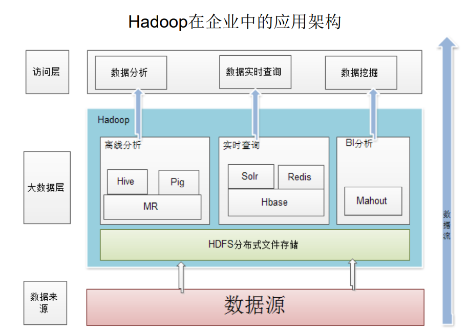
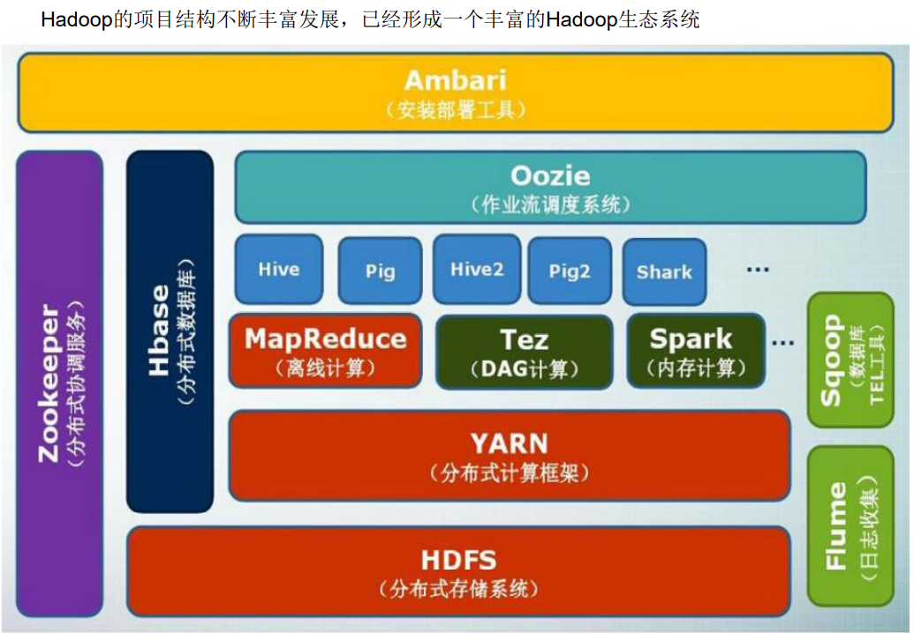
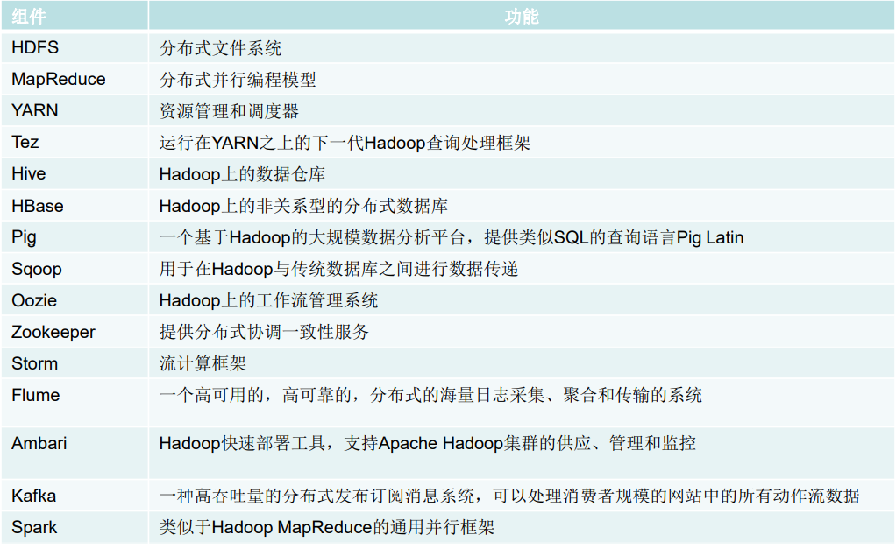
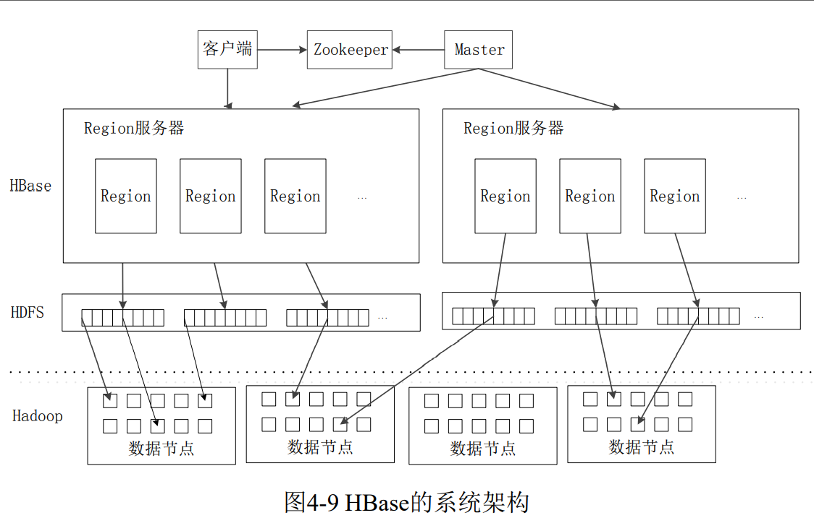
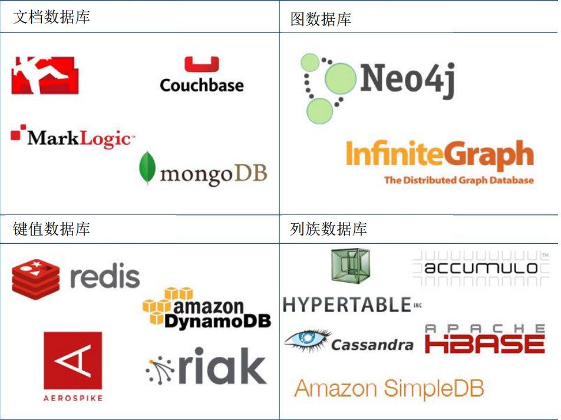
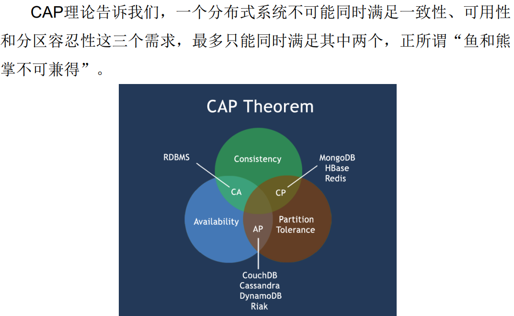
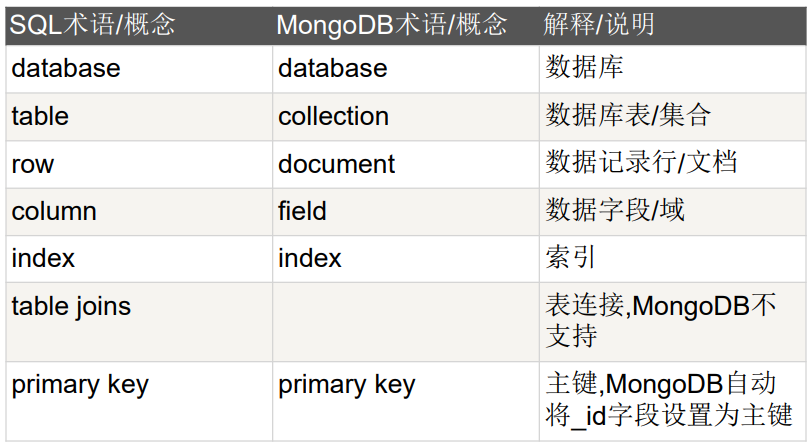
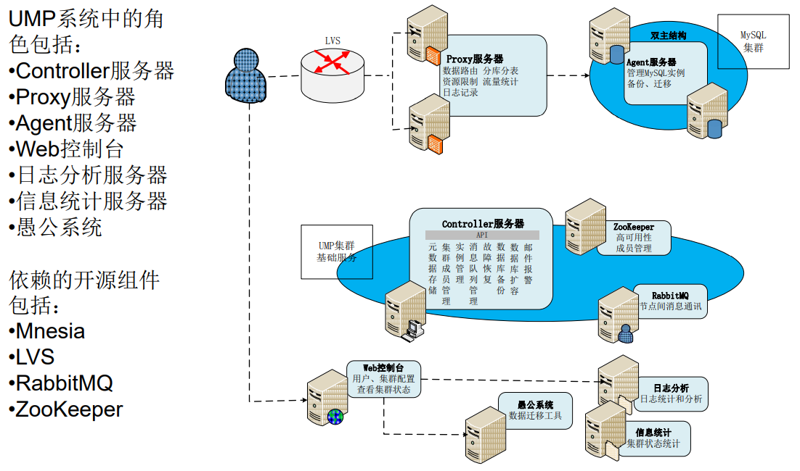
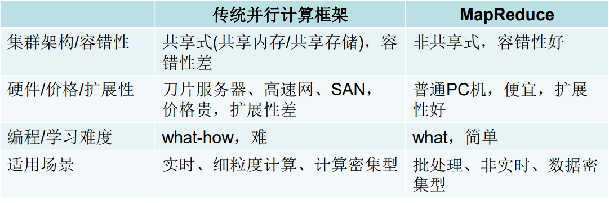
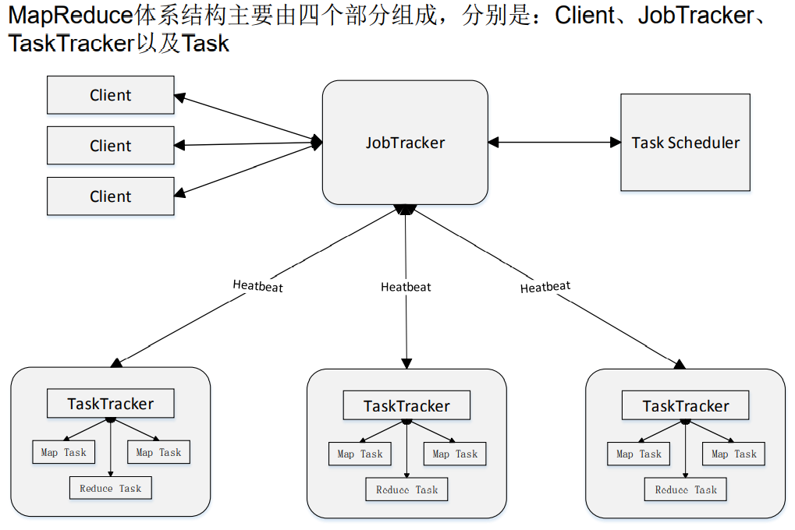

# 大数据技术原理与应用

## 概述

大数据不仅仅是数据的“大量化”，而是包含“快速化”、“多样化”和“价值化”等多重属性。

两大核心技术：分布式存储和分布式处理

大数据计算模式

- 批处理计算
- 流计算
- 图计算
- 查询分析计算

大数据具有数据量大、数据类型繁多、处理速度快、价值密度低等特点。

## Hadoop

Hadoop是Apache软件基金会旗下的一个开源分布式计算平台，为用户提供了系统底层细节透明的分布式基础架构。

Hadoop是基于Java语言开发的，具有很好的跨平台特性，并且可以部署在廉价的计算机集群中。

Hadoop的核心是分布式文件系统HDFS和MapReduce

特性：

- 高可靠性
- 高效性
- 高可扩展性
- 高容错性
- 成本低
- 运行在Linux平台上
- 支持多种编程语言







伪分布式安装配置

1. 修改配置文件
2. 初始化文件系统 hadoop namenode -format
3. 启动所有进程 start-all.sh
4. 访问web界面，查看Hadoop信息
5. 运行实例

伪分布式需要修改两个配置文件`core-site.xml`和`hdfs-site.xml`

修改配置文件core-site.xml

```xml
<configuration>
    <property>
        <name>hadoop.tmp.dir</name>
        <value>file:/usr/local/hadoop/tmp</value>
        <description>Abase for other temporary directories.</description>
    </property>
    <property>
        <name>fs.defaultFS</name>
        <value>hdfs://localhost:9000</value>
    </property>
</configuration>

```

hadoop.tmp.dir表示存放临时数据的目录，即包括NameNode的数据，也包括DataNode的数据。该路径任意指定，只要实际存在该文件夹即可

name为fs.defaultFS的值，表示hdfs路径的逻辑名称

修改配置文件hdfs-site.xml

```xml
<configuration>
    <property>
        <name>dfs.replication</name>
        <value>1</value>
    </property>
    <property>
        <name>dfs.namenode.name.dir</name>
        <value>file:/usr/local/hadoop/tmp/dfs/name</value>
    </property>
    <property>
        <name>dfs.datanode.data.dir</name>
        <value>file:/usr/local/hadoop/tmp/dfs/data</value>
    </property>
</configuration>

```

dfs.replication表示副本的数量，伪分布式要设置为1

dfs.namenode.name.dir表示本地磁盘目录，是存储fsimage文件的地方

dfs.datanode.data.dir表示本地磁盘目录，HDFS数据存放block的地方


## 分布式文件系统HDFS

HDFS要实现的目标

- 兼容廉价的硬件设备
- 实现流数据读写
- 支持大数据集
- 支持简单的文件模型
- 强大的跨平台兼容性

HDFS自身的局限性

- 不适合低延迟数据访问
- 无法高效存储大量小文件
- 不支持多用户写入及任意修改文件

HDFS两大组件

名称节点（NameNode）：整个HDFS集群的管家，记录信息

数据节点（DataNode）：存储实际数据

HDFS读数据

```java
package org.example;

import org.apache.hadoop.conf.Configuration;
import org.apache.hadoop.fs.FSDataInputStream;
import org.apache.hadoop.fs.FileSystem;
import org.apache.hadoop.fs.Path;

import java.io.BufferedReader;
import java.io.IOException;
import java.io.InputStreamReader;

public class ReadDataTest {
    public static void main(String[] args) throws IOException {
        Configuration configuration = new Configuration();
        configuration.set("fs.defaultFS", "hdfs://localhost:9000");
        configuration.set("fs.hdfs.impl", "org.apache.hadoop.hdfs.DistributedFileSystem");
        FileSystem fs = FileSystem.get(configuration);
        Path path = new Path("test.txt");
        FSDataInputStream is = fs.open(path);
        BufferedReader d = new BufferedReader(new InputStreamReader(is));
        String content = d.readLine();
        System.out.println(content);
        d.close();
        fs.close();
    }
}

```

HDFS写数据

```java
package org.example;

import org.apache.hadoop.conf.Configuration;
import org.apache.hadoop.fs.FSDataOutputStream;
import org.apache.hadoop.fs.FileSystem;
import org.apache.hadoop.fs.Path;

import java.io.IOException;
import java.nio.charset.StandardCharsets;

public class WriteDataTest {
    public static void main(String[] args) throws IOException {
        Configuration configuration = new Configuration();
        configuration.set("fs.defaultFS", "hdfs://localhost:9000");
        configuration.set("fs.hdfs.impl", "org.apache.hadoop.hdfs.DistributedFileSystem");
        FileSystem fs = FileSystem.get(configuration);
        byte[] buff = "Hello World\n".getBytes(StandardCharsets.UTF_8);
        String filename = "hello.txt";
        FSDataOutputStream os = fs.create(new Path(filename));
        os.write(buff, 0, buff.length);
        System.out.println("Create: " + filename);
        os.close();
        fs.close();
    }
}

```


## 分布式数据库HBase

HBase是一个高可靠、高性能、面向列、可伸缩的分布式数据库

可以用来存储非结构化和半结构化的松散数据

HBase的功能组件：库函数、Master服务器、Region服务器



HBase Java API编程实践

```java
package org.example;

import org.apache.hadoop.conf.Configuration;
import org.apache.hadoop.hbase.HBaseConfiguration;
import org.apache.hadoop.hbase.TableName;
import org.apache.hadoop.hbase.client.*;
import org.apache.hadoop.hbase.util.Bytes;

import java.io.IOException;
import java.nio.charset.StandardCharsets;


public class ExampleForHBase {
    public static Configuration configuration;
    public static Connection connection;
    public static Admin admin;

    public static void init() {
        configuration = HBaseConfiguration.create();
        configuration.set("hbase.rootdir", "hdfs://localhost:9000/hbase");
        try {
            connection = ConnectionFactory.createConnection(configuration);
            admin = connection.getAdmin();
        } catch (IOException e) {
            e.printStackTrace();
        }
    }

    public static void close() {
        try {
            if (admin != null) {
                admin.close();
            }
            if (null != connection) {
                connection.close();
            }
        } catch (IOException e) {
            e.printStackTrace();
        }
    }

    public static void createTable(String myTableName, String[] colFamily) throws IOException {
        TableName tableName = TableName.valueOf(myTableName);
        if (admin.tableExists(tableName)) {
            System.out.println(myTableName + "already exists");
        } else {
            TableDescriptorBuilder tableDescriptorBuilder = TableDescriptorBuilder.newBuilder(tableName);
            for (String col : colFamily) {
                ColumnFamilyDescriptor familyDescriptorBuilder =ColumnFamilyDescriptorBuilder.newBuilder(Bytes.toBytes(col)).build();
                tableDescriptorBuilder.setColumnFamily(familyDescriptorBuilder);
            }
            admin.createTable(tableDescriptorBuilder.build());
        }
    }

    public static void insertData(String tableName, String rowKey, String colFamily, String col, String val) throws IOException {
        Table table = connection.getTable(TableName.valueOf(tableName));
        Put put = new Put(rowKey.getBytes(StandardCharsets.UTF_8));
        put.addColumn(colFamily.getBytes(StandardCharsets.UTF_8), col.getBytes(StandardCharsets.UTF_8), val.getBytes(StandardCharsets.UTF_8));
        table.put(put);
        table.close();
    }

    public static void getData(String tableName, String rowKey, String colFamily, String col) throws IOException {
        Table table = connection.getTable(TableName.valueOf(tableName));
        Get get = new Get(rowKey.getBytes(StandardCharsets.UTF_8));
        get.addColumn(colFamily.getBytes(StandardCharsets.UTF_8), col.getBytes(StandardCharsets.UTF_8));
        Result result = table.get(get);
        System.out.println(new String(result.getValue(colFamily.getBytes(StandardCharsets.UTF_8), col.getBytes(StandardCharsets.UTF_8))));
        table.close();
    }


    public static void main(String[] args) throws IOException{
        init();
        createTable("student", new String[]{"score"});
        insertData("student", "tom", "score", "English", "90");
        insertData("student", "tom", "score", "Math", "60");
        insertData("student", "tom", "score", "Computer", "70");
        getData("student", "tom", "score", "English");
        close();
    }
}

```


## NoSQL数据库

NoSQL数据库具有以下几个特点：

- 灵活的可扩展性
- 灵活的数据模型
- 与云计算紧密融合

NoSQL的四大类型：

- 键值数据库
- 列族数据库
- 文档数据库
- 图数据库



CAP理论

一致性、可用性和分区容忍性



文档数据库MongoDB

MongoDB将数据存储为一个文档，数据结构由键值对组成MongoDB文档类似于JSON对象。字段值可以包含其他文档，数组及文档数组。

MongoDB术语：



## 云数据库

云数据库是部署和虚拟化在云计算环境中的数据库。

云数据库具有以下特性：

1. 动态可扩展
2. 高可用性
3. 较低的使用代价
4. 易用性
5. 高性能
6. 免维护
7. 安全

UMP系统架构：



UMP系统是构建在一个大的集群之上的，通过多个组件的协同作业，整个系统实现了对用户透明的各种功能：

- 容灾
- 读写分离
- 分库分表
- 资源管理
- 资源调度
- 资源隔离
- 数据安全

## MapReduce

MapReduce是一种分布式并行编程框架。



MapReduce的理念：计算向数据靠拢

MapReduce体系结构



MapReduce可以很好的应用于各种计算问题

- 关系代数运算（选择、投影、并、交、差、连接）
- 分组与聚合运算
- 矩阵-向量乘法
- 矩阵乘法

词频统计

```java
package org.example;

import org.apache.hadoop.conf.Configuration;
import org.apache.hadoop.fs.Path;
import org.apache.hadoop.io.IntWritable;
import org.apache.hadoop.io.Text;
import org.apache.hadoop.mapreduce.lib.input.FileInputFormat;
import org.apache.hadoop.mapreduce.Job;
import org.apache.hadoop.mapreduce.lib.output.FileOutputFormat;
import org.apache.hadoop.util.GenericOptionsParser;

public class WordCount {
    public static void main(String[] args) throws Exception{
        Configuration configuration = new Configuration();
        String[] otherArgs = (new GenericOptionsParser(configuration, args)).getRemainingArgs();
        if (otherArgs.length < 2) {
            System.err.println("Usage: wordCount <in> [<in>...] <out>");
            System.exit(2);
        }
        Job job = Job.getInstance(configuration, "wordCount");
        job.setJarByClass(WordCount.class);
        job.setMapperClass(TokenizerMapper.class);
        job.setCombinerClass(IntSumReducer.class);
        job.setReducerClass(IntSumReducer.class);
        job.setOutputKeyClass(Text.class);
        job.setOutputValueClass(IntWritable.class);
        for (int i = 0; i < otherArgs.length - 1; i++) {
            FileInputFormat.addInputPath(job, new Path(otherArgs[i]));
        }
        FileOutputFormat.setOutputPath(job, new Path(otherArgs[otherArgs.length - 1]));
        System.exit(job.waitForCompletion(true) ? 0 : 1);
    }
}

```

```java
package org.example;

import org.apache.hadoop.io.IntWritable;
import org.apache.hadoop.io.Text;
import org.apache.hadoop.mapreduce.Mapper;

import java.io.IOException;
import java.util.StringTokenizer;

public class TokenizerMapper extends Mapper<Object, Text, Text, IntWritable> {
    private final IntWritable one = new IntWritable(1);
    private final Text word = new Text();
    public TokenizerMapper() {}
    public void map(Object key, Text value, Mapper<Object, Text, Text, IntWritable>.Context context) throws IOException, InterruptedException {
        StringTokenizer stringTokenizer = new StringTokenizer(value.toString());
        while (stringTokenizer.hasMoreTokens()) {
            this.word.set(stringTokenizer.nextToken());
            context.write(this.word, one);
        }
    }
}

```

```java
package org.example;

import org.apache.hadoop.io.IntWritable;
import org.apache.hadoop.io.Text;
import org.apache.hadoop.mapreduce.Reducer;

import java.io.IOException;
import java.util.Iterator;

public class IntSumReducer extends Reducer<Text, IntWritable, Text, IntWritable> {
    private final IntWritable result = new IntWritable();
    public IntSumReducer() {}
    public void reduce(Text key, Iterable<IntWritable> values, Reducer<Text, IntWritable, Text, IntWritable>.Context context) throws IOException, InterruptedException {
        int sum = 0;
        IntWritable val;
        for (Iterator<IntWritable> it = values.iterator(); it.hasNext(); sum += val.get()) {
            val = (IntWritable) it.next();
        }
        this.result.set(sum);
        context.write(key, this.result);
    }
}

```


## 数据仓库Hive


## Spark


## 流计算


## Flink


## 图计算


## 数据可视化


## 大数据应用


