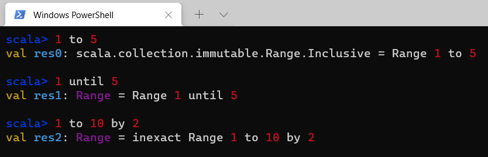
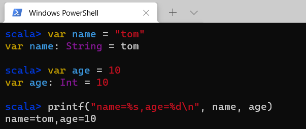
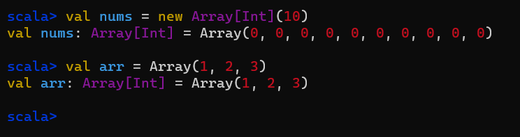

# 快学Scala

## Scala简介

Scala是一门现代的多范式编程语言，集成了面向对象和函数式语言的特性。

Scala运行于Java平台上，并兼容现有的Java程序，Scala代码可以调用Java方法，访问Java字段，继承Java类和实现Java接口。

Scala是一门非常纯粹的面向对象编程语言，在Scala中，每个值都是对象，每个操作都是方法调用。

Scala的优点：

- 具备强大的并发性，支持函数式编程，可以更好地支持分布式系统
- 语法简洁，能提供优雅的API
- 兼容Java，运行速度快，且能融合到Hadoop生态圈中

## Scala基础

### 声明值和变量

Scala有两种类型的变量，一种是val，是不可变的，在声明时就必须被初始化，而且初始化以后不能再赋值；

另一种是var，是可变的，声明的时候需要进行初始化，初始化以后还可以再次对其赋值。

Scala具有“类型推断”能力，可以自动推断出变量的类型。

### 基本数据类型和操作

Scala的数据类型包括：Byte、Char、Short、Int、Long、Float、Double和Boolean。

和Java不同的是，在Scala中，这些类型都是“类”，并且都是包scala的成员。

对于字符串，Scala用java.lang.String类来表示字符串。

在Scala中，可以使用加（+）、减（-）、乘（*）、除（/）、余数（%）等操作符，而且，这些操作符都是方法。

和Java不同，在Scala中并没有提供++和--操作符，当需要递增和递减时，可以采用如下方式表达：

```scala
scala> var num = 10
var num: Int = 10

scala> num -= 1

scala> num += 1

scala> println(num)
10
```

### Range

在执行for循环时，我们经常会用到数值序列，这时就可以采用Range来实现。

Range支持创建不同数据类型的数值序列。

在创建Range时，需要给出区间的起点和终点以及步长（默认步长为1）



### 打印语句

在Scala编程中，我们经常要打印输出结果，我们可以使用print、println来实现。

此外，Scala还带有C语言风格的格式化字符串的printf函数：



### 读写文件

1、写入文本文件

```scala
package org.example

import java.io.PrintWriter

object WriteFile {
  def main(args: Array[String]): Unit = {
    val filename = "output.txt"
    val out = new PrintWriter(filename)
    for (i <- 1 to 10) {
      out.println(i + ": HelloWorld!")
    }
    out.close()
  }
}

```


2、读取文本文件

```scala
package org.example

import scala.io.Source

object ReadFile {
  def main(args: Array[String]): Unit = {
    val filename = "output.txt"
    val inputFile = Source.fromFile(filename)
    val lines = inputFile.getLines()
    for (line <- lines) {
      println(line)
    }
  }
}

```

## 控制结构

### if条件表达式

在Scala中，执行if语句时，会首先检查if条件是否为真，如果为真，就执行对应的语句块，如果为假，就执行下一个条件分支。

和Java一样，if语句可以采用各种嵌套的形式，但是，有一点与Java不同，Scala中的if表达式的值可以赋值给变量

### while循环

Scala中的while循环语句和Java的类似。

```scala
var i = 9
while (i > 0) {
    i -= 1
    printf("i is %d\n",i)
}
```

### for循环

Scala中的for循环语句格式如下：

```scala
for (变量 <- 表达式) 语句块
```

其中，“变量<-表达式”被称为“生成器”

有时候，我们需要对结果进行进一步的处理，这时，就可以采用yield关键字，对过滤后的结果构建一个集合。

```scala
for (i <- 1 to 10 if i % 2 == 0) yield i
```

上面这种带有yield关键字的for循环，被称为“for推导式”。

这个概念源自函数式编程，也就是说，通过for循环遍历一个或多个集合，对集合中的元素进行“推导”，从而计算得到新的集合，用于后续的其他处理。

## 数据结构

### 数组

数组是编程中经常用到的数据结构，一般包括定长数组和变长数组。

定长数组，就是长度不变的数组，在Scala中使用Array进行声明。

和Java不同的是，在Scala中，对数组元素的应用，是使用圆括号，而不是方括号。



### 列表


## 函数式编程

## 集合操作

## 参考资料

[子雨大数据之Spark入门教程（Scala版](http://dblab.xmu.edu.cn/blog/spark/)

