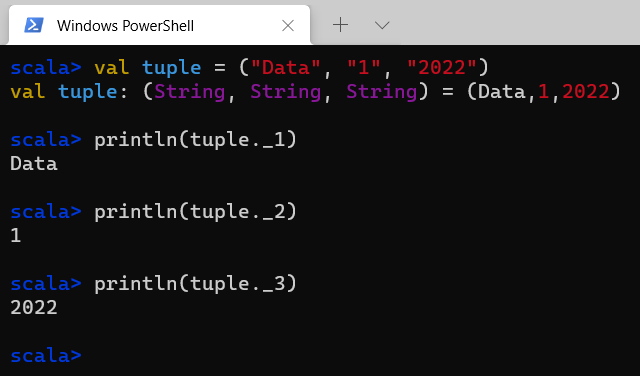
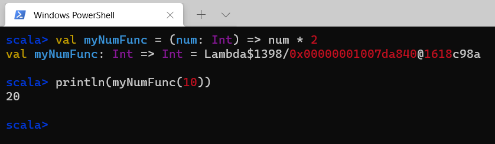
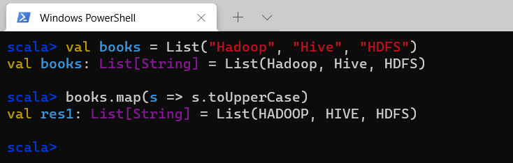
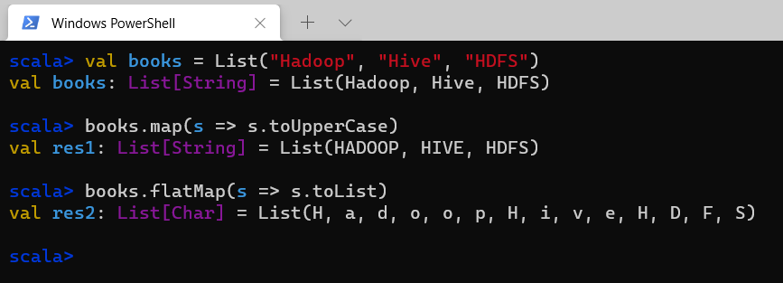
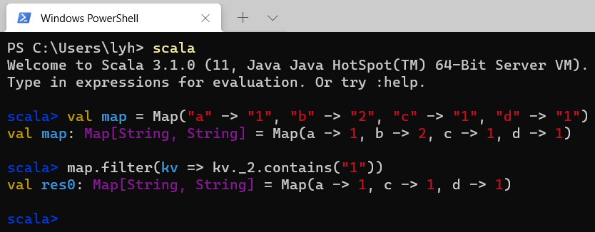
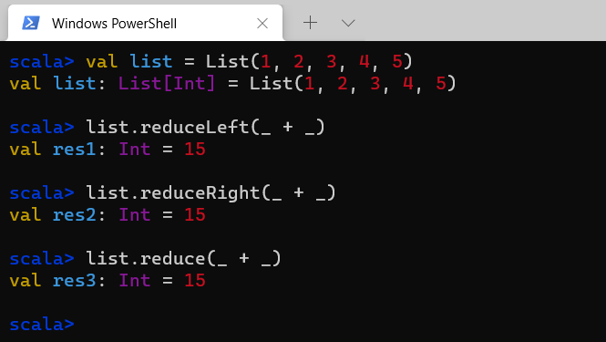
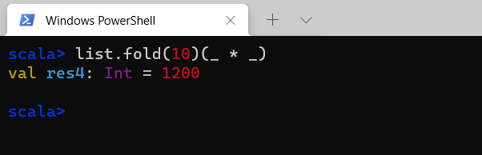

# 快学Scala

## Scala简介

Scala是一门现代的多范式编程语言，集成了面向对象和函数式语言的特性。

Scala运行于Java平台上，并兼容现有的Java程序，Scala代码可以调用Java方法，访问Java字段，继承Java类和实现Java接口。

Scala是一门非常纯粹的面向对象编程语言，在Scala中，每个值都是对象，每个操作都是方法调用。

Scala的优点：

- 具备强大的并发性，支持函数式编程，可以更好地支持分布式系统
- 语法简洁，能提供优雅的API
- 兼容Java，运行速度快，且能融合到Hadoop生态圈中

## Scala基础

### 声明值和变量

Scala有两种类型的变量，一种是val，是不可变的，在声明时就必须被初始化，而且初始化以后不能再赋值；

另一种是var，是可变的，声明的时候需要进行初始化，初始化以后还可以再次对其赋值。

Scala具有“类型推断”能力，可以自动推断出变量的类型。

### 基本数据类型和操作

Scala的数据类型包括：Byte、Char、Short、Int、Long、Float、Double和Boolean。

和Java不同的是，在Scala中，这些类型都是“类”，并且都是包scala的成员。

对于字符串，Scala用java.lang.String类来表示字符串。

在Scala中，可以使用加（+）、减（-）、乘（*）、除（/）、余数（%）等操作符，而且，这些操作符都是方法。

和Java不同，在Scala中并没有提供++和--操作符，当需要递增和递减时，可以采用如下方式表达：

```scala
scala> var num = 10
var num: Int = 10

scala> num -= 1

scala> num += 1

scala> println(num)
10
```

### Range

在执行for循环时，我们经常会用到数值序列，这时就可以采用Range来实现。

Range支持创建不同数据类型的数值序列。

在创建Range时，需要给出区间的起点和终点以及步长（默认步长为1）


### 打印语句

在Scala编程中，我们经常要打印输出结果，我们可以使用print、println来实现。

此外，Scala还带有C语言风格的格式化字符串的printf函数：


### 读写文件

1、写入文本文件

```scala
package org.example

import java.io.PrintWriter

object WriteFile {
  def main(args: Array[String]): Unit = {
    val filename = "output.txt"
    val out = new PrintWriter(filename)
    for (i <- 1 to 10) {
      out.println(i + ": HelloWorld!")
    }
    out.close()
  }
}

```


2、读取文本文件

```scala
package org.example

import scala.io.Source

object ReadFile {
  def main(args: Array[String]): Unit = {
    val filename = "output.txt"
    val inputFile = Source.fromFile(filename)
    val lines = inputFile.getLines()
    for (line <- lines) {
      println(line)
    }
  }
}

```

## 控制结构

### if条件表达式

在Scala中，执行if语句时，会首先检查if条件是否为真，如果为真，就执行对应的语句块，如果为假，就执行下一个条件分支。

和Java一样，if语句可以采用各种嵌套的形式，但是，有一点与Java不同，Scala中的if表达式的值可以赋值给变量

### while循环

Scala中的while循环语句和Java的类似。

```scala
var i = 9
while (i > 0) {
    i -= 1
    printf("i is %d\n",i)
}
```

### for循环

Scala中的for循环语句格式如下：

```scala
for (变量 <- 表达式) 语句块
```

其中，“变量<-表达式”被称为“生成器”

有时候，我们需要对结果进行进一步的处理，这时，就可以采用yield关键字，对过滤后的结果构建一个集合。

```scala
for (i <- 1 to 10 if i % 2 == 0) yield i
```

上面这种带有yield关键字的for循环，被称为“for推导式”。

这个概念源自函数式编程，也就是说，通过for循环遍历一个或多个集合，对集合中的元素进行“推导”，从而计算得到新的集合，用于后续的其他处理。

## 数据结构

### 数组

数组是编程中经常用到的数据结构，一般包括定长数组和变长数组。

定长数组，就是长度不变的数组，在Scala中使用Array进行声明。

和Java不同的是，在Scala中，对数组元素的应用，是使用圆括号，而不是方括号。


### 列表

列表有头部和尾部的概念，头部是一个元素，而尾部则仍然是一个列表。

由于列表的头部是一个元素，所以，我们可以使用::操作，在列表头部增加新的元素，得到一个新的列表。

Scala还为列表提供了一些常用的方法，比如，如果要实现求和，可以直接调用sum方法。

### 元组

元组是不同类型的值的聚集。元组和列表不同，列表中各个元素必须是相同类型，而元组可以包含不同类型的元素。



声明一个元组是很简单的，只需要用圆括号把多个元组的元素包围起来就可以了。

当我们要访问元组中的某个元素时，可以通过类似`tuple._1、tuple._2、tuple._3`这种方式就可以实现。

### 集合

集合(set)是不重复元素的集合。列表中的元素是按照插入的先后顺序来组织的，但是，集合中的元素并不会记录元素的插入顺序，而是以哈希的方式对元素的值进行组织，所以，它允许你快速地找到某个元素。

集合包括可变集合和不可变集合，缺省情况下创建的是不可变集合。

如果要声明一个可变集合，则需要引入scala.collection.mutable.Set包。

虽然可变集合和不可变集合都有添加或删除元素的操作，但是，二者有很大的区别。

对不可变集合进行操作，会产生一个新的集合，原来的集合并不会发生变化。

而对可变集合进行操作，改变的是集合本身。

### 映射

在Scala中，映射是一系列键值对的集合，也就是，建立了建和值之间的对应关系。

在映射中，所有的值，都可以通过键来获取。

映射包括可变和不可变两种，默认情况下创建的是不可变映射，如果需要创建可变映射，需要引入scala.collection.mutable.Map包。

循环遍历映射

```scala
for ((k, v) <- 映射) 语句块
```

### 迭代器

在Scala中，迭代器不是一个集合，但是，它提供了一种访问集合的方法。

当构建一个集合需要很大的开销时，迭代器就可以发挥很好的作用。

迭代器包含两个基本操作：next和hasNext

next可以返回迭代器的下一个元素

hasNext用于检测是否还有下一个元素

## 类

类和对象是Java、C++等面向对象编程的基础概念。类是用来创建对象的蓝图。定义好类以后，就可以使用new关键字来创建对象。

私有字段，外界无法访问，只有在类内部可以访问该字段，如果字段前面什么修饰符都没有，那么默认是public的，外部可以访问该字段。

对于类而言，我们并不需要声明为public，Scala文件中包含的多个类之间，都是彼此可见的。

对于方法的定义，是通过def实现的，在Scala中不返回任何值，那么就用Unit表示，相当于Java中的void类型，方法的返回值，不需要靠return语句，方法里面的最后一个表达式的值就是方法的返回值。

在Scala中，调用无参方法时，是可以省略方法名后面的圆括号的。

```scala
class TestCounter {
  private var value = 0

  def increment(): Unit = {
    value += 1
  }

  def current(): Int = {
    value
  }
}
```

## 对象

Scala并没有提供Java那样的静态方法或静态字段，但是，可以采用object关键字实现单例对象，具备和Java静态方法同样的功能。

在Java中，我们经常需要用到同时包含实例方法和静态方法的类，在Scala中可以通过伴生对象来实现。

当单例对象与某个类具有相同的名称时，它被称为这个类的“伴生对象”。类和它的伴生对象必须存在于同一个文件中，而且可以相互访问私有成员（字段和方法）。

apply方法和update方法

我们经常用到对象的apply方法和update方法，虽然我们表面上并没有察觉，但是，实际上，在Scala中，apply方法和update方法都会遵循相关的约定被调用，约定如下：

用括号传递给变量（对象）一个或多个参数时，Scala会把它转换成对apply方法的调用

在调用时，是把括号里的参数和等号右边的对象一起作为update方法的输入参数来执行调用

## 继承

Scala中的继承与Java有着显著的不同：

（1）重写一个非抽象方法必须使用override修饰符

（2）只有主构造器可以调用超类的主构造器

（3）在子类中重写超类的抽象方法时，不需要使用override关键字

（4）可以重写超类中的字段

Scala和Java一样，不允许从多个超类继承。

抽象类

```scala
// 是抽象类，不能直接被实例化
abstract class Car {
  // 字段没有初始化值，就是一个抽象字段
  val carBrand: String
  // 抽象方法，不需要使用abstract关键字
  def info()
  def greeting(): Unit = {
    println("Welcome to my car!")
  }
}

```

1、定义一个抽象类，需要使用关键字abstract

2、定义一个抽象类的抽象方法，也不需要关键字abstract，只要把方法体空着，不写方法体就可以

3、抽象类中定义的字段，只要没有给出初始化值，就表示是一个抽象字段，但是，抽象字段必须要声明类型

```scala
class BMWCar extends Car {
  override val carBrand: String = "BMW"

  override def info(): Unit = {
    printf("This is a %s car. It is expensive.\n", carBrand)
  }

  override def greeting(): Unit = super.greeting()
}

class BYDCar extends Car {
  override val carBrand: String = "BYD"

  override def info(): Unit = {
    printf("This is a %s car. It is cheap.\n", carBrand)
  }

  override def greeting(): Unit = super.greeting()
}

object MyCar {
  def main(args: Array[String]): Unit = {
    val myCar1 = new BMWCar()
    val myCar2 = new BYDCar()
    myCar1.greeting()
    myCar1.info()
    myCar2.greeting()
    myCar2.info()
  }
}

```

## 特质

Java中提供了接口，允许一个类实现任意数量的接口。在Scala中没有接口的概念，而是提供了trait，它不仅实现了接口的功能，还具备了很多其他特性。

Scala的特质，是代码重用的基本单元。可以同时拥有抽象方法和具体方法。

Scala中，一个类只能继承自一个超类，却可以实现多个特质，从而重用特质中的方法和字段，实现了多重继承。

特质也可以包含具体实现，也就是说，特质中的字段和方法不一定要是抽象的。

## 模式匹配

Java中有switch-case语句，但是，只能按顺序匹配简单的数据类型和表达式。相对而言，Scala中的模式匹配的功能则强大得多，可以应用到switch语句、类型检查、“解构”等多种场合。

简单匹配

```scala
val colorNum = 4
val colorStr = colorNum match {
    case 1 => "red"
    case 2 => "green"
    case 3 => "yellow"
    case unexpected => unexpected + " is Not Allowed"
}
println(colorStr)
```

类型匹配

```scala
for (elem <- List(9, 12.3, "Spark", "Hadoop", 'Hello)) {
    var str = elem match {
        case i: Int => i + " is an int value."
        case d: Double => d + " is an double value."
        case "Spark" => "Spark is found."
        case s: String => s + " is a string value."
        case _ => "This is an unexpected value."
    }
    println(str)
}
```

## 函数式编程

Scala是一门多范式编程语言，混合了面向对象编程和函数式编程的风格。

函数式编程可以较好满足分布式并行编程的需求。

函数式编程一个重要特性就是值不可变性，这对于编写可扩展的并发程序而言可以带来巨大好处，因为它避免了对公共的可变状态进行同步访问控制的复杂问题。

函数字面量

函数式编程中，函数的“类型”和”值“也成为两个分开的概念，函数的”值“，就是”函数字面量“

采用Scala语法来定义一个函数，如下：

```scala
val counter: Int => Int = {(value) => value += 1}
```

在Scala中，函数已经是”头等公民“，单独剥离出来了”值“的概念，一个函数”值“就是函数字面量。

匿名函数、Lambda表达式与闭包

Lambda表达式形式如下：

```scala
(参数) => 表达式 // 如果参数只有一个，参数的圆括号可以省略
```



闭包是一个函数，一种比较特殊的函数，闭包会引用函数外部的变量 ，而且闭包对捕获变量做出的改变在闭包外也是可见的。


高阶函数：函数在Scala中是”头等公民“，它的使用方法和任何其他变量是一样的。一个接受其他函数作为参数或者返回一个函数的函数就是高阶函数。

## 集合操作

### 遍历操作

List、Map等数据结构经常需要进行遍历操作。

```scala
// 列表遍历
val list = List(1, 2, 3, 4, 5)
for (elem <- list) {
    println(elem)
}
list.foreach(elem => println(elem))
```

```scala
// 映射遍历
val map = Map("a" -> 1, "b" -> 2, "c" -> 3)
for ((k, v) <- map) {
    printf("key=%s, value=%d\n", k, v)
}
// 遍历键
for (k <- map.keys) {
    println(k)
}
// 遍历值
for (v <- map.values) {
    println(v)
}
```

### map操作

map操作是针对集合的典型变换操作，它将某个函数应用到集合中的每个元素，并产生一个结果集合。



### flatMap操作

flatMap是map的一种扩展。在flatMap中，我们会传入一个函数，该函数对每个输入都会返回一个集合（而不是一个元素），然后，flatMap把生成的多个集合”拍扁“成为一个集合。



### filter操作

在实际编程中，我们经常会用到一种操作，遍历一个集合并从中获取满足指定条件的元素组成一个新的集合。Scala中可以通过filter操作来实现。



### reduce操作

在Scala中，我们可以使用reduce这种二元操作对集合中的元素进行归约。

reduce包含reduceLeft和reduceRight两种操作，前者从集合的头部开始操作，后者从集合的尾部开始操作。



实际上，我们可以直接使用reduce，而不用reduceLeft和reduceRight，这时，默认采用reduceLeft。

### fold操作

折叠（fold）操作和归约（reduce）操作比较类似。fold操作需要从一个初识的”种子“值开始，并以该值作为上下文，处理集合中的每个元素。



fold函数需要两个参数，一个参数是初识种子值，另一个参数是用于计算结果的累计函数。

fold有两个变体：foldLeft()和foldRight()

foldLeft：第一个参数为累计值，集合遍历的方向是从左到右

foldRight：第二个参数为累计值，集合遍历的方向是从右到左

对于fold()自身而言，遍历的顺序是未定义的，不过，一般都是从左到右遍历。

## 函数式编程实例：WordCount

任务：按照函数式编程的风格，编写一个程序，对某个目录下所有文件中的单词进行词频统计

```scala
import java.io.File
import scala.io.Source

object WordCount {
  def main(args: Array[String]): Unit = {
    val dir = new File("input")
    val files = dir.listFiles
    for (file <- files) {
      println(file)
    }
    val listFiles = files.toList
    val wordsMap = scala.collection.mutable.Map[String, Int]()
    listFiles.foreach(file => Source.fromFile(file).getLines().foreach(line => line.split(" ").foreach(
      word => {
        if (wordsMap.contains(word)) {
          wordsMap(word) += 1
        } else {
          wordsMap += (word -> 1)
        }
      }
    )))
    println(wordsMap)
    for ((k, v) <- wordsMap) {
      println(k + ": " + v)
    }
  }
}

```


## 参考资料

[子雨大数据之Spark入门教程（Scala版）](http://dblab.xmu.edu.cn/blog/spark/)

