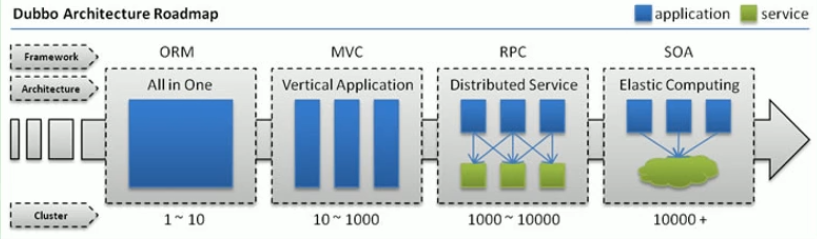
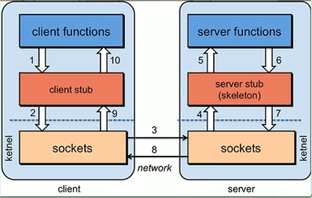
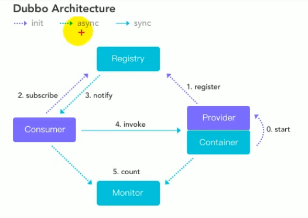
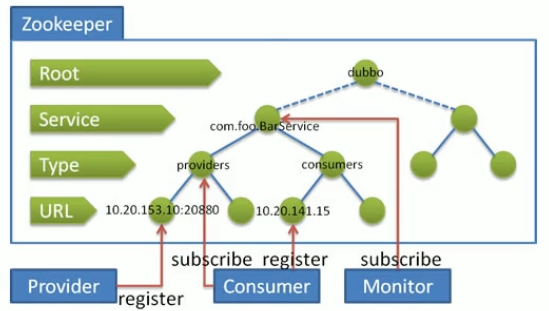

# Dubbo学习笔记（一）

从分布式系统的基本概念出发，由浅入深，讲解了RPC原理，Dubbo基本使用，Dubbo高可用场景以及Dubbo原理，涉及了分布式系统中服务注册、服务发现、负载均衡、灰度发布、集群容错、服务降级等核心概念的讲解及演示。通过学习，大家对分布式系统会有一个清晰的认识，为后来开发大型分布式项目奠定良好基础。

[](https://www.bilibili.com/video/BV1ns411c7jV)

## 分布式基础理论

### 1.1）什么是分布式系统？

分布式系统是若干独立计算机的集合，这些计算机对于用户来说就像单个相关系统。

分布式系统是建立在网络之上的软件系统。

### 1.2）发展演变



### 1.3）RPC

RPC【Remote Procedure Call】是指远程过程调用，是一种进程间的通信方式。



RPC两个核心模块：通讯、序列化

RPC框架：Dubbo、gRPC、Thrift、HSF……

## Dubbo 核心概念

Apache Dubbo是一款高性能、轻量级的开源Java RPC框架，它提供了三大核心能力：面向接口的远程方法调用，智能容错和负载均衡，以及服务自动注册和发现。

官网：[http://dubbo.apache.org](https://dubbo.apache.org/zh/)

架构设计




## Dubbo 环境搭建

推荐使用Zookeeper注册中心

Zookeeper是Apache Hadoop的子项目，是一个树型的目录服务，支持变更推送，适合作为Dubbo服务的注册中心，工业强度较高，可用于生产环境。




Dubbo：[https://github.com/apache/dubbo](https://github.com/apache/dubbo)

安装Dubbo-admin

下载地址：[https://github.com/apache/dubbo-admin](https://github.com/apache/dubbo-admin)

## Dubbo-HelloWorld

提出需求

某个电商系统，订单服务需要调用用户服务获取某个用户的所有地址

我们现在 需要创建两个服务模块进行测试

| 模块                | 功能           |
| ------------------- | -------------- |
| 订单服务web模块     | 创建订单等     |
| 用户服务service模块 | 查询用户地址等 |

测试预期结果

订单服务web模块在A服务器，用户服务模块在B服务器，A可以远程调用B的功能。

Provider.xml

```xml
<?xml version="1.0" encoding="UTF-8"?>
<beans xmlns="http://www.springframework.org/schema/beans"
       xmlns:xsi="http://www.w3.org/2001/XMLSchema-instance"
       xmlns:dubbo="http://dubbo.apache.org/schema/dubbo"
       xsi:schemaLocation="http://www.springframework.org/schema/beans
       http://www.springframework.org/schema/beans/spring-beans-4.3.xsd 
       http://dubbo.apache.org/schema/dubbo
       http://dubbo.apache.org/schema/dubbo/dubbo.xsd">
<!--    1、指定当前服务/应用的名字（同样的服务名字相同，不要和别的服务同名）-->
    <dubbo:application name="user-service-provider"></dubbo:application>
<!--    2、指定注册中心的位置 -->
    <dubbo:registry address="zookeeper://127.0.0.1:2181"></dubbo:registry>
<!--    3、指定通信规则（通信协议 通信端口）-->
    <dubbo:protocol name="dubbo" port="20880"></dubbo:protocol>
<!--    4、暴露服务 -->
    <dubbo:service interface="org.example.mall.service.UserService" ref="userServiceImpl"></dubbo:service>
<!--    服务实现 -->
    <bean id="userServiceImpl" class="org.example.mall.service.impl.UserServiceImpl"></bean>
<!--    连接监控中心-->
    <dubbo:monitor protocol="registry"></dubbo:monitor>
</beans>
```

Consumer.xml

```xml
<?xml version="1.0" encoding="UTF-8"?>
<beans xmlns="http://www.springframework.org/schema/beans"
       xmlns:xsi="http://www.w3.org/2001/XMLSchema-instance"
       xmlns:dubbo="http://dubbo.apache.org/schema/dubbo" xmlns:context="http://www.springframework.org/schema/context"
       xsi:schemaLocation="http://www.springframework.org/schema/beans
       http://www.springframework.org/schema/beans/spring-beans-4.3.xsd
       http://dubbo.apache.org/schema/dubbo
       http://dubbo.apache.org/schema/dubbo/dubbo.xsd http://www.springframework.org/schema/context http://www.springframework.org/schema/context/spring-context.xsd">
    <context:component-scan base-package="org.example.mall.service.impl"></context:component-scan>

    <dubbo:application name="order-service-consumer"></dubbo:application>

    <dubbo:registry address="zookeeper://127.0.0.1:2181"></dubbo:registry>

<!-- 声明需要调用的远程服务接口：生成远程服务代理 -->
    <dubbo:reference interface="org.example.mall.service.UserService" id="userService"></dubbo:reference>
    <!--    连接监控中心-->
    <dubbo:monitor protocol="registry"></dubbo:monitor>

</beans>
```


## 监控中心

使用maven构建`dubbo-monitor-simple`

解压`dubbo-monitor-simple-2.0.0-assembly.tar`

修改配置文件`dubbo.properties`，启动监控中心`start.bat`


添加如下配置，连接到监控中心

```xml
<!--    连接监控中心-->
<dubbo:monitor protocol="registry"></dubbo:monitor>
```


## 整合SpringBoot

引入依赖

```xml
<dependency>
    <groupId>com.alibaba.boot</groupId>
    <artifactId>dubbo-spring-boot-starter</artifactId>
    <version>0.2.0</version>
</dependency>
```


用户服务（提供者）

```properties
server.port=9001

dubbo.application.name=user-service-provider
dubbo.registry.address=127.0.0.1:2181
dubbo.registry.protocol=zookeeper

dubbo.protocol.name=dubbo
dubbo.protocol.port=20880

dubbo.monitor.protocol=register
```

```java
@Service
@Component
public class UserServiceImpl implements UserService {
    @Override
    public List<UserAddress> getUserAddressList(String userId) {
        UserAddress userAddress1 = new UserAddress(1, "北京市", "1", "刘老师", "17860787566", "Y");
        UserAddress userAddress2 = new UserAddress(2, "青岛市", "1", "张老师", "17860787599", "N");
        return Arrays.asList(userAddress1, userAddress2);
    }
}
```


订单服务（消费者）

```properties
server.port=9002

dubbo.application.name=order-service-consumer
dubbo.registry.address=zookeeper://127.0.0.1:2181

dubbo.monitor.protocol=register
```

```java
@Service
public class OrderServiceImpl implements OrderService {

    @Reference
    private UserService userService;

    @Override
    public List<UserAddress> initOrder(String userId) {
        System.out.println("用户id: " + userId);
        List<UserAddress> addressList = userService.getUserAddressList(userId);
        addressList.forEach(System.out::println);
        return addressList;
    }
}
```

```java
@Controller
public class OrderController {
    @Autowired
    private OrderService orderService;

    @RequestMapping(value = "/initOrder", method = RequestMethod.GET)
    @ResponseBody
    public List<UserAddress> initOrder(@RequestParam("uid") String userId) {
        return orderService.initOrder(userId);
    }
}
```

暴露服务：`@Service`

引用服务：`@Reference`

## 参考资料

[尚硅谷Dubbo教程(dubbo经典之作)](https://www.bilibili.com/video/BV1ns411c7jV)

