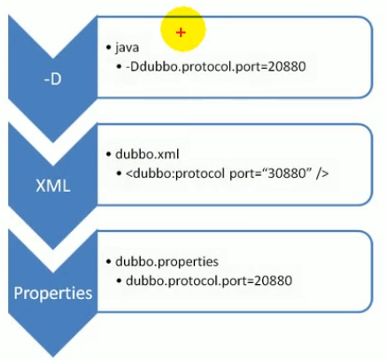
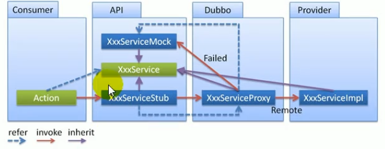
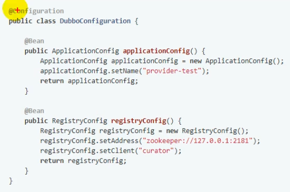
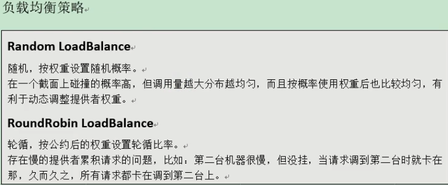
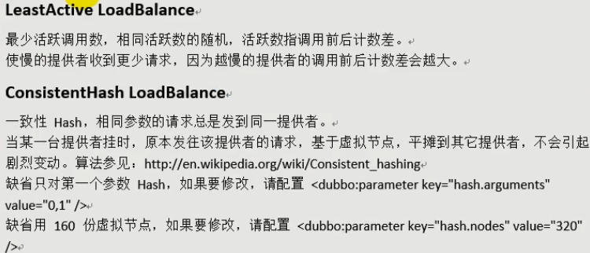
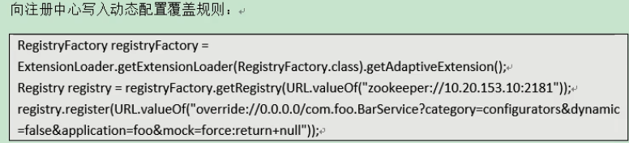
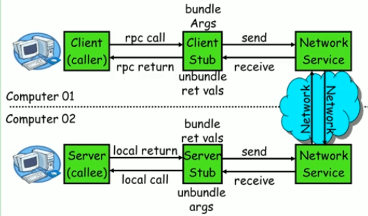
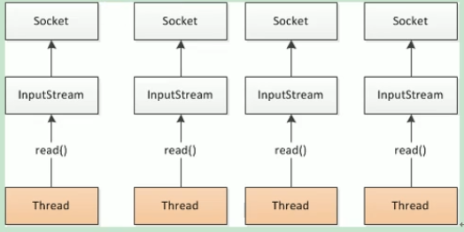
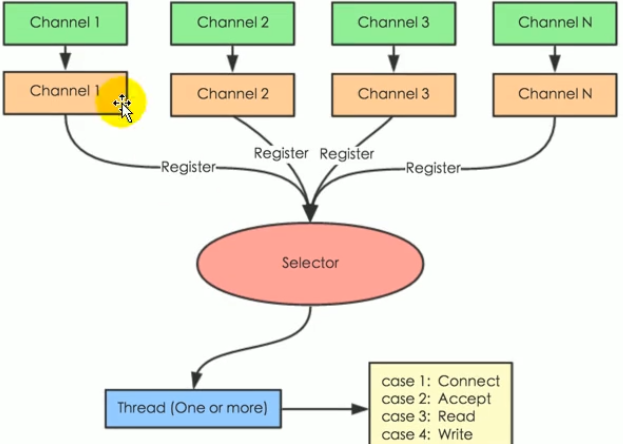
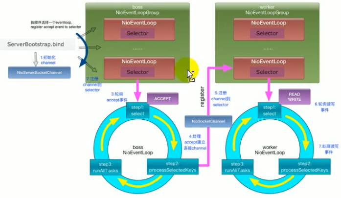

# Dubbo学习笔记（二）

## Dubbo常用配置

### 覆盖策略



规则：

1、精确优先（方法级优先，接口次之，全局配置再次之）

2、消费者设置优先（如果级别一样，则消费方优先，提供方次之）

### 启动时检查

Dubbo缺省会在启动时检查依赖的服务是否可用，不可用时会抛出异常，阻止Spring初始化完成，以便上线时，能及早发现问题，默认`check="true"`

可以通过`check="false"`关闭检查，比如，测试时，有些服务不关心，或者出现了循环依赖，必须有一方先启动。

### 超时

`timeout="3000"`

单位毫秒

默认是1000毫秒

### 重试次数

`retries=""` 重试次数，不包含第一次调用，0代表不重试

幂等方法（设置重试次数）【查询、删除、修改……】

非幂等方法（不能设置重试次数）【新增】

### 多版本

当一个接口实现，出现不兼容升级时，可以用版本号过渡，版本号不同的服务相互间不引用。

可以按照以下的步骤进行版本迁移：

0. 在低压力时间段，先升级一半提供者为新版本
1. 再将所有消费者升级为新版本
2. 然后将剩下的一半提供者升级为新版本

`version="1.0.0"`

`version="2.0.0"`

`version="*"`

### 本地存根



```xml
<dubbo:service interface="com.foo.BarService" stub="com.foo.BarServiceStub" />
```

### Spring Boot 与 Dubbo整合的三种方式

1. 导入dubbo-starter，在application.properties配置属性，使用`@Service`暴露服务，使用`@Reference`引用服务
2. 导入dubbo-starter，保留dubbo xml 配置文件，使用`@ImportResource(locations="classpath:provider.xml")`
3. 使用注解API的方式，将每一个组件手动创建到容器中，让Dubbo扫描其他的组件



## Dubbo高可用

### Zookeeper宕机

现象：Zookeeper注册中心宕机，还可以消费Dubbo暴露的服务

原因：


高可用：通过设计，减少系统不能服务的时间

### 负载均衡机制

在集群负载均衡时，Dubbo提供了多种负载均衡策略，缺省时为random随机调用





可以通过`loadbalance=""`来指定负载均衡策略

### 服务降级

当服务器压力剧增的情况下，根据实际业务情况及流量，对一些服务和页面有策略地不处理或换种简单的方式处理，从而释放服务器资源以保证核心交易正常运作或高效运作。

可以通过服务降级功能临时屏蔽某个出错的非关机服务，并定义降级后的返回策略。



- `mock=force:return+null`表示消费方对该服务的方法调用都直接返回null值，不发起远程调用。用来屏蔽不重要服务不可用时，对调用方的影响。
- `mock=fail:return+null`表示消费方对该服务的方法调用在失败后，再返回null值，不抛出异常。用来容忍不重要服务不稳定时对调用方的影响。


### 服务容错

在集群调用失败时，Dubbo提供了多种容错方案，缺省为failover重试。

可以通过整合Hystrix来进行服务容错

[spring-cloud-starter-netflix-hystrix](https://mvnrepository.com/artifact/org.springframework.cloud/spring-cloud-starter-netflix-hystrix)

```xml
<dependency>
    <groupId>org.springframework.cloud</groupId>
    <artifactId>spring-cloud-starter-netflix-hystrix</artifactId>
    <version>2.2.10.RELEASE</version>
</dependency>

```

在Application类上增加`@EnableHystrix`来启动Hystrix

使用`@HystrixCommand`来处理容错异常

## Dubbo原理

### RPC原理&Netty原理



Netty是一个异步事件驱动的网络应用程序框架，用于快速开发可维护的高性能协议服务器和客户端。它极大地简化了TCP、UDP等网络编程。

BIO：（Blocking IO）



NIO：（Non-Blocking IO）



Netty通信原理



### 框架设计


- **config 配置层**：对外配置接口，以 `ServiceConfig`, `ReferenceConfig` 为中心，可以直接初始化配置类，也可以通过 spring 解析配置生成配置类
- **proxy 服务代理层**：服务接口透明代理，生成服务的客户端 Stub 和服务器端 Skeleton, 以 `ServiceProxy` 为中心，扩展接口为 `ProxyFactory`
- **registry 注册中心层**：封装服务地址的注册与发现，以服务 URL 为中心，扩展接口为 `RegistryFactory`, `Registry`, `RegistryService`
- **cluster 路由层**：封装多个提供者的路由及负载均衡，并桥接注册中心，以 `Invoker` 为中心，扩展接口为 `Cluster`, `Directory`, `Router`, `LoadBalance`
- **monitor 监控层**：RPC 调用次数和调用时间监控，以 `Statistics` 为中心，扩展接口为 `MonitorFactory`, `Monitor`, `MonitorService`
- **protocol 远程调用层**：封装 RPC 调用，以 `Invocation`, `Result` 为中心，扩展接口为 `Protocol`, `Invoker`, `Exporter`
- **exchange 信息交换层**：封装请求响应模式，同步转异步，以 `Request`, `Response` 为中心，扩展接口为 `Exchanger`, `ExchangeChannel`, `ExchangeClient`, `ExchangeServer`
- **transport 网络传输层**：抽象 mina 和 netty 为统一接口，以 `Message` 为中心，扩展接口为 `Channel`, `Transporter`, `Client`, `Server`, `Codec`
- **serialize 数据序列化层**：可复用的一些工具，扩展接口为 `Serialization`, `ObjectInput`, `ObjectOutput`, `ThreadPool`

### 标签解析

TODO: 阅读Dubbo源码

### 服务暴露流程

TODO: 阅读Dubbo源码

### 服务引用流程

TODO: 阅读Dubbo源码

### 服务调用流程

TODO: 阅读Dubbo源码

