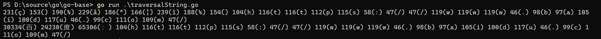

# Go语言基础

Go语言是Google开发的开源编程语言，其在多核并发上拥有原生的设计优势。

Go 语言被称为“互联网时代的C语言”。Go 语言的风格类似于C语言，其语法在C语言的基础上进行了大幅的简化。

## 学习路线图


https://github.com/Alikhll/golang-developer-roadmap

## 基本类型

**整型**

按长度分为：`int8`、`int16`、`int32`、`int64`

对应的无符号整型：`uint8`、`uint16`、`uint32`、`uint64`

**浮点型**

Go语言支持两种浮点型整数：`float32`和`float64`

**复数**

`complex64`和`complex128`

复数有实部和虚部，`complex64`的实部和虚部为32位，`complex128`的实部和虚部为64位。

**布尔值**

Go语言中以`bool`类型进行声明布尔型数据，布尔型数据只有`true`和`false`两个值。

>注意：
>
>布尔类型变量的默认值为false
>
>Go语言中不允许将整型强制转换为布尔型
>
>布尔型无法参与数值运算，也无法与其他类型进行转换

**字符串**

Go语言里的字符串内部使用UTF-8编码，字符串的值为双引号中的内容。

```go
s1 := "hello"
s2 := "祖国"
```

Go语言中要定义一个多行字符串时，就必须使用`反引号`

```go
s1 := `这是第一行
这是第二行
这是第三行
`
```

反引号间换行被作为字符串中的换行，但是所有转义字符均无效，文本将会原样输出。

常用操作：

| 方法                                 | 介绍           |
| ------------------------------------ | -------------- |
| len                                  | 求长度         |
| + 或 fmt.Sprintf                     | 字符串拼接     |
| strings.Split                        | 字符串分割     |
| strings.Contains                     | 判断是否包含   |
| strings.HasPrefix, strings.HasSuffix | 前缀/后缀判断  |
| strings.Index, strings.LastIndex     | 子串出现的位置 |
| strings.Join                         | 拼接           |

**byte和rune**

组成每个字符串的元素叫做“字符”，字符要用单引号包裹起来。

```go
var c1 = '祖'
var c2 = '国'
```

Go语言的字符有以下两种：

> uint8类型，或者叫byte型，代表了ASCII码的一个字符
>
> rune类型，代表一个UTF-8字符

rune类型实际是一个int32

Go语言使用了特殊的rune类型来处理Unicode，让基于Unicode的文本处理更为方便，也可以使用byte类型进行默认字符串处理。

```go
package main

import "fmt"

func main() {
	s := "百度：https://www.baidu.com/"
	// 遍历字符串
	// byte
	for i := 0; i < len(s); i++ {
		fmt.Printf("%v(%c) ", s[i], s[i])
	}
	fmt.Println()
	// rune
	for _, r := range s {
		fmt.Printf("%v(%c) ", r, r)
	}
	fmt.Println()
}

```



因为UTF8编码下一个中文汉字由`3~4`个字节组成，所以我们不能简单的按照字节去遍历一个包含中文的字符串，否则就会出现上面输出中第一行的结果。

字符串底层是一个byte数组，所以可以和[]byte类型相互转换。字符串是不能修改的 字符串是由byte字节组成，所以字符串的长度是byte字节的长度。 rune类型用来表示utf8字符，一个rune字符由一个或多个byte组成。

要修改字符串，需要先将其转换成`[]rune或[]byte`，完成后再转换为`string`。无论哪种转换，都会重新分配内存，并复制字节数组。

## 数组Array

## 切片Slice

## 指针

## Map

## 结构体

