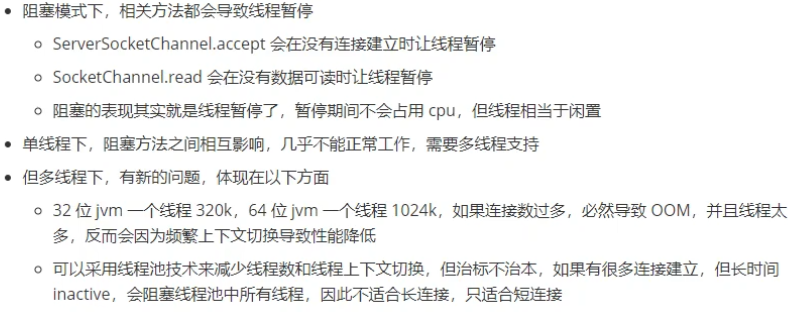
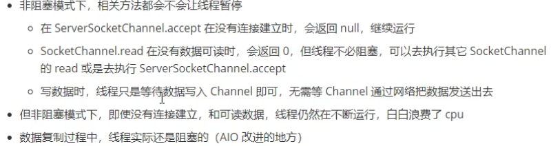
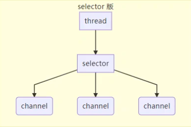
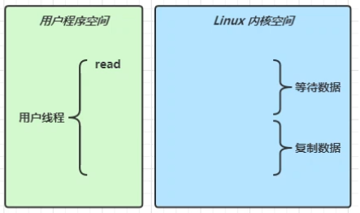

# Netty学习笔记（一）

在的互联网环境下，分布式系统大行其道，而分布式系统的根基在于网络编程，而 Netty 恰恰是 Java 领域网络编程的王者。如果要致力于开发高性能的服务器程序、高性能的客户端程序，必须掌握 Netty。

视频链接：[黑马程序员Netty全套教程，全网最全Netty深入浅出教程，Java网络编程的王者](https://www.bilibili.com/video/BV1py4y1E7oA)

## NIO基础

non-blocking io 非阻塞IO

### 1、三大组件

Channel、Buffer、Selector

Channel 有一点类似于 stream，它就是读写数据的双向通道

常见的Channel有：

- FileChannel
- DatagramChannel
- SocketChannel
- ServerSocketChannel

Buffer则用来缓冲读写数据，常见的Buffer有：

- ByteBuffer
- ShortBuffer
- IntBuffer
- LongBuffer
- FloatBuffer
- DoubleBuffer
- CharBuffer

服务器设计——多线程版

❗ 缺点：

- 内存占用高
- 线程上下文切换成本高
- 只适合连接少的场景

服务器设计——线程池版

❗ 缺点：

- 阻塞模式下，线程仅能处理一个socket连接
- 仅适合短连接场景

服务器设计——Selector版

Selector的作用就是配合一个线程来管理多个channel，获取这些channel上发生的事件，这些channel工作在非阻塞模式下，不会让线程吊死在一个channel上，适合连接数特别多，但流量低的场景（low traffic）

调用selector的select()会阻塞直到channel发生了读写就绪事件，这些事件发生，select方法就会返回这些事件交给thread来处理

### 2、ByteBuffer

正确使用姿势：

1. 向buffer写入数据，例如调用`channel.read(buffer)`
2. 调用`flip()`切换至读模式
3. 从buffer读取数据，例如调用`buffer.get()`
4. 调用`clear()` 或 `compact()`切换至写模式
5. 重复1-4步骤

```java
@Slf4j
public class TestByteBuffer {
    public static void main(String[] args) {
        // FileChannel
        // 1、输入输出流 2、RandomAccessFile
        try (FileChannel channel = new FileInputStream("data.txt").getChannel()) {
            // 准备缓存区
            ByteBuffer buffer = ByteBuffer.allocate(10);
            while (true) {
                // 从channel读取数据，向buffer写入
                int len = channel.read(buffer);
                log.debug("读取到的字节数 {}", len);
                if (len == -1) { // 没有内容
                    break;
                }
                // 打印buffer的内容
                buffer.flip(); // 切换读模式
                while (buffer.hasRemaining()) { // 是否还有剩余未读数据
                    byte b = buffer.get();
                    log.debug("读取到的字节 {}", (char) b);
                }
                // 切换写模式
                buffer.clear();
            }
        } catch (IOException e) {
            e.printStackTrace();
        }
    }
}
```

ByteBuffer有以下重要属性：

- capacity
- position
- limit

写模式下，position是写入位置，limit等于容量

flip动作发生后，position切换为读取位置，limit切换为读取限制

常见方法：

分配空间

可以使用allocate方法为ByteBuffer分配空间

```java
        /*
         * class java.nio.HeapByteBuffer    java堆内存，读写效率较低，受到gc影响
         * class java.nio.DirectByteBuffer  直接内存，读写效率高（少一次拷贝），不受gc影响，分配效率低
         */
System.out.println(ByteBuffer.allocate(16).getClass());
System.out.println(ByteBuffer.allocateDirect(16).getClass());
```

写入数据

- 调用channel的read方法
- 调用buffer自己的put方法

读取数据

- 调用channel的write方法
- 调用buffer自己的get方法

get方法会让position读指针向后走，如果想重复读取数据

- 可以调用rewind方法将position重新置为0
- 或者调用get(int i)方法获取索引i的内容，它不会移动读指针

```java
public class TestByteBufferRead {
    public static void main(String[] args) {
        ByteBuffer buffer = ByteBuffer.allocate(16);
        buffer.put(new byte[]{'a', 'b', 'c', 'd'});
        buffer.flip();

        // 从头开始读
        buffer.get(new byte[4]);
        ByteBufferUtil.debugAll(buffer);
        buffer.rewind();
        System.out.println((char) buffer.get());
        buffer.rewind();
        // mark & reset
        // mark 做一个标记，记录position位置，reset是将position重置到mark的位置
        System.out.println((char) buffer.get());
        System.out.println((char) buffer.get());
        buffer.mark(); // 加标记，索引为2的位置
        System.out.println((char) buffer.get());
        System.out.println((char) buffer.get());
        buffer.reset(); // 将position重置到上次标记的位置
        System.out.println((char) buffer.get());
        System.out.println((char) buffer.get());
        // get(i) 不会改变读索引的位置
        System.out.println((char) buffer.get(1));
        ByteBufferUtil.debugAll(buffer);
    }
}
```

字符串与ByteBuffer互转

```java
public class TestByteBufferString {
    public static void main(String[] args) {
        // 1. 字符串转为ByteBuffer
        ByteBuffer buffer = ByteBuffer.allocate(16);
        buffer.put("hello".getBytes());
        ByteBufferUtil.debugAll(buffer);
        // 2. Charset
        ByteBuffer buffer1 = StandardCharsets.UTF_8.encode("hello");
        ByteBufferUtil.debugAll(buffer1);
        // 3. wrap
        ByteBuffer buffer2 = ByteBuffer.wrap("hello".getBytes(StandardCharsets.UTF_8));
        ByteBufferUtil.debugAll(buffer2);
        // 转为字符串
        String s = StandardCharsets.UTF_8.decode(buffer2).toString();
        System.out.println(s);
        buffer.flip();
        String s1 = StandardCharsets.UTF_8.decode(buffer).toString();
        System.out.println(s1);
    }
}
```

Scattering Reads

分散读取，有一个文本文件`3parts.txt`

```java
public class TestScatteringReads {
    public static void main(String[] args) {
        try (FileChannel channel = new RandomAccessFile("3parts.txt", "r").getChannel()) {
            ByteBuffer b1 = ByteBuffer.allocate(3);
            ByteBuffer b2 = ByteBuffer.allocate(3);
            ByteBuffer b3 = ByteBuffer.allocate(5);
            channel.read(new ByteBuffer[]{b1, b2, b3});
            b1.flip();
            b2.flip();
            b3.flip();
            ByteBufferUtil.debugAll(b1);
            ByteBufferUtil.debugAll(b2);
            ByteBufferUtil.debugAll(b3);
        } catch (IOException e) {
            e.printStackTrace();
        }
    }
}
```


Gathering Writes

```java
public class TestGatheringWrites {
    public static void main(String[] args) {
        ByteBuffer b1 = StandardCharsets.UTF_8.encode("hello");
        ByteBuffer b2 = StandardCharsets.UTF_8.encode("world");
        ByteBuffer b3 = StandardCharsets.UTF_8.encode("您好");
        try (FileChannel channel = new RandomAccessFile("words.txt", "rw").getChannel()) {
            channel.write(new ByteBuffer[]{b1, b2, b3});
        } catch (IOException e) {
            e.printStackTrace();
        }
    }
}
```


ByteBuffer 黏包 半包

需求：

```java
/*
网络上有多条数据发送给服务端，数据之间使用 \n 进行分隔
但由于某种原因这些数据在接收时，被进行了重新组合，例如原始数据有3条为
Hello,world\n
I'm zhangsan\n
How are you?\n
变成了下面的两个ByteBuffer（黏包，半包）
Hello,world\nI'm zhangsan\nHo
w are you?\n
现在要求你编写程序，将错乱的数据恢复成原始的按 \n 分隔的数据
*/
```

具体实现：

```java
package com.example.netty.ch1;

import com.example.netty.utils.ByteBufferUtil;

import java.nio.ByteBuffer;

public class TestByteBufferCase {
    public static void main(String[] args) {
        ByteBuffer source = ByteBuffer.allocate(32);
        source.put("Hello,world\nI'm zhangsan\nHo".getBytes());
        split(source);
        source.put("w are you?\n".getBytes());
        split(source);
    }

    private static void split(ByteBuffer source) {
        source.flip();
        for (int i = 0; i < source.limit(); i++) {
            // 找到一条完整的消息
            if (source.get(i) == '\n') {
                int length = i + 1 - source.position();
                // 把完整消息存入新的ByteBuffer
                ByteBuffer target = ByteBuffer.allocate(length);
                // 从source读，向target写
                for (int j = 0; j < length; j++) {
                    byte b = source.get();
                    target.put(b);
                }
                ByteBufferUtil.debugAll(target);
            }
        }
        source.compact();
    }
}
```


### 3、文件编程

FileChannel

⚠注意

> FileChannel 只能工作在阻塞模式下

获取FileChannel

- 通过FileInputStream获取的channel只能读
- 通过FileOuputStream获取的channel只能写
- 通过RandomAccessFile是否能读写根据构造RandomAccessFile时的读写模式决定

读取

会从channel读取数据填充ByteBuffer，返回值表示读到了多少字节，-1表示到达了文件的末尾

```java
int len = channel.read(buffer);
```

写入

```;
ByteBuffer buffer = ...;
buffer.put(...); // 写入数据
buffer.flip(); // 切换读模式

while (buffer.hasRemaining()) {
	channel.write(buffer);
}
```

关闭

channel必须关闭

```java
channel.close();
```

两个Channel传输数据

```java
public class TestFileChannelTransferTo {
    public static void main(String[] args) {
        try (FileChannel from = new FileInputStream("data.txt").getChannel();
            FileChannel to = new FileOutputStream("to.txt").getChannel()
        ) {
            // 效率高，底层使用操作系统的零拷贝进行优化，2g 数据
            long size = from.size();
            // i 代表还剩余多少个字节
            for (long i = size; i > 0;) {
                i -= from.transferTo((size - i), i, to);
            }
        } catch (IOException exception) {
            exception.printStackTrace();
        }
    }
}
```

Path

JDK7 引入了Path和Paths类

- Path 用来表示文件路径
- Paths 是工具类，用来获取Path实例

```java
Path source = Paths.get("test.txt");
Path source = Paths.get("d:\\test.txt");
Path source = Paths.get("d:/test.txt");
Path source = Paths.get("d:\\data", "test.txt");
```

正常化路径：`path.normalize()`

Files

检查文件是否存在：`Files.exists(path)`

创建一级目录：`Files.createDirectory(path)`

创建多级目录：`Files.createDirectories(path)`

拷贝文件：`Files.copy(source, target)`

移动文件：`Files.move(source, target, StandardCopyOption.ATOMIC_MOVE)`

删除文件：`Files.delete(target)`


遍历目录

```java
public class TestFilesWalkFileTree {
    public static void main(String[] args) throws IOException {
        AtomicInteger dirCount = new AtomicInteger();
        AtomicInteger fileCount = new AtomicInteger();
        Files.walkFileTree(Paths.get("d:/env/jdk11"), new SimpleFileVisitor<Path>() {
            @Override
            public FileVisitResult preVisitDirectory(Path dir, BasicFileAttributes attrs) throws IOException {
                System.out.println("====>" + dir);
                dirCount.incrementAndGet();
                return super.preVisitDirectory(dir, attrs);
            }

            @Override
            public FileVisitResult visitFile(Path file, BasicFileAttributes attrs) throws IOException {
                System.out.println(file);
                fileCount.incrementAndGet();
                return super.visitFile(file, attrs);
            }
        });
        System.out.println("dir count: " + dirCount);
        System.out.println("file count: " + fileCount);
    }
}
```


### 4、网络编程

阻塞



非阻塞



多路复用

单线程可以配合Selector完成对多个Channel可读写事件的监控，这称之为多路复用

- 多路复用仅针对网络IO、普通文件IO没法利用多路复用
- 如果不用Selector的非阻塞模式，线程大部分时间都在做无用功，而Selector能够保证
  - 有连接事件时才去连接
  - 有可读事件才去读取
  - 有可写事件才去写入（限于网络传输能力，Channel未必时时可写，一旦Channel可写，会触发Selector的可写事件）



监听Channel事件

可以通过下面三种方法来监听是否有事件发送，方法的返回值代表有多少channel发生了事件

方法一，阻塞直到绑定事件发生

```java
int count = selector.select();
```


方法二，阻塞直到绑定事件发生，或是超时（时间单位为ms）

```java
int count = selector.select(long timeout);
```


方法三，不会阻塞，也就是不管有没有事件，立刻返回，自己根据返回值检查是否有事件

```java
int count = selector.selectNow();
```


👀select何时不阻塞？

> - 事件发生时
>   - 客户端发起连接请求，会触发accept事件
>   - 客户端发送数据过来，客户端正常、异常关闭时，都会触发read事件，另外如果发送地 数据大于buffer缓冲区，会触发多次读取事件
>   - channel可写，会触发write事件
>   - 在Linux下 nio bug 发生时
>
> - 调用selector.wakeup()
> - 调用selector.close()
> - selector 所在线程interrupt


利用多线程优化

> 现在都是多核CPU，设计时要充分考虑如何发挥多核CPU的优势


```java
package com.example.netty.ch4;

import com.example.netty.utils.ByteBufferUtil;
import lombok.extern.slf4j.Slf4j;

import java.io.IOException;
import java.net.InetSocketAddress;
import java.nio.ByteBuffer;
import java.nio.channels.*;
import java.util.Iterator;
import java.util.concurrent.ConcurrentLinkedQueue;
import java.util.concurrent.atomic.AtomicInteger;

@Slf4j
public class MultiThreadServer {
    public static void main(String[] args) throws IOException {
        Thread.currentThread().setName("boss");
        ServerSocketChannel ssc = ServerSocketChannel.open();
        ssc.configureBlocking(false);
        Selector boss = Selector.open();
        SelectionKey bossKey = ssc.register(boss, 0, null);
        bossKey.interestOps(SelectionKey.OP_ACCEPT);
        ssc.bind(new InetSocketAddress(8080));
        Worker[] workers = new Worker[Runtime.getRuntime().availableProcessors()];
        for (int i = 0; i < workers.length; i++) {
            workers[i] = new Worker("worker-" + i);
        }
        AtomicInteger index = new AtomicInteger();
        while (true) {
            boss.select();
            Iterator<SelectionKey> iter = boss.selectedKeys().iterator();
            while (iter.hasNext()) {
                SelectionKey key = iter.next();
                iter.remove();
                if (key.isAcceptable()) {
                    SocketChannel sc = ssc.accept();
                    sc.configureBlocking(false);
                    log.debug("connected...{}", sc.getRemoteAddress());
                    log.debug("before register...{}", sc.getRemoteAddress());
                    // 负载均衡（轮询）
                    workers[index.getAndIncrement() % workers.length].register(sc);
                    log.debug("after register...{}", sc.getRemoteAddress());
                }
            }
        }
    }


    static class Worker implements Runnable {
        private Thread thread;
        private Selector selector;
        private String name;
        private volatile boolean start = false;
        private ConcurrentLinkedQueue<Runnable> queue = new ConcurrentLinkedQueue<>();

        public Worker(String name) {
            this.name = name;
        }

        /**
         * 初始化线程和selector
         */
        public void register(SocketChannel sc) throws IOException {
            if (!start) {
                selector = Selector.open();
                thread = new Thread(this, name);
                thread.start();
                start = true;
            }
            // 向队列添加了任务，但这个任务并没有立刻执行
            queue.add(() -> {
                try {
                    sc.register(selector, SelectionKey.OP_READ, null);
                } catch (ClosedChannelException e) {
                    e.printStackTrace();
                }
            });
            selector.wakeup(); // 唤醒 select 方法
        }

        @Override
        public void run() {
            while (true) {
                try {
                    selector.select();
                    Runnable task = queue.poll();
                    if (task != null) {
                        // 执行了 sc.register(selector, SelectionKey.OP_READ, null);
                        task.run();
                    }
                    Iterator<SelectionKey> iter = selector.selectedKeys().iterator();
                    while (iter.hasNext()) {
                        SelectionKey key = iter.next();
                        iter.remove();
                        if (key.isReadable()) {
                            ByteBuffer buffer = ByteBuffer.allocate(16);
                            SocketChannel channel = (SocketChannel) key.channel();
                            channel.read(buffer);
                            buffer.flip();
                            ByteBufferUtil.debugAll(buffer);
                        }
                    }
                } catch (IOException e) {
                    e.printStackTrace();
                }
            }
        }
    }
}
```

### 5、NIO vs BIO

stream vs channel

- stream 不会自动缓冲数据，channel会利用系统提供的发送缓冲区，接收缓冲区（更为底层）
- stream仅支持阻塞API，channel同时支持阻塞、非阻塞API，网络channel可配合selector实现多路复用
- 两者均为全双工，即读写可以同时进行

IO模型

同步阻塞、同步非阻塞、多路复用、异步阻塞（没有此情况）、异步非阻塞

同步：线程自己去获取结果（一个线程）

异步：线程自己不去获取结果，而是由其它线程送结果（至少两个线程）

当调用一个channel.read 或 stream.read 后，会切换至操作系统内核态来完成真正数据读取，而读取又分为两个阶段，分别为：

- 等待数据阶段
- 复制数据阶段



IO模型：

- 阻塞IO
- 非阻塞IO
- 多路复用
- 信号驱动
- 异步IO


零拷贝

仅只发生一次用户态到内核态的切换，数据拷贝了2次。所谓的【零拷贝】，并不是真正的无拷贝，而是在不会拷贝重复数据到JVM内存中，零拷贝的优点有：

- 更少的用户态与内核态的切换
- 不利用CPU计算，减少CPU缓存伪共享
- 零拷贝适合小文件传输

AIO

AIO 用来解决数据复制阶段的阻塞问题

- 同步意味着，在进行读写操作时，线程需要等待结果，还是相当于闲置
- 异步意味着，在进行读写操作时，线程不必等待结果，而是将来由操作系统通过回调方式由另外的线程来获得结果

> 异步模型需要底层操作系统（Kernel）提供支持
>
> - Windows 系统通过IOCP实现了真正得异步IO
>
> - Linux 系统异步IO在2.6版本引入，但其底层实现还是用多路复用模拟了异步IO，性能没有优势


## 参考资料

[https://www.bilibili.com/video/BV1py4y1E7oA](https://www.bilibili.com/video/BV1py4y1E7oA)

