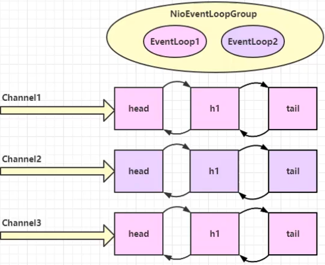

# Netty学习笔记（二）

## 概述

Netty是什么？

Netty 是一个异步的、基于事件驱动的网络应用框架，用于快速开发可维护、高性能的网络服务器和客户端。

Netty的作者：`Trustin Lee`

Netty的地位

Netty 在 Java 网络应用框架中的地位就好比：Spring框架在JavaEE开发中的地位

以下的框架都使用了Netty，因为它们有网络通信需求

- Cassandra
- Spark
- Hadoop
- RocketMQ
- Dubbo
- Zookeeper
- ……

Netty的优势

- 解决了epoll空轮询导致的CPU占用率100%的问题

- 解决了TCP传输问题
- 对API进行增强，使之更加易用
- 久经考验，比较稳定

## Hello World

目标：开发一个简单的服务器端和客户端

- 客户端向服务端发送`hello,world`
- 服务端仅接收，不返回

`HelloServer`

```java
public class HelloServer {
    public static void main(String[] args) {
        // 1. 启动器，负责组装 netty 组件，启动服务器
        new ServerBootstrap()
                // 2. selector + thread
                .group(new NioEventLoopGroup())
                // 3. 选择服务器SocketChannel实现
                .channel(NioServerSocketChannel.class) // OIO BIO
                // 4. 负责读写，决定了能干哪些事情（handler）
                // 5. channel 代表和客户端进行数据读写的通道 Initializer 初始化，负责添加其他handler
                .childHandler(new ChannelInitializer<NioSocketChannel>() {
                    @Override
                    protected void initChannel(NioSocketChannel ch) throws Exception {
                        // 6. 添加具体 handler
                        ch.pipeline().addLast(new StringDecoder()); // 将ByteBuffer转换为字符串
                        // 自定义handler
                        ch.pipeline().addLast(new ChannelInboundHandlerAdapter() {
                            @Override
                            public void channelRead(ChannelHandlerContext ctx, Object msg) throws Exception {
                                // 打印上一步转换好的字符串
                                System.out.println(msg);
                            }
                        });
                    }
                })
                // 7. 绑定监听端口
                .bind(8080);
    }
}
```

`HelloClient`

```java
public class HelloClient {
    public static void main(String[] args) throws InterruptedException {
        // 1. 启动器
        new Bootstrap()
                // 2. 添加 EventLoop
                .group(new NioEventLoopGroup())
                // 3. 选择客户端 channel 实现
                .channel(NioSocketChannel.class)
                // 4. 添加处理器
                .handler(new ChannelInitializer<NioSocketChannel>() {
                    @Override
                    protected void initChannel(NioSocketChannel ch) throws Exception {
                        ch.pipeline().addLast(new StringEncoder()); // 编码器
                    }
                })
                // 5. 连接服务器
                .connect(new InetSocketAddress("localhost", 8080))
                .sync() // 阻塞方法，直到连接建立
                .channel()// 代表连接对象
                // 6. 向服务器发送数据
                .writeAndFlush("hello, world"); // 发送数据
    }
}
```

> - 把channel理解为数据的通道
> - 把msg理解为流动的数据，最开始输入是ByteBuf，但经过pipeline的加工，会变成其它类型对象，最后输出又变成ByteBuf
> - 把handler理解为数据的处理工序
>
>   - 工序又多道，合在一起就是pipeline，pipeline负责发布事件（读、读取完成……）传播每个handler，handler对自己感兴趣的事件进行处理（重写了相应事件处理方法）
>
>   - handler分Inbound和Outbound两类
> - 把eventloop理解为处理数据的工人
>   -  工人可以管理多个channel的io操作，并且一旦工人负责了某个channel，就要负责到底（绑定）
>   - 工人既可以执行io操作，也可以进行任务处理，每位工人有任务队列，队列里可以堆放多个channel的待处理任务，任务分为普通任务、定时任务
>   - 工人按照pipeline顺序，依次按照handler的规划（代码）处理数据，可以为每道工序指定不同的工人

## 组件

### EventLoop

事件循环对象

EventLoop 本质是一个单线程执行器（同时维护一个Selector），里面有run方法处理Channel上源源不断的IO事件

事件循环组

EventLoopGroup是一组EventLoop，Channel一般会调用EventLoopGroup的register方法来绑定其中一个EventLoop，后续这个Channel上的IO事件都由此EventLoop来处理（保证了IO事件处理时的线程安全）

```java
// 1. 创建事件循环组
NioEventLoopGroup group = new NioEventLoopGroup(2);
// 2. 获取下一个事件循环对象
System.out.println(group.next());
System.out.println(group.next());
System.out.println(group.next());
// 3. 执行普通任务
group.next().submit(() -> {
    log.info("执行普通任务...");
});
// 4. 执行定时任务
group.next().scheduleAtFixedRate(() -> log.info("执行定时任务"), 0, 1, TimeUnit.SECONDS);
log.info("main");
```




### Channel

channel的主要方法

- close 可以用来关闭channel
- closeFuture用来处理channel的关闭
  - sync方法作用是同步等待channel关闭
  - addListener方法是异步等待channel关闭
- pipeline方法添加处理器
- write方法将数据写入
- writeAndFlush方法将数据写入并刷出


### Future & Promise

- 单线程没法异步提高效率，必须配合多线程，多核CPU才能发挥异步的优势

- 异步并没有缩短响应时间，反而有所增加，提高的是吞吐量

- 合理进行任务拆分，也是利用异步的关键

Netty中的Future与JDK中的Future同名，是两个接口，Netty的Future继承自JDK的Future，而Promise又对Netty的Future进行了扩展

- JDK Future 只能同步等待任务结束（或成功、或失败）才能得到结果
- Netty Future可以同步等待任务结束得到结果，也可以异步方式得到结果，但都是要等任务结束
- Netty Promise不仅有Netty Future的功能，而且脱离了任务独立存在，只作为两个线程间传递结果的容器

`JDK Future`

```java
@Slf4j
public class TestJdkFuture {
    public static void main(String[] args) throws ExecutionException, InterruptedException {
        // 1. 线程池
        ExecutorService service = Executors.newFixedThreadPool(2);
        // 2. 提交任务
        Future<Integer> future = service.submit(new Callable<Integer>() {
            @Override
            public Integer call() throws Exception {
                // 模拟计算花费时间
                log.debug("执行计算....");
                Thread.sleep(1000);
                return 100;
            }
        });
        // 3. 主线程通过future来获取结果
        log.debug("等待结果...");
        log.debug("结果是 {}", future.get());
    }
}
```


`Netty Future`

```java
@Slf4j
public class TestNettyFuture {
    public static void main(String[] args) throws ExecutionException, InterruptedException {
        NioEventLoopGroup group = new NioEventLoopGroup();
        EventLoop eventLoop = group.next();
        Future<Integer> future = eventLoop.submit(new Callable<Integer>() {
            @Override
            public Integer call() throws Exception {
                log.debug("执行计算...");
                Thread.sleep(1000);
                return 100;
            }
        });
        log.debug("等待结果...");
        log.debug("结果是 {}", future.get());
    }
}
```


`Promise`

```java
@Slf4j
public class TestNettyPromise {
    public static void main(String[] args) throws ExecutionException, InterruptedException {
        // 1. 准备 EventLoop 对象
        EventLoop eventLoop = new NioEventLoopGroup().next();
        // 2. 可以主动创建promise
        DefaultPromise<Integer> promise = new DefaultPromise<>(eventLoop);
        new Thread(() -> {
            // 3. 任意一个线程执行计算，计算完毕后向promise填充结果
            log.debug("开始计算...");
            try {
                Thread.sleep(1000);
            } catch (InterruptedException e) {
                e.printStackTrace();
            }
            promise.setSuccess(100);
        }).start();

        // 4. 接收结果的线程
        log.debug("等待结果...");
        log.debug("结果是 {}", promise.get());
    }
}
```


### Handler & Pipeline

ChannelHandler 用来处理Channel上的各种事件，分为入站、出站两种。所有ChannelHandler被连成一串，就是Pipeline

- 入站处理器通常是`ChannelInboundHandlerAdapter`的子类，主要用来读取客户端数据，写回结果
- 出站处理器通常是`ChannelOutboundHandlerAdapter`的子类，主要对写回结果进行加工


### ByteBuf

对字节数据的封装

`ByteBuf调试工具`

```java
private static void log(ByteBuf buf) {
    int length = buf.readableBytes();
    int rows = length / 16 + (length % 15 == 0 ? 0 : 1) + 4;
    StringBuilder sb = new StringBuilder(rows * 80 * 2)
        .append("read index: ").append(buf.readerIndex())
        .append(" write index: ").append(buf.writerIndex())
        .append(" capacity: ").append(buf.capacity())
        .append(NEWLINE);
    appendPrettyHexDump(sb, buf);
    System.out.println(sb);
}
```

支持直接内存和堆内存

- 直接内存创建和销毁的代价昂贵，但读写性能高（少一次内存复制），适合配合池化功能一起用
- 直接内存对GC压力小，因为这部分内存不受JVM垃圾回收的管理，但也要注意及时主动释放

池化 vs 非池化

池化的最大意义在于可以重用ByteBuf，优点有

- 没有池化，则每次都得创建新的ByteBuf实例，这个操作对直接内存代价昂贵，就算是堆内存，也会增加GC压力
- 有了池化，则可以重用池中ByteBuf实例，并且采用了与`jemalloc`类似得内存分配算法提升分配效率
- 高并发时，池化功能更节约内存，减少内存溢出得可能

池化功能是否开启，可以通过下面的系统环境变量来设置

```bash
-Dio.netty.allocator.type={unpooled|pooled}
```

扩容规则：

- 如果写入数据大小未超过512，则选择下一个16的整数倍，
- 如果写入后数据大小超过512，则选择下一个`2^n`
- 扩容不能超过max capacity

内存回收

由于Netty中有堆外内存的ByteBuf实现，堆外内存最好是手动来释放，而不是等GC垃圾回收

- `UnpooledHeapByteBuf`使用的是JVM内存，只需要等GC回收内存即可
- `UnpooledDirectByteBuf`使用的就是直接内存，需要特殊的方法来回收内存
- `PooledByteBuf`和它的子类使用了池化机制，需要更复杂的规则来回收内存

>回收内存的源码实现，请关注下面方法的不同实现
>
>`protected abstract void deallocate()`

Netty 这里采用了引用计数来控制回收内存，每个ByteBuf都实现了ReferenceCounted接口

- 每个ByteBuf对象的初识计数为1
- 调用release方法计数减一，如果计数为0，ByteBuf内存被回收
- 调用retain方法计数加一，表示调用者没用完之前，其它handler即使调用了release也不会造成回收
- 当计数为0时，底层内存会被回收，这时即使ByteBuf对象还在，其各个方法均无法正常使用

基本规则：`谁是最后使用者，谁负责release`

🔔 ByteBuf 优势：

- 池化，可以重用池中ByteBuf实例，更节约内存，减少内存溢出的可能
- 读写指针分离，不需要像ByteBuffer一样切换读写模式
- 可以自动扩容
- 支持链式调用，使用更流畅
- 很多地方体现零拷贝，例如slice、duplicate、CompositeByteBuf

