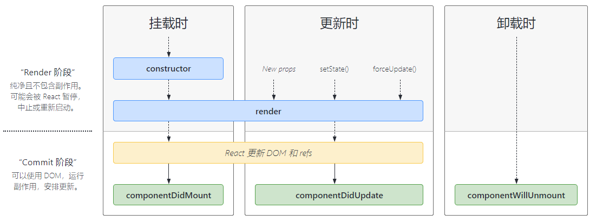

# React学习笔记

## 概述

React是用于构建用户界面的`JavaScript`库。

现在前端领域最为流行的三大框架：

- Vue
- React
- Angular

其中，Vue和React是国内最为流行的两个框架。

React的特点：

1、声明式编程：它允许我们只需要维护自己的状态，当状态改变时，React可以根据最新的状态去渲染我们的UI界面。

2、组件化开发


3、多平台适配

 ## Hello React

React开发依赖

开发React必须依赖三个库：

- react：包含react所必须的核心代码
- react-dom：react渲染在不同平台所需要的核心代码
- babel：将jsx转换成React代码的工具

如何添加这三个依赖？

方式一：直接CDN引入

方式二：下载后，添加本地依赖

方式三：通过npm

```html
<script src="https://unpkg.com/react@16/umd/react.development.js" crossorigin></script>
<script src="https://unpkg.com/react-dom@16/umd/react-dom.development.js" crossorigin></script>
<script src="https://unpkg.com/babel-standalone@6/babel.min.js"></script>
```

```html
<!DOCTYPE html>
<html lang="en">
<head>
    <meta charset="UTF-8">
    <meta http-equiv="X-UA-Compatible" content="IE=edge">
    <meta name="viewport" content="width=device-width, initial-scale=1.0">
    <title>Hello React!</title>
</head>
<body>
    <div id="app"></div>
    <!-- 添加React依赖 -->
    <script src="https://unpkg.com/react@16/umd/react.development.js" crossorigin></script>
    <script src="https://unpkg.com/react-dom@16/umd/react-dom.development.js" crossorigin></script>
    <script src="https://unpkg.com/babel-standalone@6/babel.min.js"></script>
    <!-- 注意事项：使用jsx，并且希望script中的jsx代码被解析，必须在script标签中添加一个属性 -->
    <!-- jsx特点：多个标签最外层（根）只能有一个标签 -->
    <script type="text/babel">
        let msg = "Hello World!";

        function btnClick() {
            msg = "Hello React!";
            render();
            console.log("按钮发生了点击");
        }

        function render() {
            ReactDOM.render(
            <div>
                <h2>{msg}</h2>
                <button onClick={btnClick}>改变文本</button>
            </div>, 
            document.getElementById("app"));
        }

        render();
    </script>
</body>
</html>
```

组件化

```html
<!DOCTYPE html>
<html lang="en">
<head>
    <meta charset="UTF-8">
    <meta http-equiv="X-UA-Compatible" content="IE=edge">
    <meta name="viewport" content="width=device-width, initial-scale=1.0">
    <title>Hello React!</title>
</head>
<body>
    <div id="app"></div>
    <!-- 添加React依赖 -->
    <script src="https://unpkg.com/react@16/umd/react.development.js" crossorigin></script>
    <script src="https://unpkg.com/react-dom@16/umd/react-dom.development.js" crossorigin></script>
    <script src="https://unpkg.com/babel-standalone@6/babel.min.js"></script>
    <script type="text/babel">
        // 封装组件
        class App extends React.Component {
            constructor() {
                super();
                // this.msg = "Hello World!";
                this.state = {
                    msg: "Hello World!"
                }
            }

            render() {
                return (
                    <div>
                        <h2>{this.state.msg}</h2>
                        <button onClick={this.btnClick.bind(this)}>改变文本</button>
                    </div>
                )
            }

            btnClick() {
                // this.msg = "Hello React!";
                this.setState({
                    msg: "Hello React!"
                })
                console.log("按钮发生了点击");
            }
        }
        // 渲染组件
        ReactDOM.render(<App/>, document.getElementById("app"));
    </script>
</body>
</html>
```

## JSX核心语法

ES6中如何定义类

```html
<script>
    // ES6中如何定义类
    class Person {
        // 构造方法
        constructor(name, age) {
            this.name = name;
            this.age = age;
        }
        // 定义方法
        running() {
            console.log(this.name, "running...");
        }
    }
    const p = new Person("Tom", 18);
    console.log(p.name, p.age);
    p.running();
</script>
```

ES6中类的继承

```html
<script>
    // 面向对象的三大特性：封装、继承、多态
    // 继承：1、减少重复代码 2、多态的前提
    class Person {
        constructor(name, age) {
            this.name = name;
            this.age = age;
        }

        running() {
            console.log(this.name, "running...");
        }
    }

    class Student extends Person {
        constructor(name, age, sno) {
            super(name, age);
            this.sno = sno;
        }
    }

    const stu = new Student("Tom", 20, "110");
    console.log(stu.name, stu.age, stu.sno);
    stu.running();

    class Teacher extends Person {
        constructor(name, age, tno) {
            // 子类中是必须初始化父类对象
            super(name, age);
            this.tno = tno;
        }
    }

    const t = new Teacher("Sam", 44, "000");
    console.log(t.name, t.age, t.tno);
    t.running();
</script>
```

电影列表展示

```html
<!DOCTYPE html>
<html lang="en">
<head>
    <meta charset="UTF-8">
    <meta http-equiv="X-UA-Compatible" content="IE=edge">
    <meta name="viewport" content="width=device-width, initial-scale=1.0">
    <title>电影列表</title>
</head>
<body>
    <div id="app"></div>
    <!-- 引入依赖 -->
    <script src="https://unpkg.com/react@16/umd/react.development.js" crossorigin></script>
    <script src="https://unpkg.com/react-dom@16/umd/react-dom.development.js" crossorigin></script>
    <script src="https://unpkg.com/babel-standalone@6/babel.min.js"></script>
    <!-- 编写React代码 -->
    <script type="text/babel">
        class App extends React.Component {
            constructor() {
                super();
                this.state = {
                    movies: ["大话西游", "盗梦空间", "战狼", "流浪地球", "星际穿越"]
                }
            }

            render() {
                let result = []
                for (let movie of this.state.movies) {
                    result.push(<li>{movie}</li>);
                }

                return (
                    <div>
                        <h2>电影列表1</h2>
                        <ul>{result}</ul>
                        <h2>电影列表2</h2>
                        <ul>{
                            this.state.movies.map((item) => {
                                return <li>{item}</li>
                            })
                        }</ul>
                    </div>
                )
            }
        }

        ReactDOM.render(<App/>, document.getElementById("app"));
    </script>
</body>
</html>
```

计数器

```html
<!DOCTYPE html>
<html lang="en">
<head>
    <meta charset="UTF-8">
    <meta http-equiv="X-UA-Compatible" content="IE=edge">
    <meta name="viewport" content="width=device-width, initial-scale=1.0">
    <title>计数器</title>
</head>
<body>
    <div id="app"></div>
    <script src="https://unpkg.com/react@16/umd/react.development.js" crossorigin></script>
    <script src="https://unpkg.com/react-dom@16/umd/react-dom.development.js" crossorigin></script>
    <script src="https://unpkg.com/babel-standalone@6/babel.min.js"></script>
    <script type="text/babel">
        class App extends React.Component {
            constructor(props) {
                super(props);
                this.state = {
                    cnt: 0
                }
            }

            render() {
                return (
                    <div>
                        <h2>当前计数：{this.state.cnt}</h2>
                        <button onClick={this.increment.bind(this)}>+1</button>
                        <button onClick={this.decrement.bind(this)}>-1</button>
                    </div>
                )
            }

            increment() {
                console.log("+1");
                this.setState({
                    cnt: this.state.cnt + 1
                })
            }
            
            decrement() {
                console.log("-1");
                this.setState({
                    cnt: this.state.cnt - 1
                })
            }
        }

        ReactDOM.render(<App/>, document.getElementById("app"));
    </script>
</body>
</html>
```

JSX是什么？

JSX是一种JavaScript的语法扩展，它用于描述我们的UI界面，并且其完全可以和JavaScript融合在一起使用。

React认为渲染逻辑本质上与其他UI逻辑存在内在耦合

- 比如UI需要绑定事件
- 比如UI中需要展示数据状态，在某些状态改变时，又需要改变UI

它们之间是密不可分的，所以React没有将标记分离到不同的文件中，而是将它们组合到一起

JSX书写规范：

JSX顶层只能有一个根元素，所以我们很多时候会在外层包裹一个div

为了方便阅读，我们通常在jsx的外层包裹一个小括号()，这样阅读方便，并且JSX可以进行换行书写

JSX中的标签可以是单标签，也可以是双标签

注意：如果是单标签，必须以`/>`结尾

JSX中的注释：`{/* 我是注释 */}`

JSX嵌入数据

1、在{}中可以正常显示的内容

`String` `Number` `Array`

2、在{}中不能显示（忽略）

`null` `undefined` `Boolean`

3、对象类型不能作为子元素

JSX嵌入表达式

1、运算符表达式

2、三元表达式

3、进行函数调用

JSX绑定属性

```html
    <script type="text/babel">
        class App extends React.Component {
            constructor(props) {
                super(props);
                this.state = {
                    title: "标题",
                    imgUrl: "https://placekitten.com/200/300",
                    link: "https://www.baidu.com",
                    active: true
                }
            }

            render() {
                return (
                    <div>
                        <h1>Hello React!</h1>
                        {/* 1、绑定普通属性 */}
                        <h2 title={this.state.title}>我是标题</h2>
                        
                        {/* 2、绑定class */}
                        <a href={this.state.link} target="_blank" className="box">百度一下</a> 
                        <div className={"title " + (this.state.active ? "active" : "")}>我是div</div>
                        {/* 3、绑定style */}
                        <div style={{color: "red", fontSize: "24px"}}>我是div，绑定style属性</div>
                    </div>
                )
            }
        }

        ReactDOM.render(<App/>, document.getElementById("app"));
    </script>
```

JSX绑定事件

```html
    <script type="text/babel">
        class App extends React.Component {
            constructor(props) {
                super(props);
                this.state = {
                    msg: "您好",
                    movies: ["大话西游", "盗梦空间", "战狼", "流浪地球"]
                }
                // this.btnClick = this.btnClick.bind(this);
            }

            render() {
                return (
                    <div>
                        <h1>Hello React!</h1>
                        {/* 方案一：bind绑定this（显示绑定） */}
                        {/* 方案二：定义函数时，使用箭头函数 */}
                        {/* 方案三：直接传入箭头函数，在箭头函数中调用要执行的函数 */}
                        <button onClick={this.btnClick.bind(this)}>按钮1</button>
                        <button onClick={() => { this.btnClick() }}>按钮2</button>
                        <ul>
                            {
                                this.state.movies.map((item, index, arr) => {
                                    return <li onClick={e => { this.liClick(item, index, e) }}>{item}</li>
                                })
                            }
                        </ul>
                    </div>
                )
            }

            btnClick() {
                console.log("按钮被点击了...");
                console.log(this.state.msg);
            }

            liClick(item, index, event) {
                console.log("li被点击了...");
                console.log(index, item);
                console.log(event);
            }
        }

        ReactDOM.render(<App/>, document.getElementById("app"));
    </script>
```

条件渲染

在vue中，我们会通过指令来控制：比如`v-if`、`v-show`

在react中，所有的条件判断都和普通JavaScript代码一致

```html
    <script type="text/babel">
        class App extends React.Component {
            constructor(props) {
                super(props);
                this.state = {
                    isLogin: true
                }
            }

            render() {
                // 1、if判断（适用于逻辑代码非常多的情况）
                let welcome = null;
                if (this.state.isLogin) {
                    welcome = <h2>欢迎回来~</h2>
                } else {
                    welcome = <h2>请先登录~</h2>
                }
                return (
                    <div>
                        <h1>Hello React!</h1>
                        {welcome}
                        {/* 2、使用三元运算符 */}
                        <button onClick={e => this.btnClick()}>{this.state.isLogin ? "退出" : "登录"}</button>
                        {/* 3、使用逻辑与 */}
                        { this.state.isLogin && <h2>您好，admin</h2>}
                    </div>
                )
            }

            btnClick() {
                this.setState({
                    isLogin: !this.state.isLogin
                })
            }
        }

        ReactDOM.render(<App/>, document.getElementById("app"));
    </script>
```

 列表渲染

真实开发中，我们会从服务器请求到大量的数据，数据会以列表的形式存储。

```html
    <script type="text/babel">
        class App extends React.Component {
            constructor() {
                super();
                this.state = {
                    movies: ["大话西游", "盗梦空间", "战狼", "流浪地球", "星际穿越"]
                }
            }

            render() {
                let result = []
                for (let movie of this.state.movies) {
                    result.push(<li>{movie}</li>);
                }

                return (
                    <div>
                        <h2>电影列表1</h2>
                        <ul>{result}</ul>
                        <h2>电影列表2</h2>
                        <ul>{
                            this.state.movies.map((item) => {
                                return <li>{item}</li>
                            })
                        }</ul>
                    </div>
                )
            }
        }

        ReactDOM.render(<App/>, document.getElementById("app"));
    </script>
```

JSX的本质：实际上，JSX仅仅只是React.createElement(component, props, ... , children)函数的语法糖，所有的JSX最终都会被转换成React.createElement的函数调用。

JSX --> createElement函数 --> ReactElement（对象树）--> ReactDOM.render函数 --> 真实DOM

JSX --> createElement函数 --> ReactElement（对象树）--> ReactDOM.render 函数 --> 原生的控件

## React脚手架

传统的脚手架指的是建筑学的一种结构：在搭建楼房、建筑物时，临时搭建出来的一个框架

编程中提到的脚手架，其实是一种工具，帮助我们快速生成项目的工程化结构

总结：脚手架让项目从搭建到开发，再到部署，整个流程变得快速和便捷

- Vue的脚手架：vue-cli
- Angular的脚手架：angular-cli
- React的脚手架：create-react-app

它们的作用都是帮助我们生成一个通用的目录结构，并且已经将我们所需的工程环境配置好。

安装脚手架

```bash
npm install -g create-react-app
```

创建React项目

```bash
create-react-app 项目名称
```

注意：项目名称不能包含大写字母

启动项目

```bash
cd 项目目录
yarn start
```

## 组件化开发

分而治之的思想

分而治之是软件工程的重要思想，是复杂系统开发和维护的基石

而前端目前的模块化和组件化都是基于分而治之的思想

什么是组件化开发？

我们需要通过组件化的思想来思考整个应用程序：

- 我们将一个完整的页面分成很多个组件

- 每个组件都用于实现页面的一个功能块

- 而每一个组件又可以进行细分

- 而组件本身又可以在多个地方进行复用

组件化是React的核心思想

组件化思想的应用：

- 有了组件化的思想，我们在以后的开发中就要充分利用它
- 尽可能的将页面拆分成一个个小的、可复用的组件
- 这样让我们的代码更加方便组织和管理，并且扩展性更强

类组件

类组件的定义有如下要求：

- 组件名称是大写字符开头（无论类组件还是函数组件）
- 类组件需要继承自React.Component
- 类组件必须实现render函数

组件的定义方式

```jsx
// 类组件的定义
export default class App extends React.Component {
    constructor() {
        super();
        this.state = {
            msg: "您好，App组件"
        }
    }

    render() {
        return (
            <div>
                <span>我是App组件</span>
                <h2>{this.state.msg}</h2>
            </div>
        )
    }
}
```

```jsx
// 函数组件的定义
export default function App() {
    return (
        <div>我是函数组件</div>
    )
}
// 特点：
// 1、没有this对象
// 2、没有内部的状态（可以使用hooks解决）
```

render函数的返回值：

- React元素
- 数组或fragments
- Portals
- 字符串或数值类型
- 布尔类型或null：什么都不渲染

生命周期

很多事物都有从创建到销毁的整个过程，这个过程称之为`生命周期`



生命周期是一个抽象概念，在生命周期的整个过程中，分成了很多个阶段：

- 比如装载阶段（Mount）
- 比如更新阶段（Update）
- 比如卸载阶段（Unmount）


React内部为了告诉我们当前处于哪些阶段，会对我们组件内部实现某些函数进行回调，这些函数就是生命周期函数。

```jsx
import React, { Component } from 'react'


class Component1 extends Component {
    render() {
        return (
            <div>
                我是Component1组件
            </div>
        )
    }

    componentWillUnmount() {
        console.log("调用了Component1的componentWillUnmount方法");
    }
}


export default class App extends Component {
    constructor() {
        super();
        this.state = {
            cnt: 0,
            isShow: true
        }
        console.log("执行了组件的constructor方法");
    }

    render() {
        console.log("执行了组件的render方法");
        return (
            <div>
                我是App组件
                <h2>当前计数：{this.state.cnt}</h2>
                <button onClick={e => this.increment()}>+1</button>
                <hr />
                <button onClick={e => this.changeComponent1Show()}>切换</button>
                {this.state.isShow && <Component1 />}
            </div>
        )
    }

    increment() {
        this.setState({
            cnt: this.state.cnt + 1
        })
    }

    changeComponent1Show() {
        this.setState({
            isShow: !this.state.isShow
        })
    }

    componentDidMount() {
        console.log("执行了组件的componentDidMount方法");
    }

    componentDidUpdate() {
        console.log("执行了组件的componentDidUpdate方法");
    }
}

```

constructor中通常只做两件事情：

1、通过给this.state赋值对象来初始化内部state

2、为事件绑定实例（this）

componentDidMount

- 依赖于DOM的操作可以在这里进行
- 可以在此处发送网络请求（官方建议）
- 可以在此处添加一些订阅（在componentWilUnmount中取消订阅）

componentDidUpdate

- 当组件更新后，可以在此处对DOM进行操作
- 如果你对更新前后的props进行了比较，也可以选择在此处进行网络请求（例如，当props未发生变化时，则不会执行网络请求）

componentWillUnmount

- 在此方法中执行必要的清理操作
- 例如，清除timer，取消网络请求或者清除在componentDidMount中的订阅等

组件嵌套

```jsx
import React, { Component } from 'react'

// Header
function Header() {
    return <h2>我是Header组件</h2>
}

// Main
function Main() {
    return (
        <div>
            <h2>我是Main组件</h2>
            <Banner/>
            <ProductList/>
        </div>
    )
}

// Banner
function Banner() {
    return <h3>我是Banner组件</h3>
}

// 商品列表
function ProductList() {
    return (
        <ul>
            <li>商品1</li>
            <li>商品2</li>
            <li>商品3</li>
            <li>商品4</li>
            <li>商品5</li>
        </ul>
    )
}

// Footer
function Footer() {
    return <h2>我是Footer组件</h2>
}


export default class App extends Component {
    render() {
        return (
            <div>
                <Header/>
                <Main/>
                <Footer/>
            </div>
        )
    }
}

```

组件之间的通信

`父传子-函数组件`

```jsx
import React, { Component } from 'react'


function Child(props) {
    const { name, age } = props;
    return <h2>{name + " " + age}</h2>
}

export default class App extends Component {
    render() {
        return (
            <div>
                <Child name="tom" age="18" />
                <Child name="sam" age="48" />
            </div>
        )
    }
}
```

`父传子-类组件`

```jsx
import React, { Component } from 'react'

class Child extends Component {
    render() {
        const { name, age } = this.props;
        return (
            <div>
                <h2>子组件展示的数据：{name + " " + age}</h2>
            </div>
        )
    }
}


export default class App extends Component {
    render() {
        return (
            <div>
                <Child name="tom" age="18" />
                <Child name="sam" age="48" />
            </div>
        )
    }
}

```

`属性验证`

```jsx
import React, { Component } from 'react'
import PropTypes from 'prop-types'


function Child(props) {
    const { name, age, names } = props;
    return (
        <div>
            <h2>{name + "--" + age}</h2>
            <ul>
                {
                    names.map((item, index) => {
                        return <li key={index}>{index + "-" + item}</li>
                    })
                }
            </ul>
        </div>
    )
}

Child.protoTypes = {
    name: PropTypes.string.isRequired,
    age: PropTypes.number,
    names: PropTypes.array
}


Child.defaultProps = {
    name: "test",
    age: 67,
    names: ["x", "y", "z"]
}


export default class App extends Component {
    render() {
        return (
            <div>
                <Child name="tom" age={18} names={["a", "b", "c"]} />
                <Child name="sam" age={48} names={["b", "c", "a"]} />
                <Child />
            </div>
        )
    }
}
```

在某些情况下，我们也需要子组件向父组件传递消息：

- 在vue中是通过自定义事件来完成的
- 在React中同样是通过props传递消息，只是让父组件给子组件传递一个回调函数，在子组件中调用这个回调函数即可

`子传父通信`

```jsx
import React, { Component } from 'react'


class CntButton extends Component {
    render() {
        const { increment } = this.props;
        return (
            <div>
                <button onClick={increment}>+1</button>
            </div>
        )
    }
}

export default class App extends Component {
    constructor(props) {
        super(props);
        this.state = {
            cnt: 0
        }
    }

    render() {
        return (
            <div>
                <h2>当前计数：{this.state.cnt}</h2>
                <button onClick={e => {this.increment()}}>+1</button>
                <CntButton increment={e => {this.increment()}} />
            </div>
        )
    }

    increment() {
        this.setState({
            cnt: this.state.cnt + 1
        })
    }
}

```

`组件通信案例练习`

```jsx
import React, { Component } from 'react'
import TabControl from './TabControl'

export default class App extends Component {
    constructor(props) {
        super(props);
        this.state = {
            currentTitle: "新款",
            titles: ['新款', '精选', '流行']
        }
    }
    
    render() {
        const { currentTitle, titles } = this.state;
        return (
            <div>
                <TabControl itemClick={index => this.itemClick(index)} titles={titles} />
                <h2>{currentTitle}</h2>
            </div>
        )
    }

    itemClick(index) {
        console.log(index);
        this.setState({
            currentTitle: this.state.titles[index]
        })
    }

}

```

```jsx
import React, { Component } from 'react'
import PropTypes from 'prop-types'


export default class TabControl extends Component {
    constructor(props) {
        super(props);
        this.state = {
            currentIndex: 0
        }
    }
    render() {
        const { titles } = this.props;
        const { currentIndex } = this.state;
        return (
            <div className="tab-control">
                {
                    titles.map((item, index) => {
                        return <div className={"tab-item " + (index === currentIndex ? "active" : "") } key={index} onClick={e => this.itemClick(index)}><span>{item}</span></div>
                    })
                }
            </div>
        )
    }

    itemClick(index) {
        this.setState({
            currentIndex: index
        })
        const { itemClick } = this.props;
        itemClick(index);
    }
}

TabControl.propTypes = {
    titles: PropTypes.array.isRequired
}

```

`效果展示`


`React实现插槽slot`

```jsx
import React, { Component } from 'react'
import NavBar from './NavBar'
import NavBar2 from './NavBar2'

export default class App extends Component {
    render() {
        return (
            <div>
                <NavBar>
                    <span>a</span>
                    <strong>b</strong>
                    <a href="https://www.baidu.com" target="_blank" rel="noreferrer">百度一下</a>
                </NavBar>
                <NavBar2 leftSlot={<span>a</span>}
                         centerSlot={<strong>b</strong>}
                         rightSlot={<a href="https://www.baidu.com" target="_blank" rel="noreferrer">百度一下</a>} />
            </div>
        )
    }
}

```

```jsx
import React, { Component } from 'react'

export default class NavBar extends Component {
    render() {
        return (
            <div className="nav-bar">
                <div className="nav-item nav-left">
                    {this.props.children[0]}
                </div>
                <div className="nav-item nav-center">
                {this.props.children[1]}
                </div>
                <div className="nav-item nav-right">
                {this.props.children[2]}
                </div>
            </div>
        )
    }
}

```

```jsx
import React, { Component } from 'react'

export default class NavBar extends Component {
    render() {
        const { leftSlot, centerSlot, rightSlot } = this.props;
        return (
            <div className="nav-bar">
                <div className="nav-item nav-left">
                    {leftSlot}
                </div>
                <div className="nav-item nav-center">
                    {centerSlot}
                </div>
                <div className="nav-item nav-right">
                    {rightSlot}
                </div>
            </div>
        )
    }
}

```

`跨组件通信`

方式一：通过props属性自上而下（由父到子）进行传递

```jsx
import React, { Component } from 'react'

function ProfileHeader(props) {
    return (
        <div>
            <h2>用户昵称：{props.nickname}</h2>
            <h2>用户等级：{props.level}</h2>
        </div>
    )
}

function Profile(props) {
    return (
        <div>
            <ProfileHeader nickname={props.nickname} level={props.level} />
            <ul>
                <li>设置1</li>
                <li>设置2</li>
                <li>设置3</li>
                <li>设置4</li>
            </ul>
        </div>
    )
}

export default class App extends Component {
    constructor(props) {
        super(props);

        this.state = {
            nickname: "tom",
            level: 100
        }
    }

    render() {
        const { nickname, level } = this.state;
        return (
            <div>
                <Profile nickname={nickname} level={level} />
            </div>
        )
    }
}

```

方式二：使用Context

```jsx
import React, { Component } from 'react'

// 创建Context对象
const UserContext = React.createContext({
    nickname: "test",
    level: 0
})

function ProfileHeader() {
    return (
        <UserContext.Consumer>
            {
                value => {
                    return (
                        <div>
                            <h2>用户昵称：{value.nickname}</h2>
                            <h2>用户等级：{value.level}</h2>
                        </div>
                    )
                }
            }
        </UserContext.Consumer>
    )
}

function Profile() {
    return (
        <div>
            <ProfileHeader />
            <ul>
                <li>设置1</li>
                <li>设置2</li>
                <li>设置3</li>
                <li>设置4</li>
            </ul>
        </div>
    )
}

export default class App extends Component {
    constructor(props) {
        super(props);

        this.state = {
            nickname: "tom",
            level: 100
        }
    }

    render() {
        return (
            <div>
                <UserContext.Provider value={this.state}>
                    <Profile />
                </UserContext.Provider>
            </div>
        )
    }
}

```

## React中的CSS样式

在组件化中选择合适的CSS解决方案应该符合以下条件：

- 可以编写局部CSS
- 可以编写动态CSS特性
- 支持所有CSS特性
- 编写起来简洁方便，最好符合一贯的CSS风格特点
- ……

**常见的方式：**

1、内联样式

内联样式是官方推荐的一种CSS样式写法

style接受一个采用小驼峰命名属性的JavaScript对象，而不是CSS字符串

并且可以引用state中的状态来设置相关样式

```jsx
import React, { PureComponent } from 'react'

export default class App extends PureComponent {
    render() {
        const pStyle = {
            color: "orange",
            textDecoration: "underline"
        }
        return (
            <div>
                <h2 style={{fontSize: "50px", color: "red"}}>我是标题</h2>
                <p style={pStyle}>我是一段文字描述</p>
            </div>
        )
    }
}

```

优点：

1. 内联样式之间不会有冲突
2. 可以动态获取当前state中的状态

缺点：

1. 写法上都需要使用驼峰标识
2. 某些样式没有提示
3. 大量的样式，代码混乱
4. 某些样式无法编写（比如伪类/伪元素）

2、普通CSS

我们通常会将CSS编写到单独的文件中，之后再进行引入。

这样的编写方式和普通的网页开发中编写方式是一样的，但是普通的CSS都属于全局的CSS，样式之间会相互影响。

这种编写方式最大的问题是样式之间会相互层叠掉。

3、CSS Modules

CSS Modules并不是React特有的解决方案，而是所有使用了类似webpack配置的环境下都可以使用的。

React的脚手架已经内置了CSS Modules的配置。

- .css/.less/.scss等样式文件都修改为.module.css/.module.less/.module.scss等
- 之后就可以引用并且使用了

CSS Modules确实解决了局部作用域的问题，也是很多人喜欢在React中使用的一种方案。

但是这种方案也有自己的缺陷：

- 引用的类名，不能使用连接符
- 所有的className都必须使用{style.className}的形式来编写
- 不方便动态来修改某些样式，依然需要使用内联样式的方式

4、CSS-in-JS

CSS-in-JS是指一种模式，其中CSS由JavaScript生成而不是在外部文件中定义。

目前比较流行的CSS-in-JS的库有哪些？

- styled-components
- emotion
- glamorous

安装styled-components

```bash
yarn add styled-components
```

[styled-components](https://styled-components.com/)

## AntDesign库的使用

`AntDesign` 是基于 Ant Design 设计体系的React UI组件库，主要用于研发企业级中后台产品。

[Ant Design - 一套企业级 UI 设计语言和 React 组件库](https://ant.design/index-cn)

安装AntDesign

```bash
yarn add antd
```

[介绍 - Ant Design (gitee.io)](https://ant-design.gitee.io/docs/spec/introduce-cn)

[Ant Design of React - Ant Design (gitee.io)](https://ant-design.gitee.io/docs/react/introduce-cn)

[组件总览 - Ant Design (gitee.io)](https://ant-design.gitee.io/components/overview-cn/)

[资源 - Ant Design (gitee.io)](https://ant-design.gitee.io/docs/resources-cn)

## Axios库的使用

[Axios 中文文档 | Axios 中文网 (axios-http.cn)](https://www.axios-http.cn/)

axios是目前前端使用非常广泛的网络请求库

安装

```bash
yarn add axios
```

[起步 | Axios 中文文档 (axios-http.cn)](https://www.axios-http.cn/docs/intro)

请求方法：

```markdown
axios.request(config)

axios.get(url[, config])

axios.delete(url[, config])

axios.head(url[, config])

axios.options(url[, config])

axios.post(url[, data[, config]])

axios.put(url[, data[, config]])

axios.patch(url[, data[, config]])

```

请求配置

这些是创建请求时可以用的配置选项。只有`url`是必需的，如果没有指定`method`，请求将默认使用`GET`方法。

```js
{
  // `url` 是用于请求的服务器 URL
  url: '/user',

  // `method` 是创建请求时使用的方法
  method: 'get', // 默认值

  // `baseURL` 将自动加在 `url` 前面，除非 `url` 是一个绝对 URL。
  // 它可以通过设置一个 `baseURL` 便于为 axios 实例的方法传递相对 URL
  baseURL: 'https://some-domain.com/api/',

  // `transformRequest` 允许在向服务器发送前，修改请求数据
  // 它只能用与 'PUT', 'POST' 和 'PATCH' 这几个请求方法
  // 数组中最后一个函数必须返回一个字符串， 一个Buffer实例，ArrayBuffer，FormData，或 Stream
  // 你可以修改请求头。
  transformRequest: [function (data, headers) {
    // 对发送的 data 进行任意转换处理

    return data;
  }],

  // `transformResponse` 在传递给 then/catch 前，允许修改响应数据
  transformResponse: [function (data) {
    // 对接收的 data 进行任意转换处理

    return data;
  }],

  // 自定义请求头
  headers: {'X-Requested-With': 'XMLHttpRequest'},

  // `params` 是与请求一起发送的 URL 参数
  // 必须是一个简单对象或 URLSearchParams 对象
  params: {
    ID: 12345
  },

  // `paramsSerializer`是可选方法，主要用于序列化`params`
  // (e.g. https://www.npmjs.com/package/qs, http://api.jquery.com/jquery.param/)
  paramsSerializer: function (params) {
    return Qs.stringify(params, {arrayFormat: 'brackets'})
  },

  // `data` 是作为请求体被发送的数据
  // 仅适用 'PUT', 'POST', 'DELETE 和 'PATCH' 请求方法
  // 在没有设置 `transformRequest` 时，则必须是以下类型之一:
  // - string, plain object, ArrayBuffer, ArrayBufferView, URLSearchParams
  // - 浏览器专属: FormData, File, Blob
  // - Node 专属: Stream, Buffer
  data: {
    firstName: 'Fred'
  },
  
  // 发送请求体数据的可选语法
  // 请求方式 post
  // 只有 value 会被发送，key 则不会
  data: 'Country=Brasil&City=Belo Horizonte',

  // `timeout` 指定请求超时的毫秒数。
  // 如果请求时间超过 `timeout` 的值，则请求会被中断
  timeout: 1000, // 默认值是 `0` (永不超时)

  // `withCredentials` 表示跨域请求时是否需要使用凭证
  withCredentials: false, // default

  // `adapter` 允许自定义处理请求，这使测试更加容易。
  // 返回一个 promise 并提供一个有效的响应 （参见 lib/adapters/README.md）。
  adapter: function (config) {
    /* ... */
  },

  // `auth` HTTP Basic Auth
  auth: {
    username: 'janedoe',
    password: 's00pers3cret'
  },

  // `responseType` 表示浏览器将要响应的数据类型
  // 选项包括: 'arraybuffer', 'document', 'json', 'text', 'stream'
  // 浏览器专属：'blob'
  responseType: 'json', // 默认值

  // `responseEncoding` 表示用于解码响应的编码 (Node.js 专属)
  // 注意：忽略 `responseType` 的值为 'stream'，或者是客户端请求
  // Note: Ignored for `responseType` of 'stream' or client-side requests
  responseEncoding: 'utf8', // 默认值

  // `xsrfCookieName` 是 xsrf token 的值，被用作 cookie 的名称
  xsrfCookieName: 'XSRF-TOKEN', // 默认值

  // `xsrfHeaderName` 是带有 xsrf token 值的http 请求头名称
  xsrfHeaderName: 'X-XSRF-TOKEN', // 默认值

  // `onUploadProgress` 允许为上传处理进度事件
  // 浏览器专属
  onUploadProgress: function (progressEvent) {
    // 处理原生进度事件
  },

  // `onDownloadProgress` 允许为下载处理进度事件
  // 浏览器专属
  onDownloadProgress: function (progressEvent) {
    // 处理原生进度事件
  },

  // `maxContentLength` 定义了node.js中允许的HTTP响应内容的最大字节数
  maxContentLength: 2000,

  // `maxBodyLength`（仅Node）定义允许的http请求内容的最大字节数
  maxBodyLength: 2000,

  // `validateStatus` 定义了对于给定的 HTTP状态码是 resolve 还是 reject promise。
  // 如果 `validateStatus` 返回 `true` (或者设置为 `null` 或 `undefined`)，
  // 则promise 将会 resolved，否则是 rejected。
  validateStatus: function (status) {
    return status >= 200 && status < 300; // 默认值
  },

  // `maxRedirects` 定义了在node.js中要遵循的最大重定向数。
  // 如果设置为0，则不会进行重定向
  maxRedirects: 5, // 默认值

  // `socketPath` 定义了在node.js中使用的UNIX套接字。
  // e.g. '/var/run/docker.sock' 发送请求到 docker 守护进程。
  // 只能指定 `socketPath` 或 `proxy` 。
  // 若都指定，这使用 `socketPath` 。
  socketPath: null, // default

  // `httpAgent` and `httpsAgent` define a custom agent to be used when performing http
  // and https requests, respectively, in node.js. This allows options to be added like
  // `keepAlive` that are not enabled by default.
  httpAgent: new http.Agent({ keepAlive: true }),
  httpsAgent: new https.Agent({ keepAlive: true }),

  // `proxy` 定义了代理服务器的主机名，端口和协议。
  // 您可以使用常规的`http_proxy` 和 `https_proxy` 环境变量。
  // 使用 `false` 可以禁用代理功能，同时环境变量也会被忽略。
  // `auth`表示应使用HTTP Basic auth连接到代理，并且提供凭据。
  // 这将设置一个 `Proxy-Authorization` 请求头，它会覆盖 `headers` 中已存在的自定义 `Proxy-Authorization` 请求头。
  // 如果代理服务器使用 HTTPS，则必须设置 protocol 为`https`
  proxy: {
    protocol: 'https',
    host: '127.0.0.1',
    port: 9000,
    auth: {
      username: 'mikeymike',
      password: 'rapunz3l'
    }
  },

  // see https://axios-http.com/docs/cancellation
  cancelToken: new CancelToken(function (cancel) {
  }),

  // `decompress` indicates whether or not the response body should be decompressed 
  // automatically. If set to `true` will also remove the 'content-encoding' header 
  // from the responses objects of all decompressed responses
  // - Node only (XHR cannot turn off decompression)
  decompress: true // 默认值

}
```

响应结构

一个请求的响应包含以下信息。

```js
{
  // `data` 由服务器提供的响应
  data: {},

  // `status` 来自服务器响应的 HTTP 状态码
  status: 200,

  // `statusText` 来自服务器响应的 HTTP 状态信息
  statusText: 'OK',

  // `headers` 是服务器响应头
  // 所有的 header 名称都是小写，而且可以使用方括号语法访问
  // 例如: `response.headers['content-type']`
  headers: {},

  // `config` 是 `axios` 请求的配置信息
  config: {},

  // `request` 是生成此响应的请求
  // 在node.js中它是最后一个ClientRequest实例 (in redirects)，
  // 在浏览器中则是 XMLHttpRequest 实例
  request: {}
}
```

默认配置

```js
axios.defaults.baseURL = "https://httpbin.org"
axios.defaults.timeout = 5000
axios.defaults.headers.common["token"] = "token"
```

拦截器

```js
// 拦截器
axios.interceptors.request.use(config => {
  // 1. 发送请求时，页面显示loading
  // 2. 添加token
  // 3. 序列化操作
  // 4. ……
  return config;
}, err => {
  console.log(err);
  return err;
});

axios.interceptors.response.use(res => {
  return res.data;
}, err => {
  if (err && err.response) {
    switch (err.response.status) {
      case 400:
        console.log("400");
        break;
      case 401:
        console.log("401");
        break;
      default:
        console.log("其他错误")
        break;
    }
  }
  return err;
});
```

## Redux的使用

React中的状态管理方式：

- 方式一：组件中自己的state管理；
- 方式二：Context数据的共享状态；
- 方式三：Redux管理应用状态；

Redux就是一个帮助我们管理`State`的容器。

Redux是JavaScript的状态容器，提供了可预测的状态管理。

三大原则：

- 单一数据源
- State是只读的
- 使用纯函数来执行修改


基本使用

```js
// 导入redux
const redux = require('redux');

const initialState = {
    counter: 0
}

// reducer
function reducer(state = initialState, action) {
    switch(action.type) {
        case "INCREMENT":
            return {...state, counter: state.counter + 1};
        case "DECREMENT":
            return {...state, counter: state.counter - 1};
        case "ADD_NUMBER":
            return {...state, counter: state.counter + action.num};
        case "SUB_NUMBER":
            return {...state, counter: state.counter - action.num};
        default:
            return state;
    }
}

// store
const store = redux.createStore(reducer);

// actions
const action1 = {type: 'INCREMENT'};
const action2 = {type: 'DECREMENT'};

const action3 = {type: 'ADD_NUMBER', num: 5};
const action4 = {type: 'SUB_NUMBER', num: 12};

// 订阅store修改
store.subscribe(() => {
    console.log("counter:", store.getState().counter);
});

// 派发action
store.dispatch(action1);
store.dispatch(action2);
store.dispatch(action3);
store.dispatch(action4);

```

Redux使用流程


官方文档：

[React Redux | React Redux (react-redux.js.org)](https://react-redux.js.org/)

## React Router的使用

前端流行的三大框架都有自己的路由实现：

- Angular的ngRouter
- React的react-router
- Vue的vue-router

React Router的版本从4开始，路由不再集中在一个包中进行管理了

- react-router是router的核心部分代码
- react-router-dom是用于浏览器的
- react-router-native是用于原生应用的

安装react-router

```bash
yarn add react-router-dom
```

Router的基本使用

```jsx
import React, { PureComponent } from 'react'
import {
    BrowserRouter,
    Link,
    Route,
    Routes
} from 'react-router-dom';
import Home from './pages/home';
import About from './pages/about';

export default class App extends PureComponent {
    render() {
        return (
            <div>
                <BrowserRouter>
                    <Link exact="true" to="/">首页</Link>
                    <Link to="/about">关于</Link>
                    <Routes>
                        <Route path="/" element={<Home />} />
                        <Route path="/about" element={<About />} />
                    </Routes>
                </BrowserRouter>
            </div>
        )
    }
}

```

文档：[React Router | Docs Home (reactrouterdotcom.fly.dev)](https://reactrouterdotcom.fly.dev/docs/en/v6)

## React Hooks的使用

> Hook 是 React 16.8 的新增特性。它可以让你在不编写class的情况下使用state以及其他的React特性。

[Hook 简介 – React (docschina.org)](https://react.docschina.org/docs/hooks-intro.html)

useState的基本使用

```jsx
import React, { useState } from 'react';

export default function Counter() {
    /**
     * Hook: useState
     * 本身是一个函数，来自react包
     * 参数：作用是给创建出来的状态一个默认值
     * 返回值：数组，元素1：当前state的值；元素2：设置新的值时，使用的函数
     */
    const [state, setState] = useState(0);
    return (
        <div>
            <h2>当前计数：{state}</h2>
            <button onClick={e => setState(state + 1)}>+1</button>
            <button onClick={e => setState(state - 1)}>-1</button>
        </div>
    )
}

```

两个额外的规则：

- 只能在函数最外层调用Hook，不要在循环、条件判断或者子函数中调用。
- 只能在React的函数组件中调用Hook，不要在其他JavaScript函数中调用。

复杂状态的操作

```jsx
export default function MultiHookState() {

    const [count, setCount] = useState(0);
    const [age, setAge] = useState(18);
    const [friends, setFriends] = useState(["小明", "小狗", "小虎"]);
    const [students, setStudents] = useState([
        {id: 110, name: "学生1", age: 10},
        {id: 111, name: "学生2", age: 18},
        {id: 112, name: "学生3", age: 30},
    ]);

    function incrementAgeByIndex(index) {
        const newStudents = [...students];
        newStudents[index].age += 1;
        setStudents(newStudents);
    }

    return (
        <div>
            <h2>当前计数：{count}</h2>
            <button onClick={e => setCount(count + 1)}>计数 +1</button>
            <h2>我的年龄：{age}</h2>
            <button onClick={e => setAge(age + 1)}>年龄 +1</button>
            <h2>好友列表：</h2>
            <ul>
                {
                    friends.map((item, index) => {
                        return <li key={index}>{item}</li>
                    })
                }
            </ul>
            <button onClick={e => {setFriends([...friends, "小老虎"])}}>添加好友</button>
            <h2>学生列表：</h2>
            <table border="true" cellPadding="0" cellSpacing="0" style={{width: "50%", textAlign: "center"}}>
                <thead>
                    <tr>
                        <th>序号</th>
                        <th>姓名</th>
                        <th>年龄</th>
                        <th>操作</th>
                    </tr>
                </thead>
                <tbody>
                    {
                        students.map((item, index) => {
                            return (
                                <tr key={item.id}>
                                    <td>{index+1}</td>
                                    <td>{item.name}</td>
                                    <td>{item.age}</td>
                                    <td><button onClick={e => incrementAgeByIndex(index)}>年龄+1</button></td>
                                </tr>
                            )
                        })
                    }
                </tbody>
            </table>
        </div>
    )
}
```

useEffect的基本使用

```jsx
import React, { useEffect, useState } from 'react'

export default function ChangeCounterTitle() {
    const [cnt, setCnt] = useState(0);
    useEffect(() => {
        document.title = `计数器：${cnt}`
    });

    return (
        <div>
            <h2>计数器：{cnt}</h2>
            <button onClick={e => setCnt(cnt + 1)}>+1</button>
        </div>
    )
}

```

useContext的基本使用

```jsx
import React, { useContext } from 'react';
import {UserContext, ThemeContext} from '../App';

export default function ContextHookDemo() {
    const user = useContext(UserContext);
    const theme = useContext(ThemeContext);

    console.log(user);
    console.log(theme);

    return (
        <div>
            <h2>ContextHookDemo</h2>
        </div>
    )
}

```

useRef返回一个ref对象，返回的ref对象在组件的整个生命周期保持不变。

两种最常用的ref：

- 用法一：引入DOM（或者组件，但是需要是class组件）元素；
- 用法二：保存一个数据，这个对象在整个生命周期中可以保持不变；


[Hook API 索引 – React (docschina.org)](https://react.docschina.org/docs/hooks-reference.html)

