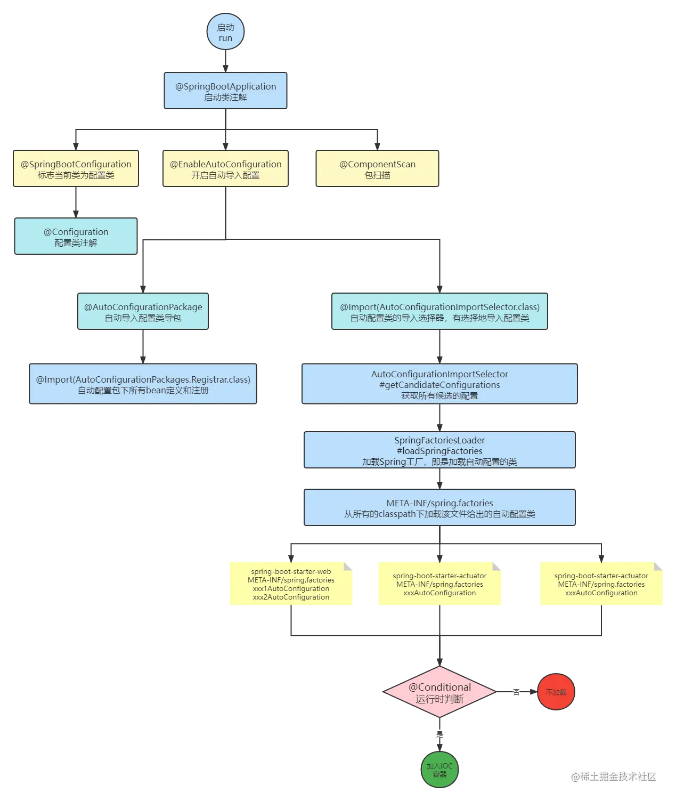

# SpringBoot自动配置原理

> SpringBoot的特点
>
> - 提供了固定的配置来简化配置，即约定大于配置
>
> - 尽可能的自动化配置Spring和第三方库，即能自动配置
>
> - 内嵌容器，创建独立的Spring应用
>
> - 让测试变得简单，内置了JUnit、Spring Boot Test等多种测试框架，方便测试
>
> - 提供可用于生产的特性，如度量、运行状况检查和外部化配置
>

`Spring Boot 版本为 2.6.3`

```xml
<parent>
    <groupId>org.springframework.boot</groupId>
    <artifactId>spring-boot-starter-parent</artifactId>
    <version>2.6.3</version>
    <relativePath/> <!-- lookup parent from repository -->
</parent>
```

## 🎈启动类

`@SpringBootApplication` 标注在某个类上，说明这个类是`SpringBoot`的主配置类，SpringBoot会运行这个类的`main`方法来启动SpringBoot应用

```java
@Target({ElementType.TYPE})
@Retention(RetentionPolicy.RUNTIME)
@Documented
@Inherited
@SpringBootConfiguration
@EnableAutoConfiguration
@ComponentScan(
    excludeFilters = {@Filter(
    type = FilterType.CUSTOM,
    classes = {TypeExcludeFilter.class}
), @Filter(
    type = FilterType.CUSTOM,
    classes = {AutoConfigurationExcludeFilter.class}
)}
)
```

它的本质是一个组合注解

- `@SpringBootConfiguration`：标注当前类为配置类
- `@EnableAutoConfiguration`：开启自动配置
- `@ComponentScan`：包扫描

`@SpringBootConfiguration`

```java
@Target({ElementType.TYPE})
@Retention(RetentionPolicy.RUNTIME)
@Documented
@Configuration
@Indexed
public @interface SpringBootConfiguration {
    @AliasFor(
        annotation = Configuration.class
    )
    boolean proxyBeanMethods() default true;
}
```

`@Configuration`标注在某个类上时，表示这个是一个SpringBoot的配置类，可以向容器中注入组件。

`@ComponentScan`配置用于Configuration类的组件扫描指令

## 🎈@EnableAutoConfiguration

```java
@Target({ElementType.TYPE})
@Retention(RetentionPolicy.RUNTIME)
@Documented
@Inherited
@AutoConfigurationPackage
@Import({AutoConfigurationImportSelector.class})
public @interface EnableAutoConfiguration {
    String ENABLED_OVERRIDE_PROPERTY = "spring.boot.enableautoconfiguration";

    Class<?>[] exclude() default {};

    String[] excludeName() default {};
}
```

`@AutoConfigurationPackage`：自动导入配置包

```java
@Target({ElementType.TYPE})
@Retention(RetentionPolicy.RUNTIME)
@Documented
@Inherited
@Import({Registrar.class})
public @interface AutoConfigurationPackage {
    String[] basePackages() default {};

    Class<?>[] basePackageClasses() default {};
}
```

`@Import`是Spring的注解，导入一个配置文件，导入的组件由AutoConfigurationPackages.class的内部类`Registrar.class`执行逻辑来决定是如何导入的

```java
static class Registrar implements ImportBeanDefinitionRegistrar, DeterminableImports {
    Registrar() {
    }

    public void registerBeanDefinitions(AnnotationMetadata metadata, BeanDefinitionRegistry registry) {
        AutoConfigurationPackages.register(registry, (String[])(new AutoConfigurationPackages.PackageImports(metadata)).getPackageNames().toArray(new String[0]));
    }

    public Set<Object> determineImports(AnnotationMetadata metadata) {
        return Collections.singleton(new AutoConfigurationPackages.PackageImports(metadata));
    }
}
```

`@AutoConfigurationPackage`将主配置类（`@SpringBootApplication`标注的类）所在包下面的所有组件都扫描注册到Spring容器中

`@AutoConfigurationImportSelector`开启自动配置类的导包选择器，选择哪些类导入

`selectImports`：选择哪些组件导入

```java
    public String[] selectImports(AnnotationMetadata annotationMetadata) {
        if (!this.isEnabled(annotationMetadata)) {
            return NO_IMPORTS;
        } else {
            AutoConfigurationImportSelector.AutoConfigurationEntry autoConfigurationEntry = this.getAutoConfigurationEntry(annotationMetadata);
            return StringUtils.toStringArray(autoConfigurationEntry.getConfigurations());
        }
    }
```

```java
    protected AutoConfigurationImportSelector.AutoConfigurationEntry getAutoConfigurationEntry(AnnotationMetadata annotationMetadata) {
        if (!this.isEnabled(annotationMetadata)) {
            return EMPTY_ENTRY;
        } else {
            AnnotationAttributes attributes = this.getAttributes(annotationMetadata);
            List<String> configurations = this.getCandidateConfigurations(annotationMetadata, attributes);
            configurations = this.removeDuplicates(configurations);
            Set<String> exclusions = this.getExclusions(annotationMetadata, attributes);
            this.checkExcludedClasses(configurations, exclusions);
            configurations.removeAll(exclusions);
            configurations = this.getConfigurationClassFilter().filter(configurations);
            this.fireAutoConfigurationImportEvents(configurations, exclusions);
            return new AutoConfigurationImportSelector.AutoConfigurationEntry(configurations, exclusions);
        }
    }
```

```java
    protected List<String> getCandidateConfigurations(AnnotationMetadata metadata, AnnotationAttributes attributes) {
        List<String> configurations = SpringFactoriesLoader.loadFactoryNames(this.getSpringFactoriesLoaderFactoryClass(), this.getBeanClassLoader());
        Assert.notEmpty(configurations, "No auto configuration classes found in META-INF/spring.factories. If you are using a custom packaging, make sure that file is correct.");
        return configurations;
    }
```

在`META-INF/spring.factories`中寻找自动配置类

```java
    protected Class<?> getSpringFactoriesLoaderFactoryClass() {
        return EnableAutoConfiguration.class;
    }
```

获取一个能加载自动配置类的类，即SpringBoot默认自动配置类为`EnableAutoConfiguration.class`

> SpringFactoriesLoader工厂加载机制是Spring内部提供的一个约定俗成的加载方式，使用模块的META-INF/spring.factories文件
>
> 加载classpath路径下的META-INF/spring.factories文件

结论：

>loadSpringFactories()方法就是从`META-INF/spring.factories`中加载给定类型的工厂实现的完全限定类名放到map中
>
>loadFactoryNames()是根据SpringBoot的启动生命流程，当需要加载自动配置类时，就会传入`org.springframework.boot.autoconfigure.EnableAutoConfiguration`参数，从map中查找key为`org.springframework.boot.autoconfigure.EnableAutoConfiguration`的值，这些值通过反射加到容器中，之后的作用就是用它们来做自动配置，这就是Springboot自动配置的开始
>
>只有这些自动配置类进入到容器中后，接下来这个自动配置类才开始进行启动

## 🎈流程总结图



## 🎈@Import支持导入的三种方式

1. 带有`@Configuration`的配置类
2. ImportSelector的实现
3. ImportBeanDefinitionRegistrar

## 🎈参考资料

[https://juejin.cn/post/7046554366068654094](https://juejin.cn/post/7046554366068654094)

[https://juejin.cn/post/7047674475331977224](https://juejin.cn/post/7047674475331977224)

