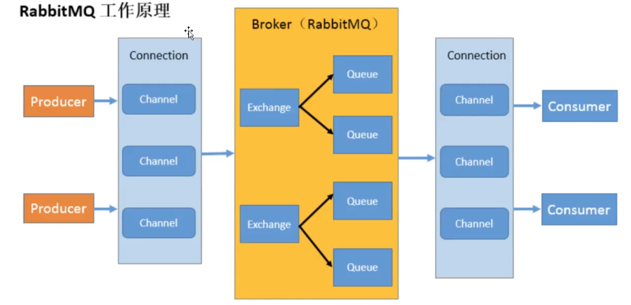
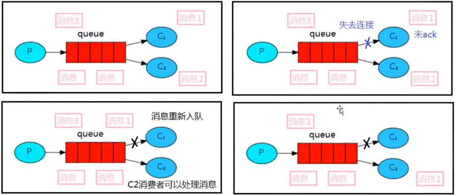

# RabbitMQ学习笔记

## 消息队列

### MQ的相关概念

MQ（message queue），从字面意思上看，本质是一个队列，FIFO先入先出，只不过队列中存放的内容是message而已，还是一种跨进程的通信机制，用于上下游传递消息。

在互联网架构中，MQ是一种非常常见的上下游“逻辑解耦+物理解耦”的消息通信服务。使用了MQ之后，消息发送上游只需要依赖MQ，不用依赖其他服务。

为什么要用MQ：

1. 流量消峰
2. 应用解耦
3. 异步处理

MQ分类

1. ActiveMQ 优点：可用性高，可靠性高 缺点：维护越来越少，高吞吐量场景使用较少
2. Kafka 为大数据而生的消息中间件，以其百万级的吞吐量名声大噪
3. RocketMQ 阿里巴巴开源的产品，用Java语言实现，在设计时参考了Kafka，并做出了自己的一些改进
4. RabbitMQ 当前最主流的消息中间件之一，高并发特性，性能好，吞吐量到万级，支持多种语言，社区活跃度高

MQ的选择

Kafka：主要特点是基于Pull的模式来处理消息消费，适合产生大量数据的互联网服务，大型公司建议可以选用，如果有日志采集功能，肯定是首选Kafka

RocketMQ：天生为金融互联网领域而生，对可靠性要求很高的场景，尤其是电商里面的订单扣款，以及业务削峰

RabbitMQ：时效性微秒级，社区活跃度也比较高，如果你的数据量没有那么大，中小型公司优先选择功能比较完备的RabbitMQ

### RabbitMQ

RabbitMQ是一个消息中间件，负责存储和转发消息数据。

四大核心概念：

生产者、交换机、队列、消费者

RabbitMQ核心部分

1. Hello World
2. Work Queues
3. Publish/Subscribe
4. Routing
5. Topics
6. Publisher Confirms



## Hello World

用Java编写两个程序，发送单个消息的生产者和接收消息并打印出来的消费者。

依赖

```xml
<dependencies>
    <dependency>
        <groupId>com.rabbitmq</groupId>
        <artifactId>amqp-client</artifactId>
        <version>5.12.0</version>
    </dependency>
    <dependency>
        <groupId>commons-io</groupId>
        <artifactId>commons-io</artifactId>
        <version>2.6</version>
    </dependency>
</dependencies>
```


消息生产者

```java
package org.example.rabbitmq.one;

import com.rabbitmq.client.Channel;
import com.rabbitmq.client.Connection;
import com.rabbitmq.client.ConnectionFactory;

import java.io.IOException;
import java.nio.charset.StandardCharsets;
import java.util.concurrent.TimeoutException;

/**
 * 生产者：发消息
 */
public class Producer {
    // 队列名称
    public static final String QUEUE_NAME = "hello";

    // 发消息
    public static void main(String[] args) throws IOException, TimeoutException {
        // 创建一个连接工厂
        ConnectionFactory factory = new ConnectionFactory();
        // 工厂IP 连接rabbitmq的队列
        factory.setHost("192.168.108.128");
        // 用户名
        factory.setUsername("admin");
        // 密码
        factory.setPassword("123456");
        // 创建连接
        Connection connection = factory.newConnection();
        // 获取信道
        Channel channel = connection.createChannel();
        // 生成一个队列
        channel.queueDeclare(QUEUE_NAME, false, false, false, null);
        // 发消息
        String msg = "Hello World!";
        channel.basicPublish("", QUEUE_NAME, null, msg.getBytes(StandardCharsets.UTF_8));
        System.out.println("消息发送完毕");
    }
}

```


消息消费者

```java
package org.example.rabbitmq.one;

import com.rabbitmq.client.*;

import java.io.IOException;
import java.util.concurrent.TimeoutException;

/**
 * 消费者：接收消息
 */
public class Consumer {
    // 队列名称
    public static final String QUEUE_NAME = "hello";

    public static void main(String[] args) throws IOException, TimeoutException {
        // 创建一个连接工厂
        ConnectionFactory factory = new ConnectionFactory();
        // 工厂IP 连接rabbitmq的队列
        factory.setHost("192.168.108.128");
        // 用户名
        factory.setUsername("admin");
        // 密码
        factory.setPassword("123456");
        // 创建连接
        Connection connection = factory.newConnection();
        // 获取信道
        Channel channel = connection.createChannel();
        // 声明
        DeliverCallback deliverCallback = (consumerTag, message) -> {
            System.out.println(new String(message.getBody()));
        };
        CancelCallback cancelCallback = (consumerTag) -> {
            System.out.println("消息消费被中断");
        };
        // 消费消息
        channel.basicConsume(QUEUE_NAME, true, deliverCallback, cancelCallback);
    }
}

```

## Work Queues

工作队列（又称任务队列）的主要思想是避免立即执行资源密集型任务，而不得不等待它完成。相反我们安排任务在之后执行。我们把任务封装为消息并将其发送到队列。在后台运行的工作进程将弹出任务并最终执行作业。当有多个工作线程时，这些工作线程将一起处理这些任务。

注意事项：一个消息只能被处理一次，不可以处理多次。

工作线程之间是竞争的关系。

### 轮询分发消息

抽取工具类

```java
public class RabbitMqUtils {
    public static Channel getChannel() throws Exception {
        // 创建一个连接工厂
        ConnectionFactory factory = new ConnectionFactory();
        // 工厂IP 连接rabbitmq的队列
        factory.setHost("192.168.108.128");
        // 用户名
        factory.setUsername("admin");
        // 密码
        factory.setPassword("123456");
        // 创建连接
        Connection connection = factory.newConnection();
        return connection.createChannel();
    }
}
```

生产者

```java
/**
 * 生产者 发送大量消息
 */
public class Task01 {
    // 队列名称
    public static final String QUEUE_NAME = "hello";

    // 发送大量消息
    public static void main(String[] args) throws Exception {
        Channel channel = RabbitMqUtils.getChannel();
        channel.queueDeclare(QUEUE_NAME, false, false, false, null);
        // 从控制台中接收消息
        Scanner scanner = new Scanner(System.in);
        while (scanner.hasNext()) {
            String msg = scanner.nextLine();
            channel.basicPublish("", QUEUE_NAME, null, msg.getBytes(StandardCharsets.UTF_8));
            System.out.println("发送消息完成: " + msg);
        }
    }
}
```


工作线程

```java
/**
 * 这是一个工作线程
 */
public class Work01 {
    // 队列名称
    public static final String QUEUE_NAME = "hello";

    // 接收消息
    public static void main(String[] args) throws Exception {
        Channel channel = RabbitMqUtils.getChannel();
        DeliverCallback deliverCallback = (consumerTag, message) -> {
            System.out.println("Work01接收到的消息：" + new String(message.getBody()));
        };
        CancelCallback cancelCallback = (consumerTag) -> {
            System.out.println(consumerTag + "消费者取消消费接口回调逻辑");
        };
        System.out.println("C2等待接收消息...");
        channel.basicConsume(QUEUE_NAME, true, deliverCallback, cancelCallback);
    }
}
```

### 消息应答

消息应答：消费者在接收到消息并且处理消息之后，告诉rabbitmq，它已经处理了，rabbitmq可以把该消息删除了。

两种方式：自动应答、手动应答

手动应答的好处是可以批量应答并且减少网络拥堵。

手动应答：

basicAck：用于肯定确认

basicNack：用于否定确认

basicReject：用于否定确认



消息手动应答代码：


### 持久化

