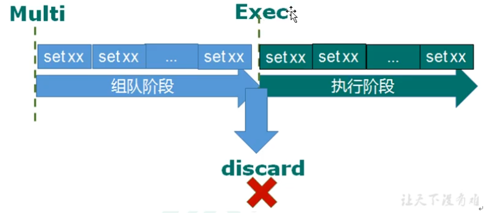
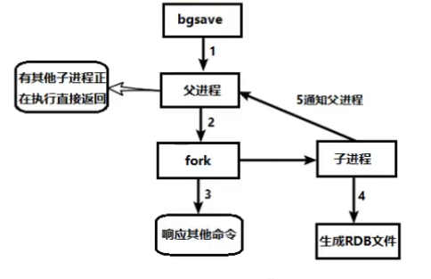

# Redis学习笔记

[](https://redis.io/)

采用Redis 6.2.1版本，内容由浅入深，循序渐进，从Redis的基本概念开启讲解。

内容涵盖：Redis安装与部署、Redis常用数据类型操作和底层结构、Redis客户端Jedis和整合SpringBoot项目、Redis事务和锁，Redis持久化RDB和AOF、Redis主从复制和集群、Redis应用中的问题和解决方案（缓存穿透、击穿、雪崩、分布式锁）、Redis的新数据类型以及Redis 6的新特性等。

视频链接：

[【尚硅谷】Redis 6 入门到精通 超详细 教程](https://www.bilibili.com/video/BV1Rv41177Af)

## NoSQL数据库简介

技术的分类：

1. 解决功能性的问题：Java、JSP、RDBMS、Tomcat、HTML、Linux、JDB、SVN、……
2. 解决扩展性的问题：Struts、Spring、SpringMVC、Hibernate、Mybatis、……
3. 解决性能的问题：NoSQL、Java线程、Hadoop、Nginx、MQ、ElasticSearch、……

NoSQL = Not Only SQL，意即“不仅仅是SQL”，泛指非关系型数据库。

NoSQL不依赖业务逻辑方式存储，而以简单的key-value模式存储，因此大大的增加了数据库的扩展能力。

- 不遵循SQL标准
- 不支持ACID
- 远超于SQL的性能

NoSQL适用场景：

- 对数据高并发的读写
- 海量数据的读写
- 对数据高可扩展性

NoSQL不适用的场景：

- 需要事务支持
- 基于SQL的结构化查询存储，处理复杂的关系
- 用不着SQL和用了SQL也不行的情况

## Redis概述

Redis是一个开源的key-value存储系统。

它支持的value类型相对更多，包括string、list、set、zset和hash等。

这些数据类型都支持push、pop、add、remove等丰富的操作，而且这些操作都是原子性的。

Redis支持各种不同方式的排序。

Redis能够实现master-slave（主从）同步。

应用场景：

- 配合关系型数据库做高速缓存
- 多样的数据结构存储持久化数据

查看默认安装目录下的文件：

> redis-benchmark：性能测试工具
>
> redis-check-aof：修复有问题的AOF文件
>
> redis-check-dump：修复有问题的dump.rdb文件
>
> redis-sentinel：Redis集群使用
>
> redis-server：Redis服务器启动命令
>
> redis-cli：客户端，操作入口

Redis相关知识

端口`6379`	从何而来：Alessia `Merz`

默认16个数据库，类似数组下标从0开始，初识默认使用0号库

使用命令`select <dbid>`来切换数据库。如：select 9

统一密码管理，所有库使用同样的密码

> dbsize ：查看当前数据库key的数量

> flushdb：清空当前库

> flushall：通杀全部库

Redis是单线程+多路IO复用

## 常用五大数据类型

### 键（Key）操作

> 查看当前库所有key：keys *
>
> 判断key是否存在：exists key的名称
>
> 查看key的类型：type key名称
>
> 删除指定key的数据：del key的名称
>
> 根据value选择非阻塞删除（仅将keys从keyspace元数据中删除，真正的删除会在后续异步操作中）：unlink key的名称
>
> 为key设置过期时间（时间以秒为单位）：expire key 10
>
> 查看key还有多少秒过期（-1表示永不过期，-2表示已经过期）：ttl key

### 字符串（String）

String是Redis最基本的类型，是二进制安全的，意味着Redis的String可以包含任何数据。比如，jpg图片或者序列化对象。

一个Redis中字符串value最多可以是512M

常用操作

```
set <key> <value> 添加键值对

get <key> 查询对应键值

append <key> <value> 将给定的<value>追加到原值的末尾

strlen <key> 获得值的长度

setnx <key> <value> 只有key不存在时，设置key的值

incr <key> 数字值加一，只能对数字值操作，如果为空，新增值为1

decr <key> 数字值减一，只能对数字值操作，如果为空，新增值为-1

incrby/decrby <key> <步长> 将key中存储的数字值增减，自定义步长

mset <key1> <value1> <key2> <value2> ... 同时设置一个或多个key-value对

mget <key1> <key2> ... 同时获取一个或多个value

msetnx <key1> <value1> <key2> <value2> ... 同时设置一个或多个key-value对，当且仅当所有给定的key都不存在

getrange <key> <起始位置> <结束位置> 获取值的范围 前包 后包

setrange <key> <起始位置> <value> 用<value>覆写<key>所存储的字符串值，从<起始位置>开始（索引从0开始）

setex <key> <过期时间> <value> 设置键值的同时，设置过期时间，单位秒

getset <key> <value> 以新换旧，设置了新值同时获得旧值

```

String的数据结构为简单动态字符串（Simple Dynamic String，缩写SDS），是可以修改的字符串，内部结构实现上类似于Java的ArrayList，采用预分配冗余空间的方式，来减少内存的频繁分配。


需要注意的是字符串最大长度为512M。

### 列表（List）

Redis列表是简单的字符串列表，按照插入顺序排序。可以在列表的头部或者尾部添加一个元素。

它的底层实际是个双向链表，对两端的操作性能很高，通过索引下标操作中间结点性能会较差。


单键多值

常用命令

```
lpush/rpush <key> <value1> <value2> ... 从左边/右边插入一个或多个值

lpop/rpop <key> 从左边/右边吐出一个值，值在键在，值光键亡

rpoplpush <key1> <key2> 从key1列表右边吐出一个值，插到<key2>列表的左边

lrange <key> <start> <stop> 按照索引下标获得元素（从左到右）

lindex <key> <index> 按照索引下标获得元素（从左到右）

llen <key> 获得列表长度

linsert <key> before <value> <newValue> 在<value>的后面插入<newValue>插入值

lrem <key> <n> <value> 从左边删除n个value（从左到右）

lset <key> <index> <value> 将列表key下标为index的值替换成value
```

List的数据结构为快速链表

首先在列表元素较少的情况下会使用一块连续的内存存储，这个结构是压缩列表，它将所有的元素紧挨着一起存储，分配的是一块连续的内存。

当数据量较大时才会成为快速链表。

Redis将链表和压缩列表结合起来组成了快速链表，这样既满足了快速的插入删除性能，又不会出现太大的空间冗余。

### 集合（Set）

Redis的set和list类似，特殊之处在于set可以自动排重，当你需要存储一个列表数据，又不希望出现重复数据时，set是一个很好的选择。

Set是String类型的无序集合，它的底层其实是一个value为null的hash表，所以添加、删除、查找的复杂度都是O(1)

常用命令

```
sadd <key> <value1> <value2> ... 将一个或多个元素加入集合key中

smembers <key> 取出该集合的所有值

sismember <key> <value> 判断集合<key>是否为含有该<value>值，有1，没有0

scard <key> 返回该集合的元素个数

srem <key> <value1> <value2> ... 删除集合中的某个元素

spop <key> 随机从该集合中吐出一个值

srandmember <key> <n> 随机从该集合中取出n个值，不会从集合中删除

smove <source> <destination> <value> 把集合中的一个值从一个集合移动到另一个集合

sinter <key1> <key2> 返回两个集合的交集

sunion <key1> <key2> 返回两个集合的并集

sdiff <key1> <key2> 返回两个集合的差集
```

Set数据结构是dict字典，字典是用哈希表实现的。

### 哈希（Hash）

Redis Hash是一个键值对集合，是一个string类型的field和value的映射表，hash特别适合于存储对象。

类似Java里面的`Map<String, Object>`

常用命令

```
hset <key> <field> <value> 给<key>集合中的<field>键赋值<value>

hget <key> <field> 从<key>集合<field>取出value

hmset <key1> <field1> <value1> ... 批量设置hash值

hexists <key> <field> 查看哈希表key中，给定field是否存在

hkeys <key> 列出该hash集合的所有field

hvals <key> 列出该hash集合的所有value

hincrby <key> <field> <increment> 为哈希表key中的域field的值加上增量

hsetnx <key> <field> <value> 将哈希表key中的域field的值设置为value，当且仅当域field不存在
```

Hash类型对应的数据结构是两种：ziplist（压缩列表），hashtable（哈希表）

当filed-value长度较短且个数较少时，使用ziplist，否则使用hashtable。

### 有序集合（Zset）

Redis有序集合zset和普通集合set非常相似，是一个没有重复元素的字符串集合。

有序集合的每个成员都关联了一个评分，这个评分被用来按照从最低分到最高分的方式排序集合中的成员。集合的成员是唯一的，但是评分可以是重复的。

因为元素是有序的，你也可以很快的根据评分或者次序来获取一个范围的元素。

访问有序集合的中间元素也是非常快的，因此你能够使用有序集合作为一个没有重复成员的智能列表。

常用命令

```
zadd <key> <score1> <value1> <score2> <value2> ... 将一个或多个member元素及其score值加入到有序集key当中

zrange <key> <start> <stop> [WITHSCORES] 返回有序集key中，下标在<start> <stop> 之间的元素

zrangebyscore key minmax [withscores][limit offset count] 返回有序集key中，所有score值介于min和max之间（包括等于min或max）的成员。有序集成员按score值递增（从小到大）次序排列。

zrevrangebyscore key maxmin [withscores][limit offset count] 同上，改为从大到小排列

zincrby <key> <increment> <value> 为元素的score加上增量

zrem <key> <value> 删除该集合下，指定值的元素

zcount <key> <min> <max> 统计该集合，分数区间内的元素个数

zrank <key> <value> 返回该值在集合中的排名，从0开始
```

SortedSet（zset）是Redis提供的一个非常特别的数据结构，一方面它等价于Java的数据结构`Map<String,Double>`，可以给每一元素value赋予一个权重score，另一方面它又类似于TreeSet，内部的元素会按照权重score进行排序，可以得到每个元素的名次，还可以通过score的范围来获取元素的列表。

zset 底层使用了两个数据结构

（1）hash，作用是关联元素value和权重score，保障value的唯一性，可以通过元素value找到相应的score值

（2）跳跃表，跳跃表的目的在于给元素value排序，根据score的范围获取元素列表

## 配置文件

### Units单位

配置文件开头定义了一些基本的度量单位，只支持bytes，不支持bit，大小写不敏感

### 网络相关配置

bind

默认情况bind=127.0.0.1，只能接受本机的访问请求

不写的情况下，无限制接受任何ip地址的访问

生产环境肯定要写你应用服务器的地址，服务器是需要远程访问的，所以需要将其注释掉

如果开启了protected-mode，那么在没有设定bind ip且没有设密码的情况下，Redis只允许接受本机的响应

端口号，默认6379

tcp-backlog

设置tcp的backlog，backlog其实是一个连接队列，backlog队列总和=未完成三次握手队列+已经完成三次握手队列

在高并发环境下，需要一个高的backlog值来避免慢客户连接问题

timeout：超时时间

tcp-keepalive：心跳时间

### 通用配置

daemonize：是否后台启动

pidfile：存放pid文件的位置，每个实例会产生一个不同的pid文件

loglevel：日志级别（debug、verbose、notice、warning）

logfile：日志输出文件的路径

databases：数据库id

### 安全配置

访问密码的查看、设置和取消

在命令中设置的密码，只是临时的，重启Redis服务器，密码就还原了

永久设置，需要在配置文件中进行设置

```bash
config get requirepass

config set requirepass "123456"
```

### LIMITS限制

maxclients：设置redis同时可以与多少个客户端进行连接，默认情况下为10000个客户端，如果达到了此限制，redis则会拒绝新的连接请求，并且向这些连接请求发出"max number of clients reached"

maxmemory：建议必须设置，否则，将内存占满，造成服务器宕机

maxmemory-policy：设置移除策略


maxmemory-samples：设置样本数量，一般设置3到7的数字，数值越小样本越不准确，但性能消耗越小

## 发布和订阅

Redis发布订阅（pub/sub）是一种消息通信模式：发送者（pub）发送消息，订阅者（sub）接收消息

Redis客户端可以订阅任意数量的频道


注意：发布的消息没有持久化，只能收到订阅后发布的消息

## Redis6新数据类型

### Bitmaps

Redis提供了Bitmaps这个“数据类型”可以实现对位的操作

（1）Bitmaps本事不是一种数据类型，实际上它就是字符串（key-value），但是它可以对字符串的位进行操作

（2）Bitmaps单独提供了一套命令，所以在Redis中使用Bitmaps和使用字符串的方法不太相同。可以把Bitmaps看成一个以位为单位的数组，数组的每个单元只能存储0和1，数组的下标在Bitmaps中称作偏移量

在第一次初识化Bitmaps时，假如偏移量非常大，那么整个初始化过程执行会比较慢，可能会造成Redis的阻塞。

命令

```
setbit <key> <offset> <value> 设置Bitmaps中某个偏移量的值（0或1）offset从0开始

getbit <key> <offset> 获取Bitmaps中某个偏移量的值

bitcount <key> [start end] 统计比特值为1的数量

bitop 是一个复合操作，它可以做多个Bitmaps的and、or、not、xor操作并将结果保存在destkey中
```

### HyperLogLog

Redis HyperLogLog 是用来做基数统计的算法，HyperLogLog的优点是，在输入元素的数量或体积非常大时，计算基数所需的空间是固定的，并且是很小的。

HyperLogLog只会根据输入元素来计算基数，而不会存储输入元素本身，所以HyperLogLog不能像集合那样，返回输入的各个元素。

命令

```
pfadd <key> <element> [element...] 添加指定元素到HyperLogLog中，成功返回1，失败返回0

pfcount <key> [key...] 计算HLL的近似基数

pfmerge <key> <sourceKey> [sourceKey...] 将一个或多个HLL合并后的结果存储在另一个HLL中
```

### Geospatial

Redis 提供了经纬度设置，查询，范围查询，距离查询，经纬度Hash等常见操作

命令

```
geoadd <key> <longitude> <latitude> <member> [longitude latitude member...] 添加地理位置（经度、纬度、名称）

geopos <key> <member> [member...] 获得指定地区的坐标值

geodist <key> <member1> <member2> [m|km|ft|mi] 获取两个位置之间的直线距离

georadius <key> <longitude> <latitude> radius m|km|ft|mi 以给定的经纬度为中心，找出某一半径内的元素
```

## Jedis操作Redis6

### Jedis所需的jar包

```xml
<!-- https://mvnrepository.com/artifact/redis.clients/jedis -->
<dependency>
    <groupId>redis.clients</groupId>
    <artifactId>jedis</artifactId>
    <version>3.3.0</version>
</dependency>
```

### 连接Redis注意事项

禁用Linux的防火墙：Linux（CentOS 7）里执行命令

```bash
systemctl stop/disable firewalld.service
```

### 测试连接

```java
package com.example;

import redis.clients.jedis.Jedis;

public class JedisDemo1 {
    public static void main(String[] args) {
        // 创建Jedis对象
        Jedis jedis = new Jedis("192.168.108.128", 6379);
        // 测试
        String ping = jedis.ping();
        System.out.println(ping);
    }
}

```

### Jedis常用操作

操作key

```java
@Test
public void demo1() {
    Jedis jedis = new Jedis("192.168.108.128", 6379);
    // 添加
    jedis.set("name", "liuyuhe");
    // 获取
    String name = jedis.get("name");
    System.out.println(name);
    // 设置多个key
    jedis.mset("k1", "v1", "k2", "v2");
    // 获取多个key
    List<String> strings = jedis.mget("k1", "k2");
    System.out.println(strings);
    // 查看key
    Set<String> keys = jedis.keys("*");
    for (String key : keys) {
        System.out.println(key);
    }
}
```

List

```java
@Test
public void demo2() {
    Jedis jedis = new Jedis("192.168.108.128", 6379);
    jedis.lpush("key1", "v1", "v2", "v3", "v4");
    List<String> list = jedis.lrange("key1", 0, -1);
    System.out.println(list);
}
```

Set

```java
@Test
public void demo3() {
    Jedis jedis = new Jedis("192.168.108.128", 6379);
    jedis.sadd("names", "tom", "sam", "jack");
    Set<String> names = jedis.smembers("names");
    System.out.println(names);
}
```

Hash

```java
@Test
public void demo4() {
    Jedis jedis = new Jedis("192.168.108.128", 6379);
    jedis.hset("users", "age", "18");
    String age = jedis.hget("users", "age");
    System.out.println(age);
}
```

Zset

```java
@Test
public void demo5() {
    Jedis jedis = new Jedis("192.168.108.128", 6379);
    jedis.zadd("china", 100d, "shanghai");
    jedis.zadd("china", 99d, "beijing");
    Set<String> china = jedis.zrange("china", 0, -1);
    System.out.println(china);
}
```

### 案例-模拟验证码发送

要求：

1、输入手机号，点击发送后，随机生成6位数字码，2分钟有效

2、输入验证码，点击验证，返回成功或失败

3、每个手机号每天只能输入3次

具体实现：

1、生成随机6位数字验证码，可以使用Java中的Random

2、验证码在2分钟内有效，把验证码放到Redis里面，设置过期时间120秒

3、判断验证码是否一致，从redis获取验证码和输入的验证码进行比较

4、每个手机每天只能发送3次验证码，使用incr操作，每次发送后加一，超过3后，不能再发送

```java
package com.example;

import redis.clients.jedis.Jedis;

import java.util.Random;

public class PhoneCode {
    public static void main(String[] args) {
        // 模拟验证码发送
        setRedisCode("15866154198");
        // 校验
        verifyCode("15866154198", "123456");
    }

    // 验证码校验
    public static void verifyCode(String phone, String code) {
        Jedis jedis = new Jedis("192.168.108.128", 6379);
        String codeKey = "VerifyCode" + phone + ":code";
        String redisCode = jedis.get(codeKey);
        if (redisCode.equals(code)) {
            System.out.println("验证码正确");
        } else {
            System.out.println("验证码错误");
        }
    }

    // 每个手机每天只能发送3次，验证码放到redis中，设置过期时间
    public static void setRedisCode(String phone) {
        Jedis jedis = new Jedis("192.168.108.128", 6379);
        String countKey = "VerifyCode" + phone + ":count";
        String codeKey = "VerifyCode" + phone + ":code";
        // 每个手机每天只能发送三次
        String count = jedis.get(countKey);
        if (count == null) {
            jedis.setex(countKey, 24*60*60, "1");
        } else if (Integer.parseInt(count) <= 2) {
            jedis.incr(countKey);
        } else if (Integer.parseInt(count) > 2) {
            System.out.println(phone + ": 今天发送次数已经超过三次");
            jedis.close();
            return;
        }
        // 验证码放到redis中
        String vCode = getCode();
        System.out.println("验证码: " + vCode);
        jedis.setex(codeKey, 120, vCode);
        jedis.close();
    }

    // 生成6位数字验证码
    public static String getCode() {
        Random random = new Random();
        StringBuilder code = new StringBuilder();
        for (int i = 0; i < 6; i++) {
            int v = random.nextInt(10);
            code.append(v);
        }
        return code.toString();
    }
}

```

## Spring Boot 整合 Redis

引入依赖

```xml
<dependency>
    <groupId>org.springframework.boot</groupId>
    <artifactId>spring-boot-starter-data-redis</artifactId>
</dependency>

<dependency>
    <groupId>org.apache.commons</groupId>
    <artifactId>commons-pool2</artifactId>
</dependency>
```

redis配置

```yaml
spring:
  redis:
    # Redis服务器地址
    host: 192.168.108.128
    # Redis服务器连接端口
    port: 6379
    # 数据库索引
    database: 0
    # 连接超时时间
    timeout: 1800000
    lettuce:
      pool:
        # 最大连接数
        max-active: 20
        # 最大阻塞时间
        max-wait: 1
        # 最大空闲连接
        max-idle: 5
        # 最小空闲连接
        min-idle: 0
```

添加Redis配置类

```java
@Configuration
@EnableCaching
public class RedisConfig extends CachingConfigurerSupport {
    @Bean
    public RedisTemplate<String, Object> redisTemplate(RedisConnectionFactory factory) {
        RedisTemplate<String, Object> template = new RedisTemplate<>();
        RedisSerializer<String> redisSerializer = new StringRedisSerializer();
        Jackson2JsonRedisSerializer<Object> jackson2JsonRedisSerializer = new Jackson2JsonRedisSerializer<>(Object.class);
        ObjectMapper objectMapper = new ObjectMapper();
        objectMapper.setVisibility(PropertyAccessor.ALL, JsonAutoDetect.Visibility.ANY);
        objectMapper.enableDefaultTyping(ObjectMapper.DefaultTyping.NON_FINAL);
        jackson2JsonRedisSerializer.setObjectMapper(objectMapper);
        template.setKeySerializer(redisSerializer);
        template.setValueSerializer(jackson2JsonRedisSerializer);
        template.setConnectionFactory(factory);
        return template;
    }

    @Bean
    public CacheManager cacheManager(RedisConnectionFactory factory) {
        Jackson2JsonRedisSerializer<Object> jackson2JsonRedisSerializer = new Jackson2JsonRedisSerializer<>(Object.class);
        ObjectMapper objectMapper = new ObjectMapper();
        objectMapper.enableDefaultTyping(ObjectMapper.DefaultTyping.NON_FINAL);
        objectMapper.setVisibility(PropertyAccessor.ALL, JsonAutoDetect.Visibility.ANY);
        jackson2JsonRedisSerializer.setObjectMapper(objectMapper);
        RedisCacheConfiguration configuration = RedisCacheConfiguration.defaultCacheConfig()
                .entryTtl(Duration.ofSeconds(600))
                .serializeKeysWith(RedisSerializationContext.SerializationPair.fromSerializer(new StringRedisSerializer()))
                .serializeValuesWith(RedisSerializationContext.SerializationPair.fromSerializer(jackson2JsonRedisSerializer))
                .disableCachingNullValues();
        return RedisCacheManager.builder(factory)
                .cacheDefaults(configuration)
                .build();
    }
}
```

测试

```java
@RestController
@RequestMapping("/redisTest")
public class RedisTestController {
    @Autowired
    private RedisTemplate<String, Object> redisTemplate;

    @GetMapping
    public String testRedis() {
        // 设置值
        redisTemplate.opsForValue().set("name", "lyh");
        // 获取值
        return (String) redisTemplate.opsForValue().get("name");
    }
}
```

## 事务和锁机制

Redis事务是一个单独的隔离操作：事务中的所有命令都会序列化、按顺序地执行。事务在执行的过程中，不会被其他客户端发送来的命令请求所打断。

Redis事务的主要作用就是串联多个命令防止别的命令插队。



组队中某个命令出现了报告错误，执行时整个的所有队列都会被取消。

如果执行阶段某个命令报出了错误，则只有报错的命令不会被执行，而其他命令都会执行，不会回滚。

事务冲突的解决方法：使用锁机制（悲观锁、乐观锁）

watch key [key ...]

在执行multi之前，先执行watch key1 [key2]，可以监视一个（或多个）key，如果在事务执行之前这个（或这些）key被其他命令所改动，那么事务将被打断。

unwatch：取消watch命令对所有key的监视

Redis事务三特性

- 单独的隔离操作
- 没有隔离级别的概念
- 不保证原子性

工具ab

工具ab安装（CentOS7）：

```bash
yum install httpd-tools
```

CentOS6 默认安装

参数：

-n：次数

-c：并发次数

-T：content-type

-p：postfile

```bash
ab -n 1000 -c 100 -p ~/postfile -T application/x-www-form-urlencoded http://192.168.2.115:8081/Seckill/doseckill
```

Redis事务秒杀案例

连接超时解决方案：使用连接池

超卖解决方案：使用乐观锁

库存遗留问题（乐观锁造成）解决方案：LUA脚本

将复杂的或者多步的redis操作，写为一个脚本，一次提交给redis执行，减少反复连接redis的次数，提升性能。

Lua脚本是类似redis事务，有一定的原子性，不会被其他命令插队，可以完成一些redis事务性的操作。

可以利用lua脚本淘汰用户，解决超卖问题。

加事务——乐观锁解决超卖问题，但是出现了库存遗留问题

```java

public class JedisPoolUtil {
    private static volatile JedisPool jedisPool = null;

    private JedisPoolUtil() {

    }

    public static JedisPool getJedisPoolInstance(String host, int port, int timeout) {
        if (null == jedisPool) {
            synchronized (JedisPoolUtil.class) {
                if (null == jedisPool) {
                    JedisPoolConfig poolConfig = new JedisPoolConfig();
                    poolConfig.setMaxTotal(200);
                    poolConfig.setMaxIdle(32);
                    poolConfig.setMaxWaitMillis(100 * 1000);
                    poolConfig.setBlockWhenExhausted(true);
                    poolConfig.setTestOnBorrow(true);
                    jedisPool = new JedisPool(poolConfig, host, port, timeout);
                }
            }
        }
        return jedisPool;
    }
}
```

```java
public class SecKill {
    public static boolean doSecKill(String uid, String productId) {
        // 1. uid和productId非空判断
        if (uid == null || productId == null) {
            return false;
        }
        // 2. 连接redis
        // Jedis jedis = new Jedis("127.0.0.1", 6379);
        // 通过连接池得到Jedis对象
        JedisPool jedisPool = JedisPoolUtil.getJedisPoolInstance("127.0.0.1", 6379, 60000);
        Jedis jedis = jedisPool.getResource();
        // 3. 拼接key
        // 3.1 库存key
        String kcKey = "sk:" + productId + ":qt";
        // 3.2 秒杀成功用户key
        String userKey = "sk:" + productId + ":user";
        // 监视库存
        jedis.watch(kcKey);
        // 4. 获取库存，如果库存为null，秒杀还没有开始
        String kc = jedis.get(kcKey);
        if (kc == null) {
            System.out.println("秒杀还没有开始，请等待...");
            jedis.close();
            return false;
        }
        // 5. 判断用户是否重复做秒杀操作
        if (jedis.sismember(userKey, uid)) {
            System.out.println("已经秒杀成功了，不能重复秒杀");
            jedis.close();
            return false;
        }
        // 6. 如果库存数量小于1，秒杀结束
        if (Integer.parseInt(kc) < 0) {
            System.out.println("秒杀已经结束了");
            jedis.close();
            return false;
        }
        // 7. 秒杀过程
        // 使用事务
        Transaction transaction = jedis.multi();
        // 组队
        transaction.decr(kcKey);
        transaction.sadd(userKey, uid);
        // 执行
        List<Object> list = transaction.exec();
        if (list == null || list.size() == 0) {
            System.out.println("秒杀失败了");
            jedis.close();
            return false;
        }
        // 7.1 库存减一
        // jedis.decr(kcKey);
        // 7.2 把秒杀成功用户添加到清单里面去
        // jedis.sadd(userKey, uid);
        System.out.println("秒杀成功");
        jedis.close();
        return true;
    }
}
```

解决库存遗留问题：使用Lua脚本

## 持久化

Redis提供了2个不同形式的持久化方式：

- RDB（Redis DataBase）
- AOF（Append Of File）

### RDB

在指定的时间间隔内将内存中的数据集快照写入磁盘，它恢复时是将快照文件直接读到内存里。

Redis会单独创建（fork）一个子进程来进行持久化，会先将数据写入到一个临时文件中，待持久化过程都结束了，再用这个临时文件替换上次持久化好的文件。

RDB的缺点：最后一次持久化的数据可能丢失。



优势：

- 适合大规模的数据恢复
- 对数据完整性和一致性要求不高时更适合使用
- 节省磁盘空间
- 恢复速度快


劣势：

- fork的时候，内存中的数据也被克隆了一份，大致2倍的膨胀性需要考虑
- 虽然Redis在fork的时候使用了写时拷贝技术，但是如果数据庞大时还是比较消耗性能
- 在备份周期内，每隔一定的时间间隔做一次备份，所以如果Redis意外down掉的话，就会丢失最后一次快照后的所有修改

### AOF

以日志的形式来记录每个操作（增量保存），将Redis执行过的所有写指令记录下来（读操作不记录），只允许追加文件但不可以改写文件，Redis启动之初会读取该文件重新构建数据，换言之，redis重启的话就根据日志文件的内容将写指令从前到后执行一次以完成数据的恢复工作。

AOF默认不开启

可以在Redis的配置文件中开启，默认文件名为appendonly.aof

AOF 文件的保存路径，同RDB的路径一致。

AOF和RDB同时开启，系统默认读取AOF的数据（数据不会存在丢失）

如果AOF文件损坏，可以使用redis-check-aof  --fix 进行恢复

AOF同步频率设置（appendfsync）

```bash
always：始终同步，每次Redis的写入都会立刻记入日志；性能较差但数据完整性比较好
everysec：每秒同步，每秒记入日志一次，如果宕机，本秒的数据可能丢失
no：redis不主动进行同步，把同步时机交给操作系统
```

优势：

- 备份机制更稳健，丢失数据概率更低
- 可读的日志文本，通过操作AOF稳健，可以处理误操作

劣势：

- 比起RDB占用更多的磁盘空间
- 恢复备份速度慢
- 每次读写都同步的话，有一定的性能压力
- 存在个别bug，造成不能恢复

## 主从复制

主机数据更新后根据配置和策略，自动同步到备机的master/slaver机制，Master以写为主，Slave以读为主。


1. 读写分离，性能扩展
2. 容灾的快速恢复

搭建一主两从

```bash
redis6379.conf
redis6380.conf
redis6381.conf
```

redis6379.conf

```bash
include /root/myRedis/redis.conf
pidfile /var/run/redis_6379.pid
port 6379
dbfilename dump6379.rdb
```

redis6380.conf

```bash
include /root/myRedis/redis.conf
pidfile /var/run/redis_6380.pid
port 6380
dbfilename dump6380.rdb
```

redis6381.conf

```bash
include /root/myRedis/redis.conf
pidfile /var/run/redis_6381.pid
port 6381
dbfilename dump6381.rdb
```

[root@localhost myRedis]# redis-server redis6379.conf 
[root@localhost myRedis]# redis-server redis6380.conf 
[root@localhost myRedis]# redis-server redis6381.conf 

````bash
[root@localhost myRedis]# ps -ef | grep redis
root      25001      1  0 13:47 ?        00:00:00 redis-server *:6379
root      25130      1  0 13:47 ?        00:00:00 redis-server *:6380
root      25211      1  0 13:47 ?        00:00:00 redis-server *:6381
root      25889   1233  0 13:48 pts/0    00:00:00 grep --color=auto redis
````

查看当前主机运行状况：info replication

配从不配主：`slaveof <ip> <port> ` 

在从机上执行slaveof 主机ip 端口号

```bash
[root@localhost myRedis]# redis-cli -p 6379
127.0.0.1:6379> info replication
# Replication
role:master
connected_slaves:2
slave0:ip=127.0.0.1,port=6380,state=online,offset=98,lag=1
slave1:ip=127.0.0.1,port=6381,state=online,offset=98,lag=0
master_failover_state:no-failover
master_replid:4cd5ad94afe407ed3cbdb921ebda0d9a2d6dd02f
master_replid2:0000000000000000000000000000000000000000
master_repl_offset:98
second_repl_offset:-1
repl_backlog_active:1
repl_backlog_size:1048576
repl_backlog_first_byte_offset:1
repl_backlog_histlen:98
127.0.0.1:6379> 
```

常用3招：

- 一主二仆

- 薪火相传

- 反客为主

复制原理

1. Slave启动成功连接到master后会发送一个sync命令
2. Master接到命令启动后台的存盘进程，同时收集所有接收到的用于修改数据集命令，在后台进程执行完毕之后，master将传送整个数据文件到slave，来完成一次完全同步
3. 全量复制：slave服务在接收到数据库文件数据后，将其存盘并加载到内存中
4. 增量复制：Master继续将新的所有收集到的修改命令依次传给slave完成同步
5. 只要是重新连接master，一次完全同步（全量复制）将被自动执行


哨兵模式


反客为主的自动版，能够后台监控主机是否故障，如果故障了根据投票数自动将从升级为主。

```bash
sentinel monitor master 127.0.0.1 6379 1
```

其中，master为监控对象起的服务器名称，1为至少有多少个哨兵同意迁移的数量。

当主机挂掉，从机选举出新的主机，原主机重启后会变成从机。


优先级在redis.conf中默认：replica-priority 100 ，值越小优先级越高

偏移量是指获得原主机数据最全的

每个redis实例启动后都会随机生成一个40位的runid

## 集群

Redis集群实现了对Redis的水平扩容，即启动N个redis节点，将整个数据库分布存储在这N个节点中，每个节点存储总数据的1/N。

Redis集群通过分区（partition）来提供一定程度的可用性（availability）：即使集群中有一部分节点失效或者无法进行通讯，集群也可以继续处理命令请求。

搭建Redis集群


redis cluster配置

```bash
# 打开集群模式
cluster-enabled yes
# 设定节点配置文件名
cluster-config-file nodes-6379.conf
# 设定节点失联时间，超时该时间（毫秒），集群自动进行主从切换
cluster-node-timeout 15000
```

```bash
[root@localhost myRedis]# ll
总用量 116
-rw-r--r-- 1 root root   322 1月  18 15:20 redis6379.conf
-rw-r--r-- 1 root root   322 1月  18 15:22 redis6380.conf
-rw-r--r-- 1 root root   322 1月  18 15:22 redis6381.conf
-rw-r--r-- 1 root root   322 1月  18 15:22 redis6389.conf
-rw-r--r-- 1 root root   322 1月  18 15:22 redis6390.conf
-rw-r--r-- 1 root root   322 1月  18 15:22 redis6391.conf
-rw-r--r-- 1 root root 93726 1月  18 13:34 redis.conf
```

启动6个Redis服务

```bash
[root@localhost myRedis]# ps -ef | grep redis
root      16718      1  0 15:30 ?        00:00:00 redis-server *:6379 [cluster]
root      17142      1  0 15:30 ?        00:00:00 redis-server *:6380 [cluster]
root      17538      1  0 15:31 ?        00:00:00 redis-server *:6381 [cluster]
root      18127      1  0 15:31 ?        00:00:00 redis-server *:6389 [cluster]
root      18523      1  0 15:32 ?        00:00:00 redis-server *:6390 [cluster]
root      18858      1  3 15:32 ?        00:00:00 redis-server *:6391 [cluster]
root      18970   1233  0 15:32 pts/0    00:00:00 grep --color=auto redis
```

将6个节点合成一个集群

```bash
redis-cli --cluster create --cluster-replicas 1 192.168.108.128:6379 192.168.108.128:6380 192.168.108.128:6381 192.168.108.128:6389 192.168.108.128:6390 192.168.108.128:6391
```

--cluster-replicas 1 采用最简单的方式配置集群，一台主机，一台从机，正好三组

```bash
[OK] All 16384 slots covered.
```

-c 采用集群策略连接，设置数据会自动切换到相应的写主机

```bash
redis-cli -c -p 6379
```

查看集群信息：cluster nodes

分配原则尽量保证每个主数据库运行在不同的IP地址，每个从库和主库不在一个IP地址上。

一个Redis集群包含16384个插槽（hash slot），数据库中的每个键都属于这16384个插槽的其中一个

集群使用公式`CRC16(key) % 16384`来计算键key属于哪个槽

集群中的每个节点负责处理一部分插槽

集群的Jedis开发

即使连接的不是主机，集群会自动切换主机存储，主机写，从机读。

无中心化主从集群，无论从哪台主机写的数据，其他主机上都能读取到数据。

```java
public class RedisClusterTest {
    public static void main(String[] args) {
        HostAndPort hostAndPort = new HostAndPort("192.168.108.128", 6379);
        JedisCluster jedisCluster = new JedisCluster(hostAndPort);
        jedisCluster.set("name", "lyh");
        String name = jedisCluster.get("name");
        System.out.println(name);
        jedisCluster.close();
    }
}
```

Redis集群的不足：

多建操作是不被支持的

多键的Redis事务是不被支持的，lua脚本不被支持

## 应用问题解决

### 缓存穿透


现象：

1. 应用服务器压力变大
2. Redis命中率降低
3. 一直查询数据库

解决方案：

（1）对空值缓存

（2）设置可访问的名单（白名单）

（3）采用布隆过滤器

（4）进行实时监控

### 缓存击穿


现象：

- 数据库访问压力瞬时增加
- redis里面没有出现大量key过期
- redis正常运行

redis某个key过期了，大量访问使用这个key（热门key）

解决方案：

- 预先设置热门数据
- 实时调整
- 使用锁

### 缓存雪崩

key对应的数据存在，但在redis中过期，此时若有大量并发请求过来，这些请求发现缓存过期一般都会从后端DB加载数据并回设到缓存，这个时候大并发的请求可能会瞬间把后端DB压垮。

缓存雪崩与缓存击穿的区别在于这里针对很多key缓存，前者则是某一个key


现象：数据库压力变大，服务器崩溃

在极少时间段，查询大量的key集中过期

解决方案：

- 构建多级缓存架构
- 使用锁或队列
- 设置过期标志更新缓存
- 将缓存失效时间分散开

### 分布式锁

分布式锁主流的实现方案：

1. 基于数据库实现分布式锁
2. 基于缓存（Redis等）
3. 基于Zookeeper

每一种分布式锁解决方案都有各自的优缺点：

1. 性能：Redis最高
2. 可靠性：zookeeper最高

解决方案：使用redis实现分布式锁

redis命令：

```bash
set sku:1:info "OK" NX PX 10000
```

使用setnx上锁，通过del释放锁

锁一直没有释放，设置key的过期时间，自动释放

上锁之后突然出现异常，无法设置过期时间了（解决方法：上锁的时候同时设置过期时间 set users nx ex 12）

可以使用UUID来防止锁被误删

如何解决删除的原子性问题？

使用lua脚本来保证删除的原子性

具体操作：

1. 加锁
2. 使用lua释放锁
3. 重试

为了保证分布式锁可用，我们至少要确保锁的实现同时满足以下四个条件：

- 互斥性，在任意时刻，只有一个客户端能持有锁
- 不会发生死锁
- 解铃还须系铃人，加锁和解锁必须是同一个客户端，客户端自己不能把别人加的锁给解了
- 加锁和解锁必须具有原子性

## Redis6新功能

### ACL

Redis ACL是访问控制列表的缩写，该功能允许根据可以执行的命令和可以访问的键来限制某些连接

提供ACL的功能对用户进行更细粒度的权限控制：

（1）接入权限：用户名和密码

（2）可以执行的命令

（3）可以操作的KEY

参考官网：[https://redis.io/topics/acl](https://redis.io/topics/acl)

acl list：展示用户权限列表

acl cat：查看添加权限指令类别

acl whoami：查看当前用户

……

### IO多线程

IO多线程其实指客户端交互部分的网络IO 交互处理模块多线程，而非执行命令多线程

### 工具支持Cluster

之前老版本Redis想要搭建集群需要单独安装ruby环境，Redis5将redis-trib.rb的功能集成到redis-cli。

另外官方的redis-benchmark工具开始支持cluster模式了，通过多线程的方式对多个分片进行压测。

## 参考资料

[【尚硅谷】Redis 6 入门到精通 超详细 教程](https://www.bilibili.com/video/BV1Rv41177Af)

[redis官网](https://redis.io/)

