# Zookeeper学习笔记

尚硅谷Zookeeper视频教程再次全方面大升级！在对Zookeeper的集群安装、选举机制、基本操作等内容讲解之外，增加了Zookeeper的分布式锁案例、对ZAB协议的精细讲解，更加细致地讲解了Paxos算法，深入剖析了Zookeeper源码。

视频链接：[https://www.bilibili.com/video/BV1to4y1C7gw](https://www.bilibili.com/video/BV1to4y1C7gw)

## Zookeeper入门

### 概述

Zookeeper是什么？

Zookeeper是一个开源的、分布式的，为分布式框架提供协调服务的Apache项目。

Zookeeper从设计模式角度来理解：是一个基于观察者模式设计的分布式服务管理框架，它负责存储和管理大家都关心的数据，然后接受观察者的注册，一旦这些数据的状态发生变化，Zookeeper就将负责通知已经在Zookeeper上注册的那些观察者做出相应的反应。

特点：

1. 一个领导者（Leader），多个跟随者（Follower）组成的集群
2. 集群中只要有半数以上节点存活，Zookeeper集群就能正常服务，所以Zookeeper适合安装奇数台服务器
3. 全局数据一致：每个Server保存一份相同的数据副本，Client无论连接到哪个Server，数据都是一致的
4. 更新请求顺序执行，来自同一个Client的更新请求按其发送顺序依次执行
5. 数据更新原子性，一次数据更新要么成功，要么失败
6. 实时性，在一定时间范围内，Client能读到最新数据

数据结构：

Zookeeper数据模型的结构与Unix文件系统很类似

整体上可以看作是一棵树，每个节点称做一个ZNode，每一个ZNode默认能够存储1MB的数据，每个ZNode都可以通过其路径唯一标识

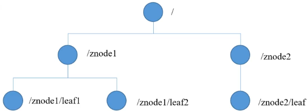

应用场景

提供的服务包括：统一命名服务、统一配置管理、统一集群管理、服务器节点动态上下线、软负载均衡等。

### 单机安装

（1）安装JDK

（2）下载安装包，下载地址：[https://zookeeper.apache.org/releases.html](https://zookeeper.apache.org/releases.html)

（3）解压到指定目录

配置文件：conf/zoo.cfg

启动服务端：`bin/zkServer.sh start`

停止服务端：`bin/zkServer.sh stop`

启动客户端：`bin/zkCli.sh`

查看状态：`bin/zkServer.sh status`

### 配置参数解读

```bash
1）tickTime：通信心跳时间，单位毫秒
2）initLimit：LF初始通信时限
3）syncLimit：LF同步通信时限
4）dataDir：zookeeper数据文件的位置
5）clientPort：客户端连接端口，通常不做修改
```

### 集群安装

1）集群规划

2）解压安装

3）配置服务器编号，添加myid文件

4）配置zoo.cfg，`server.A=B:C:D`

A是一个数字，表示这个是第几号服务器

B是这个服务器的地址

C是这个服务器Follower与集群中的Leader服务器交换信息的端口

D是万一集群中的Leader服务器挂了，需要一个端口来重新进行选举，选出一个新的Leader，而这个端口就是用来执行选举时服务器相互通信的端口

5）启动服务端`bin/zkServer.sh start`

### 选举机制

第一次启动

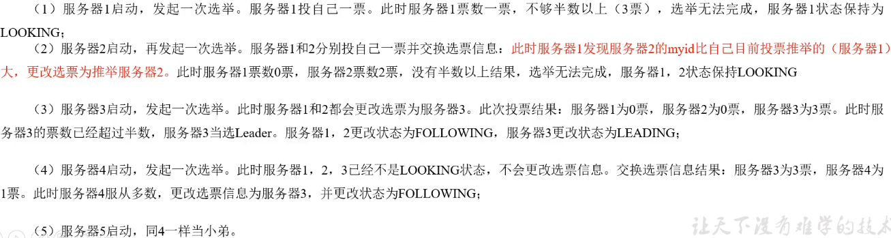

SID：服务器ID，和myid一致

ZXID：事务ID，ZXID是一个事务ID，用来标识一次服务器状态的变更。

Epoch：每个Leader任期的代号。 没有Leader时同一轮投票过程中的逻辑时钟值是相同的。每投完一次票这个数据就会增加

非第一次启动

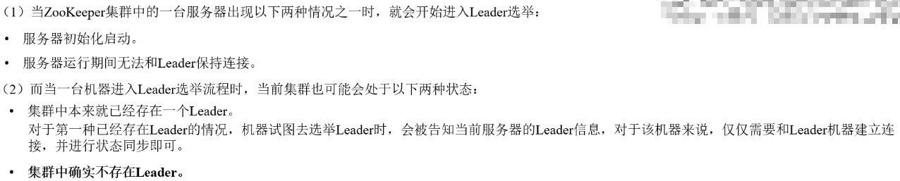

选举Leader规则：

1. Epoch大的直接胜出
2. Epoch相同，事务id大的胜出
3. 事务id相同，服务器id大的胜出

优先级：Epoch > ZXID > SID

### 集群启停脚本

```sh
#!/bin/bash

case $1 in
"start") {
	for i in node1 node2 node3
	do
		echo ----- zookeeper $i 启动 -----
		ssh $i "/opt/module/zookeeper-3.5.7/bin/zkServer.sh start"
	done
}
;;
"stop") {
	for i in node1 node2 node3
	do
		echo ----- zookeeper $i 停止 -----
		ssh $i "/opt/module/zookeeper-3.5.7/bin/zkServer.sh stop"
	done
}
;;
"status") {
	for i in node1 node2 node3
	do
		echo ----- zookeeper $i 状态 -----
		ssh $i "/opt/module/zookeeper-3.5.7/bin/zkServer.sh status"
	done
}
;;
esac
```

### 客户端命令行

命令行语法

```bash
help: 显示所有操作命令

ls path: 使用ls命令来查看当前znode的子节点[可监听]
-w 监听子节点变化
-s 附加次级信息

create: 普通创建
-s 含有序号
-e 临时（重启或者超时消失）

get path 获得节点的值[可监听]
-w 监听节点内容变化
-s 附加次级信息

set 设置节点的具体值

stat 查看节点状态

delete 删除节点

deleteall 递归删除节点
```

节点类型：

持久：客户端和服务端断开连接后，创建的节点不删除

短暂：客户端和服务端断开连接后，创建的节点自己删除

### 监听器原理

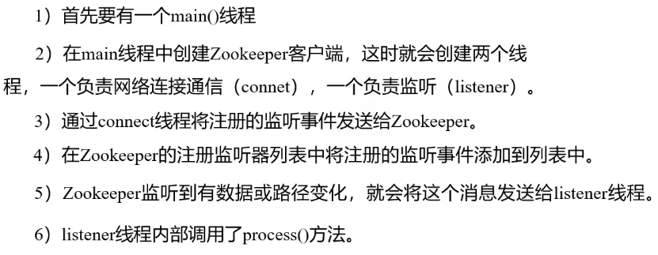

常见的监听

1）监听节点数据变化 `get path [watch]`

2）监听子节点增减的变化 `ls path [watch]`

注意：节点的路径变化，也是注册一次，生效一次。想多次生效，就需要多次注册。

### 客户端API操作

```xml
<dependency>
    <groupId>junit</groupId>
    <artifactId>junit</artifactId>
    <version>4.13.2</version>
</dependency>
<dependency>
    <groupId>org.apache.logging.log4j</groupId>
    <artifactId>log4j-core</artifactId>
    <version>2.17.1</version>
</dependency>
<dependency>
    <groupId>org.apache.zookeeper</groupId>
    <artifactId>zookeeper</artifactId>
    <version>3.4.14</version>
</dependency>
```

创建节点

```java
public class ZookeeperClient {
    private final String connectString = "localhost:2181";
    private final int sessionTimeout = 2000;
    private ZooKeeper zk;

    @Before
    public void init() throws IOException {
        zk = new ZooKeeper(connectString, sessionTimeout, new Watcher() {
            @Override
            public void process(WatchedEvent watchedEvent) {

            }
        });
    }

    @Test
    public void create() throws InterruptedException, KeeperException {
        zk.create("/lyh", "test.mp4".getBytes(), ZooDefs.Ids.OPEN_ACL_UNSAFE, CreateMode.PERSISTENT);
    }
}
```

监听节点变化

```java
@Before
public void init() throws IOException {
    zk = new ZooKeeper(connectString, sessionTimeout, new Watcher() {
        @Override
        public void process(WatchedEvent watchedEvent) {
            List<String> children = null;
            try {
                children = zk.getChildren("/", true);
                children.forEach(System.out::println);
            } catch (KeeperException | InterruptedException e) {
                e.printStackTrace();
            }
        }
    });
}
```

```java
@Test
public void getChildren() throws InterruptedException, KeeperException {
    List<String> children = zk.getChildren("/", true);
    children.forEach(System.out::println);
}
```

判断Znode是否存在

```java
@Test
public void exist() throws InterruptedException, KeeperException {
    Stat exists = zk.exists("/lyh", false);
    System.out.println(exists == null ? "不存在" : "存在");
}
```

### 写数据原理

1、写入请求直接发送给Leader节点

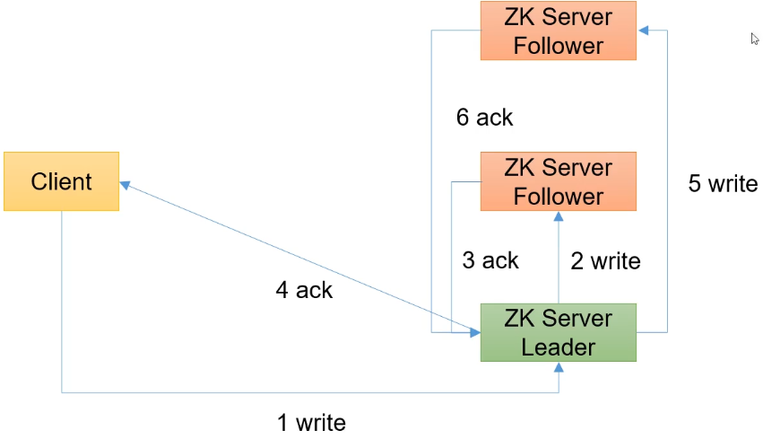

2、写入请求发送给Follower节点

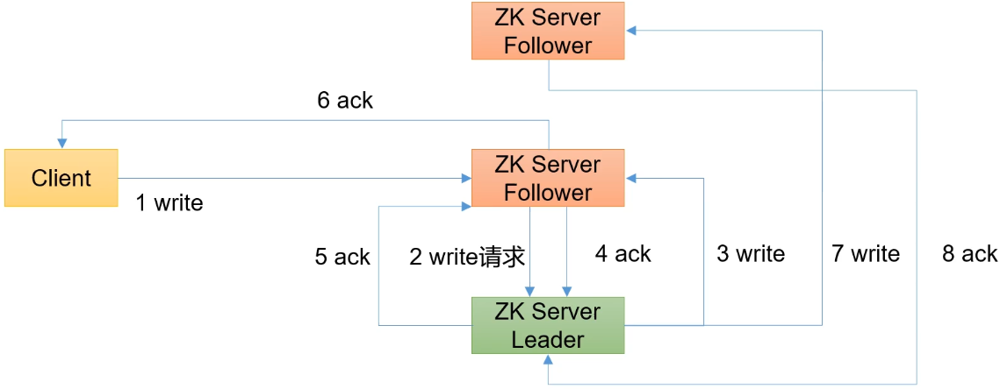

## Zookeeper案例

### 服务器动态上下线

需求：某分布式系统中，主节点可以有多台，可以动态上下线，任意一台客户端都能实时感知到主节点服务器上下线

先在Zookeeper上创建`/lyh_servers`节点

```bash
create /lyh_servers "servers"
```

服务器注册

```java
public class DistributeServer {
    private final String connectionString = "localhost:2181";
    private final int sessionTimeout = 2000;
    private ZooKeeper zk;

    public static void main(String[] args) throws Exception {
        DistributeServer server = new DistributeServer();
        // 1. 获取zk连接
        server.getConnection();
        // 2. 注册服务器到zk
        server.register(args[0]);
        // 3. 启动业务逻辑（睡觉）
        server.business();
    }

    private void getConnection() throws IOException {
        zk = new ZooKeeper(connectionString, sessionTimeout, new Watcher() {
            @Override
            public void process(WatchedEvent watchedEvent) {

            }
        });
    }

    private void register(String hostname) throws InterruptedException, KeeperException {
        zk.create("/lyh_servers/" + hostname, hostname.getBytes(), ZooDefs.Ids.OPEN_ACL_UNSAFE, CreateMode.EPHEMERAL_SEQUENTIAL);
        System.out.println(hostname + " is online");
    }

    private void business() throws InterruptedException {
        Thread.sleep(Long.MAX_VALUE);
    }
}
```


客户端监听

```java
public class DistributeClient {
    private final String connectionString = "localhost:2181";
    private final int sessionTimeout = 2000;
    private ZooKeeper zk;


    public static void main(String[] args) throws Exception {
        DistributeClient client = new DistributeClient();
        // 1. 获取zk连接
        client.getConnection();
        // 2. 监听/lyh_servers下面节点的增加和删除
        client.getServerList();
        // 3. 业务逻辑（睡觉）
        client.business();
    }

    private void getConnection() throws IOException {
        zk = new ZooKeeper(connectionString, sessionTimeout, new Watcher() {
            @Override
            public void process(WatchedEvent watchedEvent) {
                try {
                    getServerList();
                } catch (InterruptedException | KeeperException e) {
                    e.printStackTrace();
                }
            }
        });
    }

    private void getServerList() throws InterruptedException, KeeperException {
        List<String> children = zk.getChildren("/lyh_servers", true);
        List<String> servers = new ArrayList<>();
        for (String child : children) {
            byte[] data = zk.getData("/lyh_servers/" + child, false, null);
            servers.add(new String(data));
        }
        System.out.println(servers);
    }


    private void business() throws InterruptedException {
        Thread.sleep(Long.MAX_VALUE);
    }
}
```


### 分布式锁

1）接收到请求后，在/locks节点下创建一个临时顺序节点

2）判断自己是不是当前节点下最小的节点，是，获取到锁，不是，对前一个节点进行监听

3）获取到锁，处理完业务后，delete节点释放锁，然后下面的节点将收到通知，重复第二步判断

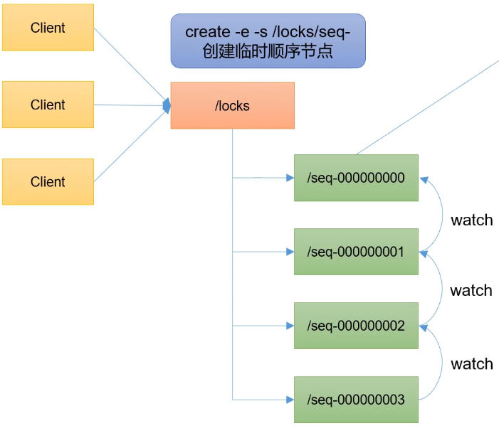

```java
public class DistributedLock {
    private final String connectionString = "localhost:2181";
    private final int sessionTimeout = 2000;
    private final ZooKeeper zooKeeper;
    private String waitPath;
    private String currentNode;
    private CountDownLatch connectionLatch = new CountDownLatch(1);
    private CountDownLatch waitLatch = new CountDownLatch(1);

    public DistributedLock() throws Exception {
        // 获取连接
        zooKeeper = new ZooKeeper(connectionString, sessionTimeout, new Watcher() {
            @Override
            public void process(WatchedEvent watchedEvent) {
                // connectionLatch 如果连接上zk，可以释放
                if (watchedEvent.getState() == Event.KeeperState.SyncConnected) {
                    connectionLatch.countDown();
                }
                // waitLatch 需要释放
                if (watchedEvent.getType() == Event.EventType.NodeDeleted && watchedEvent.getPath().equals(waitPath)) {
                    waitLatch.countDown();
                }
            }
        });
        // 等待zk正常连接
        connectionLatch.await();
        // 判断根节点/locks是否存在
        Stat stat = zooKeeper.exists("/locks", false);
        if (stat == null) {
            // 创建根节点
            zooKeeper.create("/locks", "locks".getBytes(), ZooDefs.Ids.OPEN_ACL_UNSAFE, CreateMode.PERSISTENT);
        }
    }

    /**
     * 对zk加锁
     */
    public void zkLock() {
        try {
            // 创建对应的临时带序号节点
            currentNode = zooKeeper.create("/locks/seq-", null, ZooDefs.Ids.OPEN_ACL_UNSAFE, CreateMode.EPHEMERAL_SEQUENTIAL);
            // 判断创建的节点是否是最小的，如果是获取到锁，如果不是，监听它序号前一个节点
            List<String> children = zooKeeper.getChildren("/locks", false);
            // 如果children只有一个值，那就直接获取锁，如果有多个节点，需要判断，谁最小
            if (children.size() > 1) {
                Collections.sort(children);
                String thisNode = currentNode.substring("/locks/".length());
                int index = children.indexOf(thisNode);
                if (index == -1) {
                    System.out.println("数据异常");
                } else if (index >= 1) {
                    // 需要监听前一个节点
                    waitPath = "/locks/" + children.get(index - 1);
                    zooKeeper.getData(waitPath, true, null);
                    waitLatch.await();
                }
            }
        } catch (KeeperException | InterruptedException e) {
            e.printStackTrace();
        }
    }

    /**
     * 对zk解锁
     */
    public void zkUnlock() {
        // 删除节点
        try {
            zooKeeper.delete(currentNode, -1);
        } catch (InterruptedException | KeeperException e) {
            e.printStackTrace();
        }
    }
}
```

Curator框架实现分布式锁

1）原生的Java API开发存在的问题

（1）会话连接是异步的，需要自己去处理

（2）Watch需要重复注册，不然不能生效

（3）开发的复杂性较高

（4）不支持多节点删除和创建，需要自己去递归

`Curator`是一个专门解决分布式锁的框架，解决了原生`Java API`开发分布式遇到的问题

官网：[https://curator.apache.org/](https://curator.apache.org/)

```xml
<dependency>
    <groupId>org.apache.curator</groupId>
    <artifactId>curator-framework</artifactId>
    <version>4.3.0</version>
</dependency>
<dependency>
    <groupId>org.apache.curator</groupId>
    <artifactId>curator-recipes</artifactId>
    <version>4.3.0</version>
</dependency>
<dependency>
    <groupId>org.apache.curator</groupId>
    <artifactId>curator-client</artifactId>
    <version>4.3.0</version>
</dependency>
```

```java
public class CuratorLockTest {
    public static void main(String[] args) {
        // 创建分布式锁1
        InterProcessMutex lock1 = new InterProcessMutex(getCuratorFramework(), "/locks");
        // 创建分布式锁2
        InterProcessMutex lock2 = new InterProcessMutex(getCuratorFramework(), "/locks");
        new Thread(new Runnable() {
            @Override
            public void run() {
                try {
                    lock1.acquire();
                    System.out.println("线程1获取到锁");
                    lock1.acquire();
                    System.out.println("线程1再次获取到锁");
                    Thread.sleep(5 * 1000);
                    lock1.release();
                    System.out.println("线程1释放锁");
                    lock1.release();
                    System.out.println("线程1再次释放锁");
                } catch (Exception e) {
                    e.printStackTrace();
                }
            }
        }).start();
        new Thread(new Runnable() {
            @Override
            public void run() {
                try {
                    lock2.acquire();
                    System.out.println("线程2获取到锁");
                    lock2.acquire();
                    System.out.println("线程2再次获取到锁");
                    Thread.sleep(5 * 1000);
                    lock2.release();
                    System.out.println("线程2释放锁");
                    lock2.release();
                    System.out.println("线程2再次释放锁");
                } catch (Exception e) {
                    e.printStackTrace();
                }
            }
        }).start();
    }

    private static CuratorFramework getCuratorFramework() {
        ExponentialBackoffRetry policy = new ExponentialBackoffRetry(3000, 3);
        CuratorFramework client = CuratorFrameworkFactory.builder()
                .connectString("localhost:2181")
                .connectionTimeoutMs(2000)
                .sessionTimeoutMs(2000)
                .retryPolicy(policy).build();
        client.start();
        System.out.println("zookeeper启动成功");
        return client;
    }
}
```

## Zookeeper算法基础

思考：Zookeeper是如何保证数据一致性的？

### 拜占庭将军问题

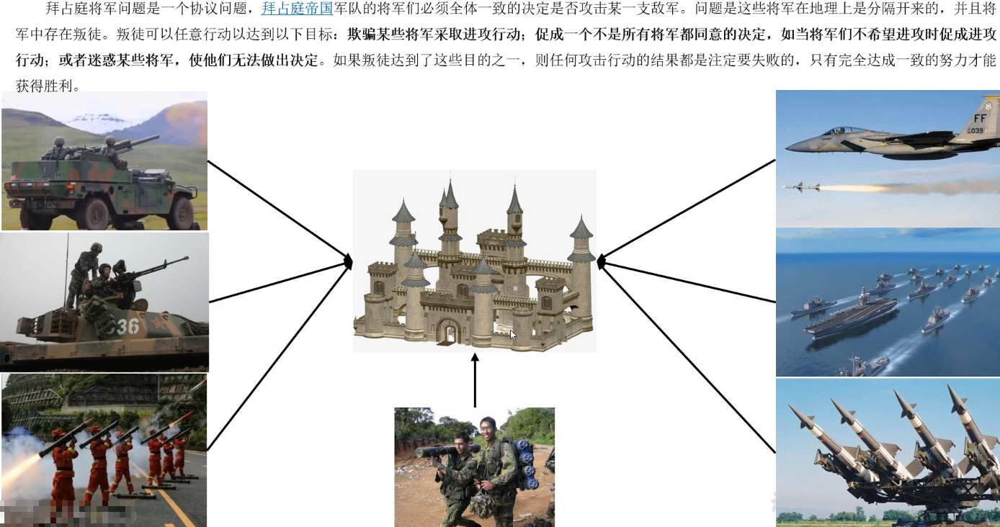

### Paxos算法

Paxos算法：一种基于消息传递且具有高度容错特性的一致性算法。

解决的问题：如何快速正确的在一个分布式系统中对某个数据值达成一致，并且保证不论发生任何异常都不会破坏整个系统的一致性。

在一个Paxos系统中，首先将所有节点划分为提议者、接受者和学习者

- Proposer（提议者）

- Acceptor（接受者）

- Learner（学习者）

注意：每个节点都可以身兼数职

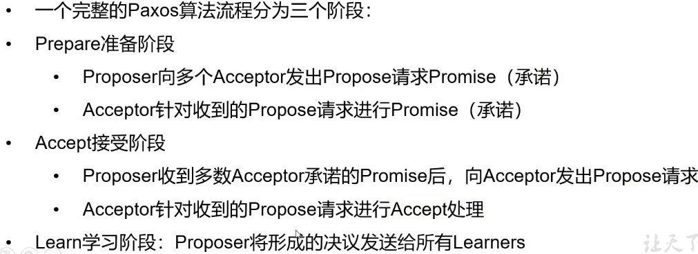

### ZAB协议

借鉴了Paxos算法，特别为Zookeeper设计的支持崩溃恢复的原子广播协议。基于该协议，Zookeeper设计为只有一台客户端（Leader）负责处理外部的写事务请求，然后Leader客户端将数据同步到其他Follower节点。即Zookeeper只有一个Leader可以发起提案。

ZAB协议包括两种基本的模式：消息广播、崩溃恢复

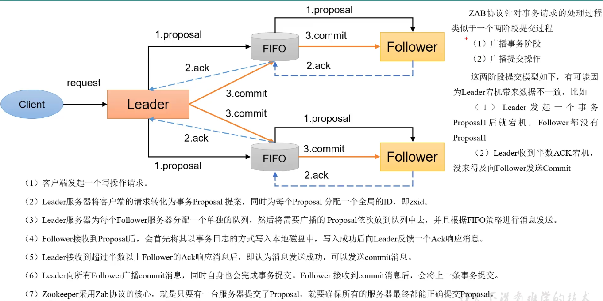

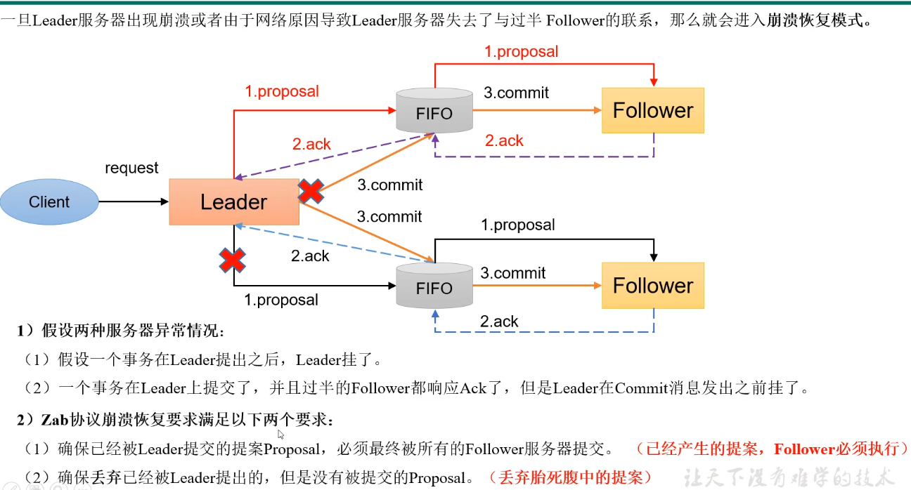

崩溃恢复主要包括两部分：Leader选举和数据恢复

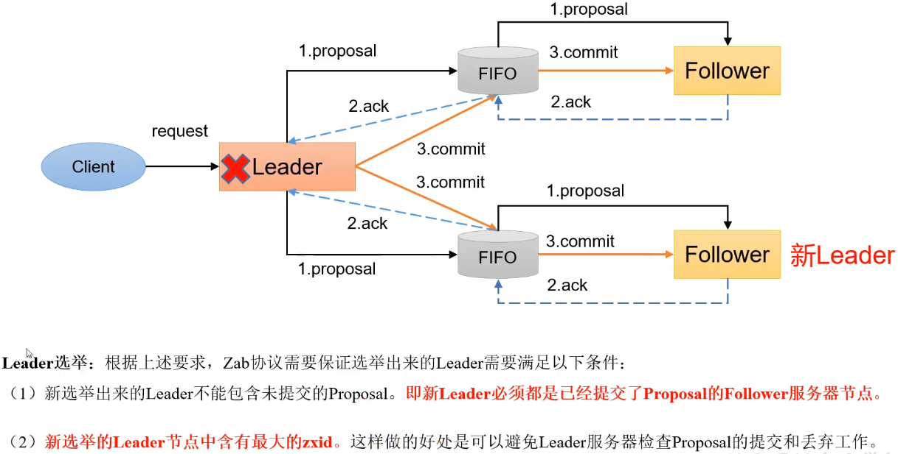

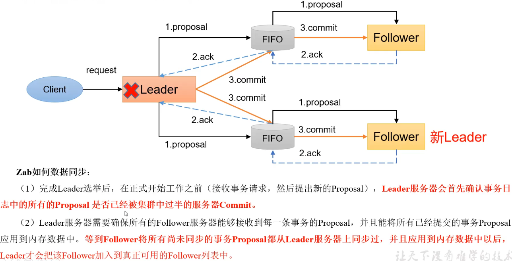

### CAP

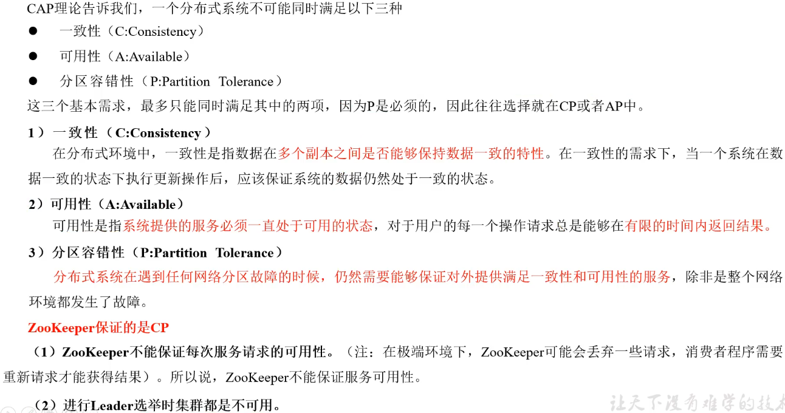

## Zookeeper源码

TODO: 阅读Zookeeper的源码

## 参考资料

[【尚硅谷】大数据技术之Zookeeper 3.5.7版本教程](https://www.bilibili.com/video/BV1to4y1C7gw)

