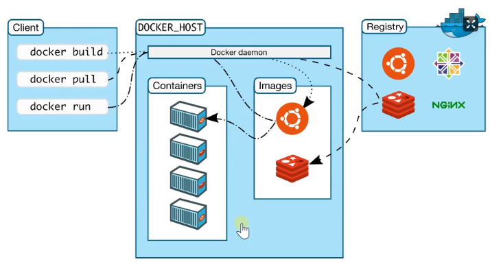
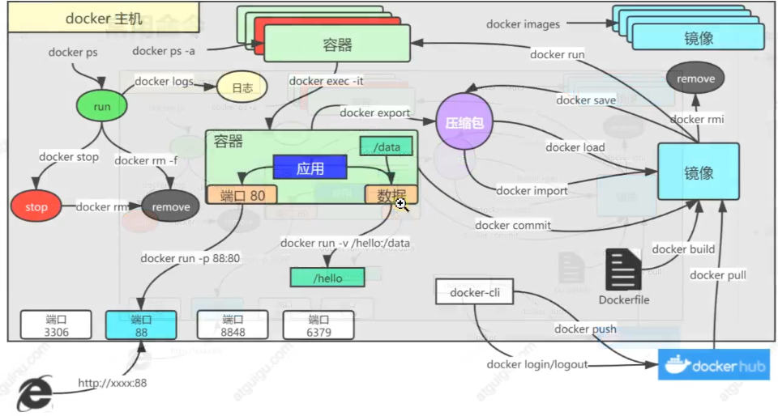

# 云原生学习笔记（一）

《云原生实战》是尚硅谷与KubeSphere官方联合打造的云原生系列课程之一

上篇由雷神主讲：P1-P130 

下篇由KubeSphere团队人员参与录制：P131-P200 

Java架构师的第一课，Docker+k8s+KubeSphere+DevOps上云实战 

让雷神带你站在新高度重新审视技术，真正实现云上亿级流量永不宕机

视频链接：[https://www.bilibili.com/video/BV13Q4y1C7hS](https://www.bilibili.com/video/BV13Q4y1C7hS)

课程笔记：[https://www.yuque.com/leifengyang/oncloud](https://www.yuque.com/leifengyang/oncloud)

## 云平台核心

为什么用云平台？

- 环境统一
- 按需付费
- 即开即用
- 稳定性强
- ……

国内常见云平台：阿里云、百度云、腾讯云、华为云、青云……

国外常见云平台：亚马逊AWS、微软Azure……

> 没有一种云计算类型适用于所有人。多种不同的云计算模型、类型和服务已得到发展，可以满足组织快速变化的技术需求。

## Docker基础

解决的问题：

- 统一标准
- 资源隔离




### 安装Docker

[Linux安装Docker](https://hub.docker.com/search?offering=community&operating_system=linux&q=&type=edition)


#### Uninstall old versions

```bash
 sudo apt-get remove docker docker-engine docker.io containerd runc
```


#### Install using the repository

```bash
 sudo apt-get update
 sudo apt-get install \
    ca-certificates \
    curl \
    gnupg \
    lsb-release
```

```bash
 curl -fsSL https://download.docker.com/linux/ubuntu/gpg | sudo gpg --dearmor -o /usr/share/keyrings/docker-archive-keyring.gpg
```

```bash
 echo \
  "deb [arch=$(dpkg --print-architecture) signed-by=/usr/share/keyrings/docker-archive-keyring.gpg] https://download.docker.com/linux/ubuntu \
  $(lsb_release -cs) stable" | sudo tee /etc/apt/sources.list.d/docker.list > /dev/null
```


#### Install Docker Engine

```bash
 sudo apt-get update
 sudo apt-get install docker-ce docker-ce-cli containerd.io
```

#### 镜像加速器

```bash
sudo mkdir -p /etc/docker
sudo tee /etc/docker/daemon.json <<-'EOF'
{
  "registry-mirrors": ["你的加速器地址"]
}
EOF
sudo systemctl daemon-reload
sudo systemctl restart docker
```


### Docker命令




```bash
# 拉取镜像
docker pull nginx # 拉取最新版

# 镜像名:版本名（标签）
docker pull nginx:1.20.1

# 查看所有镜像
docker images

# 删除镜像
docker rmi 镜像名:版本号/镜像id

# 启动容器
docker run [OPTIONS] IMAGE [COMMAND] [ARG...]

# 常用设置项
--name 指定名字
--restart=always 开机自启
-d 后台运行
-p 端口映射
-v 挂载数据 主机目录:容器目录

# 更新容器设置项
docker update 容器id/容器名字 设置项

# 进入容器内部
docker exec -it 容器id /bin/bash
docker exec -it 容器id /bin/sh

# 停止容器
docker stop 容器id/容器名字

# 再次启动
docker start 容器id/容器名字

# 删除停止的容器
docker rm 容器id/容器名字

# 强制删除
docker rm -f 容器id/容器名字

# 查看正在运行的容器
docker ps

# 查看所有
docker ps -a

# 提交改变
docker commit -a "作者" -m "消息" 容器id 镜像名:版本号

# 镜像保存
docker save -o 名字.tar 镜像名:版本号

# 加载镜像
docker load -i 名字.tar

# 推送远程仓库
docker tag local-image:tagname new-repo:tagname
docker push new-repo:tagname

# 登录 docker hub
docker login

# 退出
docker logout

# 挂载数据
-v 主机目录:容器目录

# 日志
docker logs 容器名/容器id

# 复制
docker cp
docker cp 5eff66eec7e1:/etc/nginx/nginx.conf /data/conf/nginx.conf
docker cp /data/conf/nginx.conf 5eff66eec7e1:/etc/nginx/nginx.conf
```

### 部署Redis

```bash
docker run \
-v /data/redis/redis.conf:/etc/redis/redis.conf \
-v /data/redis/data:/data \
-d --name myRedis \
-p 6379:6379 \
redis:latest redis-server /etc/redis/redis.conf
```


## 参考资料

[云原生Java架构师的第一课K8s+Docker+KubeSphere+DevOps](https://www.bilibili.com/video/BV13Q4y1C7hS)

