# 大数据技术原理与应用

## 概述

大数据不仅仅是数据的“大量化”，而是包含“快速化”、“多样化”和“价值化”等多重属性。

两大核心技术：分布式存储和分布式处理

大数据计算模式

- 批处理计算
- 流计算
- 图计算
- 查询分析计算

大数据具有数据量大、数据类型繁多、处理速度快、价值密度低等特点。

## Hadoop

Hadoop是Apache软件基金会旗下的一个开源分布式计算平台，为用户提供了系统底层细节透明的分布式基础架构。

Hadoop是基于Java语言开发的，具有很好的跨平台特性，并且可以部署在廉价的计算机集群中。

Hadoop的核心是分布式文件系统HDFS和MapReduce

特性：

- 高可靠性
- 高效性
- 高可扩展性
- 高容错性
- 成本低
- 运行在Linux平台上
- 支持多种编程语言

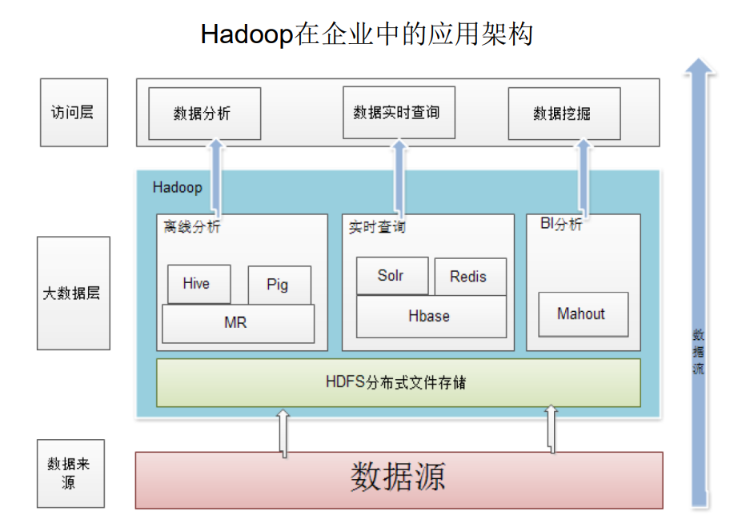

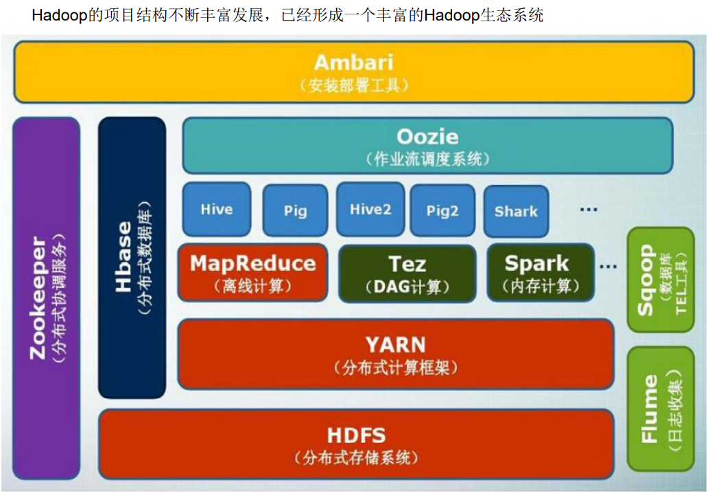

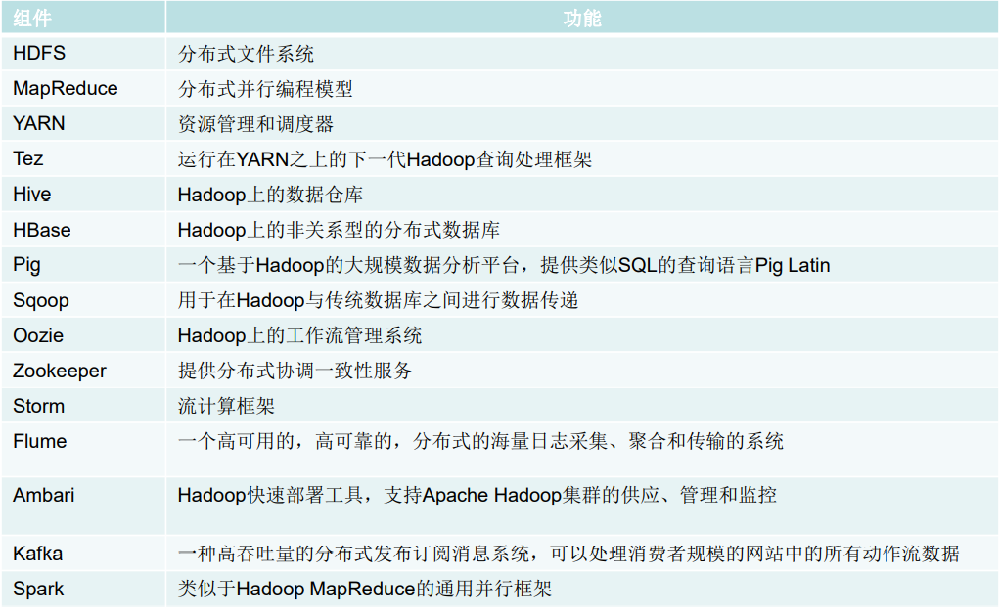

伪分布式安装配置

1. 修改配置文件
2. 初始化文件系统 hadoop namenode -format
3. 启动所有进程 start-all.sh
4. 访问web界面，查看Hadoop信息
5. 运行实例

伪分布式需要修改两个配置文件`core-site.xml`和`hdfs-site.xml`

修改配置文件core-site.xml

```xml
<configuration>
    <property>
        <name>hadoop.tmp.dir</name>
        <value>file:/usr/local/hadoop/tmp</value>
        <description>Abase for other temporary directories.</description>
    </property>
    <property>
        <name>fs.defaultFS</name>
        <value>hdfs://localhost:9000</value>
    </property>
</configuration>

```

hadoop.tmp.dir表示存放临时数据的目录，即包括NameNode的数据，也包括DataNode的数据。该路径任意指定，只要实际存在该文件夹即可

name为fs.defaultFS的值，表示hdfs路径的逻辑名称

修改配置文件hdfs-site.xml

```xml
<configuration>
    <property>
        <name>dfs.replication</name>
        <value>1</value>
    </property>
    <property>
        <name>dfs.namenode.name.dir</name>
        <value>file:/usr/local/hadoop/tmp/dfs/name</value>
    </property>
    <property>
        <name>dfs.datanode.data.dir</name>
        <value>file:/usr/local/hadoop/tmp/dfs/data</value>
    </property>
</configuration>

```

dfs.replication表示副本的数量，伪分布式要设置为1

dfs.namenode.name.dir表示本地磁盘目录，是存储fsimage文件的地方

dfs.datanode.data.dir表示本地磁盘目录，HDFS数据存放block的地方


## 分布式文件系统HDFS

HDFS要实现的目标

- 兼容廉价的硬件设备
- 实现流数据读写
- 支持大数据集
- 支持简单的文件模型
- 强大的跨平台兼容性

HDFS自身的局限性

- 不适合低延迟数据访问
- 无法高效存储大量小文件
- 不支持多用户写入及任意修改文件

HDFS两大组件

名称节点（NameNode）：整个HDFS集群的管家，记录信息

数据节点（DataNode）：存储实际数据

HDFS读数据

```java
package org.example;

import org.apache.hadoop.conf.Configuration;
import org.apache.hadoop.fs.FSDataInputStream;
import org.apache.hadoop.fs.FileSystem;
import org.apache.hadoop.fs.Path;

import java.io.BufferedReader;
import java.io.IOException;
import java.io.InputStreamReader;

public class ReadDataTest {
    public static void main(String[] args) throws IOException {
        Configuration configuration = new Configuration();
        configuration.set("fs.defaultFS", "hdfs://localhost:9000");
        configuration.set("fs.hdfs.impl", "org.apache.hadoop.hdfs.DistributedFileSystem");
        FileSystem fs = FileSystem.get(configuration);
        Path path = new Path("test.txt");
        FSDataInputStream is = fs.open(path);
        BufferedReader d = new BufferedReader(new InputStreamReader(is));
        String content = d.readLine();
        System.out.println(content);
        d.close();
        fs.close();
    }
}

```

HDFS写数据

```java
package org.example;

import org.apache.hadoop.conf.Configuration;
import org.apache.hadoop.fs.FSDataOutputStream;
import org.apache.hadoop.fs.FileSystem;
import org.apache.hadoop.fs.Path;

import java.io.IOException;
import java.nio.charset.StandardCharsets;

public class WriteDataTest {
    public static void main(String[] args) throws IOException {
        Configuration configuration = new Configuration();
        configuration.set("fs.defaultFS", "hdfs://localhost:9000");
        configuration.set("fs.hdfs.impl", "org.apache.hadoop.hdfs.DistributedFileSystem");
        FileSystem fs = FileSystem.get(configuration);
        byte[] buff = "Hello World\n".getBytes(StandardCharsets.UTF_8);
        String filename = "hello.txt";
        FSDataOutputStream os = fs.create(new Path(filename));
        os.write(buff, 0, buff.length);
        System.out.println("Create: " + filename);
        os.close();
        fs.close();
    }
}

```


## 分布式数据库HBase

HBase是一个高可靠、高性能、面向列、可伸缩的分布式数据库

可以用来存储非结构化和半结构化的松散数据

HBase的功能组件：库函数、Master服务器、Region服务器

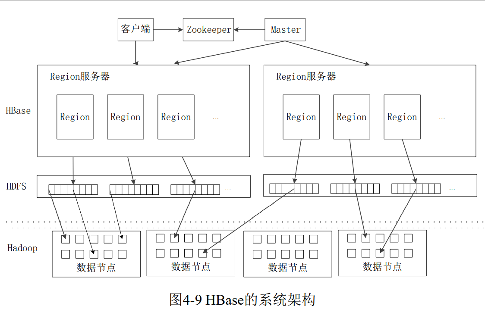

HBase Java API编程实践

```java
package org.example;

import org.apache.hadoop.conf.Configuration;
import org.apache.hadoop.hbase.HBaseConfiguration;
import org.apache.hadoop.hbase.TableName;
import org.apache.hadoop.hbase.client.*;
import org.apache.hadoop.hbase.util.Bytes;

import java.io.IOException;
import java.nio.charset.StandardCharsets;


public class ExampleForHBase {
    public static Configuration configuration;
    public static Connection connection;
    public static Admin admin;

    public static void init() {
        configuration = HBaseConfiguration.create();
        configuration.set("hbase.rootdir", "hdfs://localhost:9000/hbase");
        try {
            connection = ConnectionFactory.createConnection(configuration);
            admin = connection.getAdmin();
        } catch (IOException e) {
            e.printStackTrace();
        }
    }

    public static void close() {
        try {
            if (admin != null) {
                admin.close();
            }
            if (null != connection) {
                connection.close();
            }
        } catch (IOException e) {
            e.printStackTrace();
        }
    }

    public static void createTable(String myTableName, String[] colFamily) throws IOException {
        TableName tableName = TableName.valueOf(myTableName);
        if (admin.tableExists(tableName)) {
            System.out.println(myTableName + "already exists");
        } else {
            TableDescriptorBuilder tableDescriptorBuilder = TableDescriptorBuilder.newBuilder(tableName);
            for (String col : colFamily) {
                ColumnFamilyDescriptor familyDescriptorBuilder =ColumnFamilyDescriptorBuilder.newBuilder(Bytes.toBytes(col)).build();
                tableDescriptorBuilder.setColumnFamily(familyDescriptorBuilder);
            }
            admin.createTable(tableDescriptorBuilder.build());
        }
    }

    public static void insertData(String tableName, String rowKey, String colFamily, String col, String val) throws IOException {
        Table table = connection.getTable(TableName.valueOf(tableName));
        Put put = new Put(rowKey.getBytes(StandardCharsets.UTF_8));
        put.addColumn(colFamily.getBytes(StandardCharsets.UTF_8), col.getBytes(StandardCharsets.UTF_8), val.getBytes(StandardCharsets.UTF_8));
        table.put(put);
        table.close();
    }

    public static void getData(String tableName, String rowKey, String colFamily, String col) throws IOException {
        Table table = connection.getTable(TableName.valueOf(tableName));
        Get get = new Get(rowKey.getBytes(StandardCharsets.UTF_8));
        get.addColumn(colFamily.getBytes(StandardCharsets.UTF_8), col.getBytes(StandardCharsets.UTF_8));
        Result result = table.get(get);
        System.out.println(new String(result.getValue(colFamily.getBytes(StandardCharsets.UTF_8), col.getBytes(StandardCharsets.UTF_8))));
        table.close();
    }


    public static void main(String[] args) throws IOException{
        init();
        createTable("student", new String[]{"score"});
        insertData("student", "tom", "score", "English", "90");
        insertData("student", "tom", "score", "Math", "60");
        insertData("student", "tom", "score", "Computer", "70");
        getData("student", "tom", "score", "English");
        close();
    }
}

```


## NoSQL数据库

NoSQL数据库具有以下几个特点：

- 灵活的可扩展性
- 灵活的数据模型
- 与云计算紧密融合

NoSQL的四大类型：

- 键值数据库
- 列族数据库
- 文档数据库
- 图数据库


CAP理论

一致性、可用性和分区容忍性

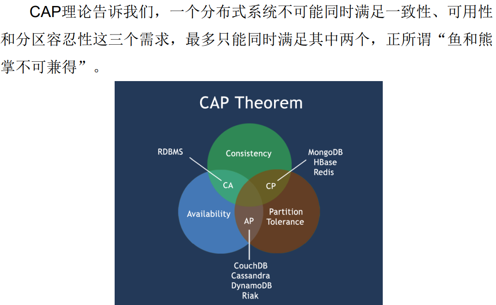

文档数据库MongoDB

MongoDB将数据存储为一个文档，数据结构由键值对组成MongoDB文档类似于JSON对象。字段值可以包含其他文档，数组及文档数组。

MongoDB术语：

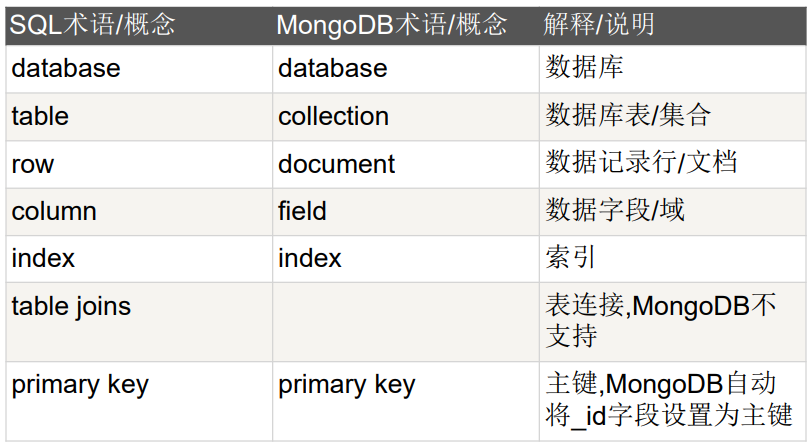

## 云数据库

云数据库是部署和虚拟化在云计算环境中的数据库。

云数据库具有以下特性：

1. 动态可扩展
2. 高可用性
3. 较低的使用代价
4. 易用性
5. 高性能
6. 免维护
7. 安全

UMP系统架构：

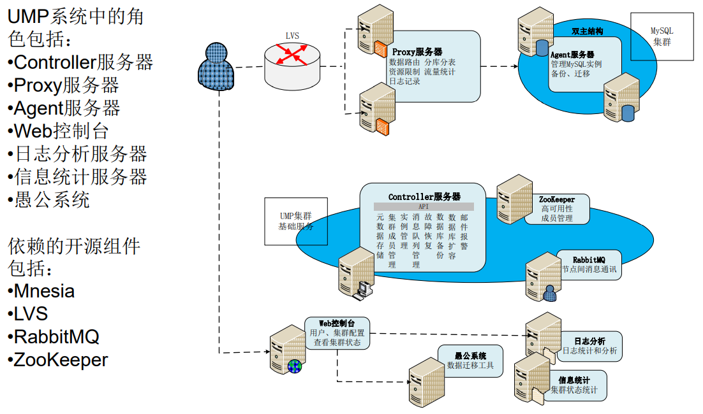

UMP系统是构建在一个大的集群之上的，通过多个组件的协同作业，整个系统实现了对用户透明的各种功能：

- 容灾
- 读写分离
- 分库分表
- 资源管理
- 资源调度
- 资源隔离
- 数据安全

## MapReduce

MapReduce是一种分布式并行编程框架。

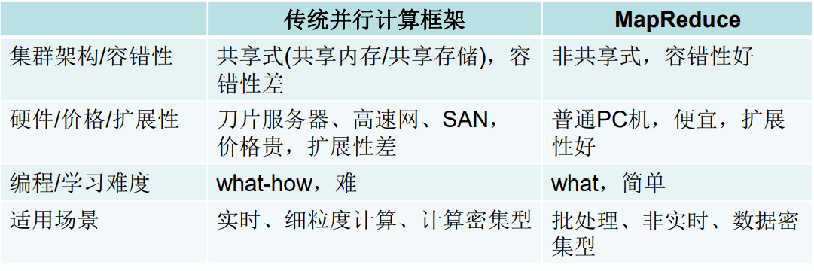

MapReduce的理念：计算向数据靠拢

MapReduce体系结构

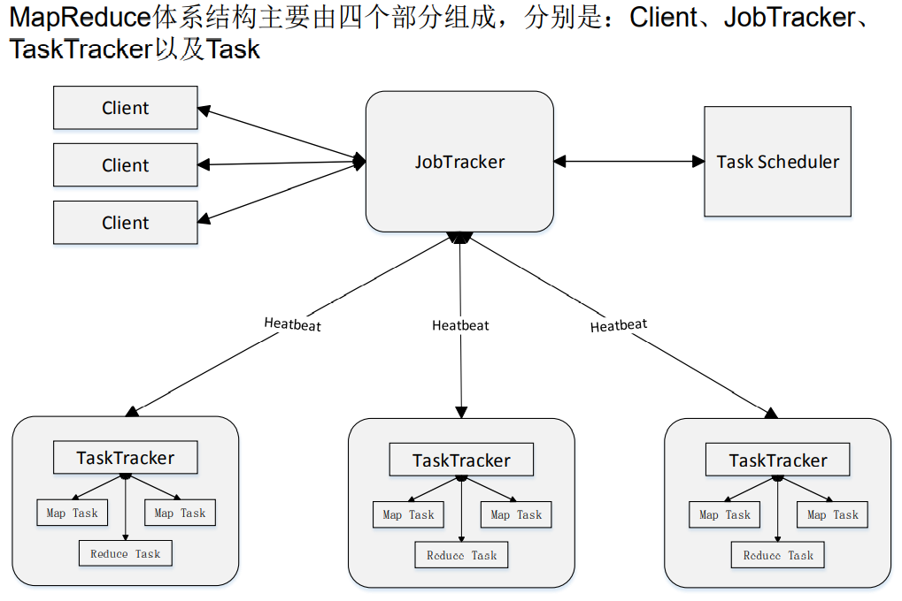

MapReduce可以很好的应用于各种计算问题

- 关系代数运算（选择、投影、并、交、差、连接）
- 分组与聚合运算
- 矩阵-向量乘法
- 矩阵乘法

词频统计

```java
package org.example;

import org.apache.hadoop.conf.Configuration;
import org.apache.hadoop.fs.Path;
import org.apache.hadoop.io.IntWritable;
import org.apache.hadoop.io.Text;
import org.apache.hadoop.mapreduce.lib.input.FileInputFormat;
import org.apache.hadoop.mapreduce.Job;
import org.apache.hadoop.mapreduce.lib.output.FileOutputFormat;
import org.apache.hadoop.util.GenericOptionsParser;

public class WordCount {
    public static void main(String[] args) throws Exception{
        Configuration configuration = new Configuration();
        String[] otherArgs = (new GenericOptionsParser(configuration, args)).getRemainingArgs();
        if (otherArgs.length < 2) {
            System.err.println("Usage: wordCount <in> [<in>...] <out>");
            System.exit(2);
        }
        Job job = Job.getInstance(configuration, "wordCount");
        job.setJarByClass(WordCount.class);
        job.setMapperClass(TokenizerMapper.class);
        job.setCombinerClass(IntSumReducer.class);
        job.setReducerClass(IntSumReducer.class);
        job.setOutputKeyClass(Text.class);
        job.setOutputValueClass(IntWritable.class);
        for (int i = 0; i < otherArgs.length - 1; i++) {
            FileInputFormat.addInputPath(job, new Path(otherArgs[i]));
        }
        FileOutputFormat.setOutputPath(job, new Path(otherArgs[otherArgs.length - 1]));
        System.exit(job.waitForCompletion(true) ? 0 : 1);
    }
}

```

```java
package org.example;

import org.apache.hadoop.io.IntWritable;
import org.apache.hadoop.io.Text;
import org.apache.hadoop.mapreduce.Mapper;

import java.io.IOException;
import java.util.StringTokenizer;

public class TokenizerMapper extends Mapper<Object, Text, Text, IntWritable> {
    private final IntWritable one = new IntWritable(1);
    private final Text word = new Text();
    public TokenizerMapper() {}
    public void map(Object key, Text value, Mapper<Object, Text, Text, IntWritable>.Context context) throws IOException, InterruptedException {
        StringTokenizer stringTokenizer = new StringTokenizer(value.toString());
        while (stringTokenizer.hasMoreTokens()) {
            this.word.set(stringTokenizer.nextToken());
            context.write(this.word, one);
        }
    }
}

```

```java
package org.example;

import org.apache.hadoop.io.IntWritable;
import org.apache.hadoop.io.Text;
import org.apache.hadoop.mapreduce.Reducer;

import java.io.IOException;
import java.util.Iterator;

public class IntSumReducer extends Reducer<Text, IntWritable, Text, IntWritable> {
    private final IntWritable result = new IntWritable();
    public IntSumReducer() {}
    public void reduce(Text key, Iterable<IntWritable> values, Reducer<Text, IntWritable, Text, IntWritable>.Context context) throws IOException, InterruptedException {
        int sum = 0;
        IntWritable val;
        for (Iterator<IntWritable> it = values.iterator(); it.hasNext(); sum += val.get()) {
            val = (IntWritable) it.next();
        }
        this.result.set(sum);
        context.write(key, this.result);
    }
}

```


## 数据仓库Hive

数据仓库是一个面向主题的、集成的、相对稳定的、反映历史变化的数据集合，用于支持管理决策

Hive简介

- 依赖分布式文件系统HDFS存储数据
- 依赖分布式并行计算模型MapReduce处理数据
- 借鉴SQL语言设计了新的查询语言HiveQL

Hive是一个可以提供有效合理直观组织和使用数据的分析工具

Hive两个方面的特性

（1）采用批处理方式处理海量数据

（2）Hive提供了一系列对数据进行提取、转换、加载（ETL）的工具

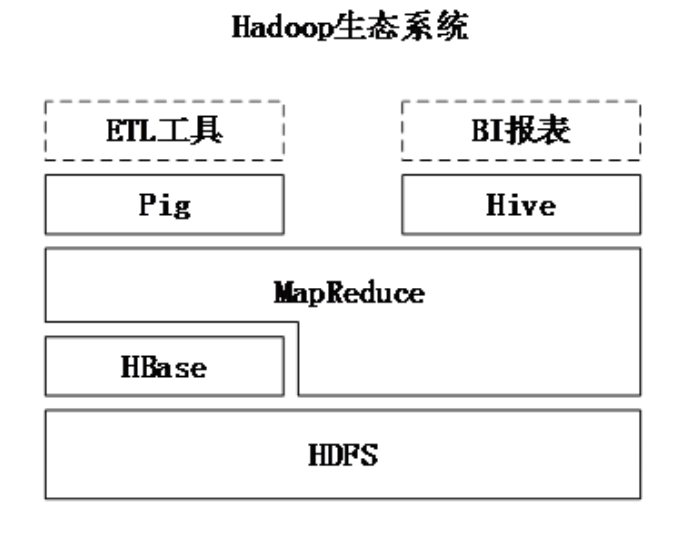

Pig主要用于数据仓库的ETL环节

Hive主要用于数据仓库海量数据的批处理分析

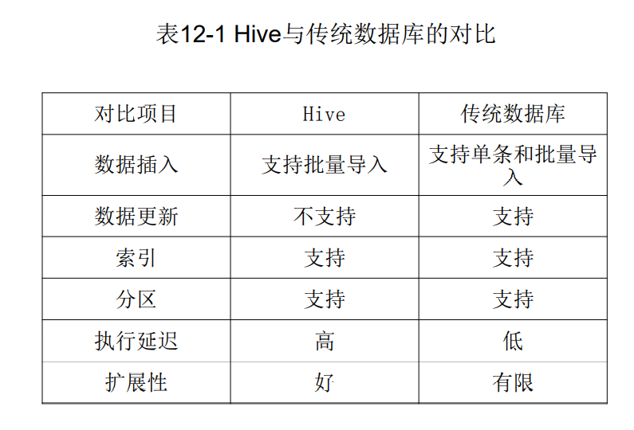

Hive应用实例：WordCount

词频统计任务要求：

1、创建一个需要分析的输入数据文件

2、编写HiveQL语句来实现WordCount，统计出每个单词出现的频率

```sql
create table docs(line string);
```

```sql
load data inpath 'wordCountInput' overwrite into table docs;
```

```sql
create table word_count as
    select word, count(1) as count from
    (select explode(split(line, ' '))as word from docs) w
    group by word
    order by word;

```

采用Hive实现WordCount算法需要编写较少的代码量

在MapReduce的实现中，需要进行编译生成jar文件来执行算法，而在Hive中不需要

## Spark

Spark的特点：

- 运行速度快
- 容易使用
- 通用性
- 运行模式多样

Scala是Spark的主要编程语言，但Spark还支持Java、Python、R作为编程语言

Spark提供内存计算，可将中间结果放到内存中，对于迭代运算效率更高

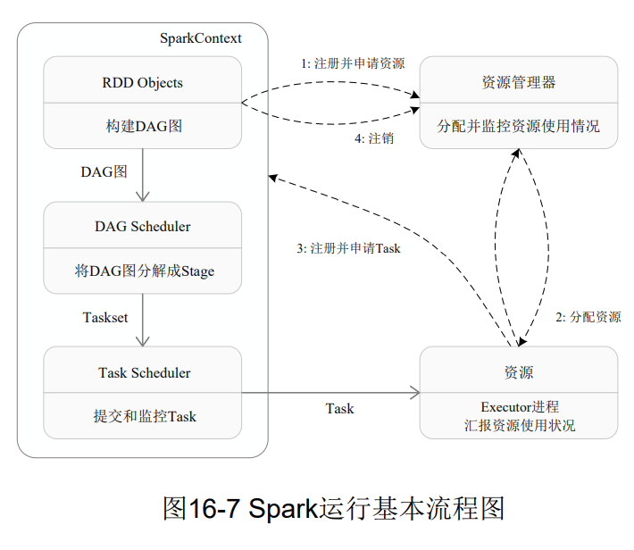

Spark运行架构特点：

1、每个Application都有自己专属的Executor进程，并且该进程在Application运行期间一直驻留。Executor进程以多线程的方式运行Task。

2、Spark运行过程与资源管理器无关，只要能够获取Executor进程并保持通信即可

3、Task采用了数据本地性和推测执行等优化机制

RDD

一个RDD就是一个分布式对象集合，本质上是一个只读的分区记录集合，每个RDD可分成多个分区，每个分区就是一个数据集片段，并且一个RDD的不同分区可以被保存到集群中不同的节点上，从而可以在集群中的不同节点上进行并行计算。

RDD提供了一种高度受限的共享内存模型，即RDD是只读的记录分区的集合，不能直接修改。

RDD运行过程

1、创建RDD对象

2、SparkContext负责计算RDD之间的依赖关系，构建DAG

3、DAGScheduler负责把DAG图分解成多个Stage，每个Stage中包含了多个Task，每个Task会被TaskScheduler分发给各个WorkerNode上的Executor去执行


Spark实例：词频统计

```scala
import org.apache.log4j.{Level, Logger}
import org.apache.spark.{SparkConf, SparkContext}

object WordCount {
  def main(args: Array[String]): Unit = {
    Logger.getLogger("org.apache.spark").setLevel(Level.WARN)
    Logger.getLogger("org.eclipse.jetty.server").setLevel(Level.OFF)
    val inputFile = "file:///home/hadoop/lyh/wordCountApp/input/file1.txt"
    val conf = new SparkConf().setAppName("WordCount").setMaster("local[2]")
    val sc = new SparkContext(conf)
    val textFile = sc.textFile(inputFile)
    val wordCount = textFile.flatMap(line => line.split(" ")).map(word => (word, 1)).reduceByKey((a, b) => a+b)
    wordCount.foreach(println)
  }
}
```


## 流计算

近年来，在Web应用、网络监控、传感监测等领域，兴起了一种新的数据密集型应用——流数据

流数据：数据以大量、快速、时变的流形式持续到达

流数据的特征：

- 数据快速持续到达，潜在大小也许是无穷无尽
- 数据来源众多，格式复杂
- 数据量大，但是不十分关注存储，一旦经过处理，要么被丢弃，要么归档存储
- 注重数据的整体价值，不过分关注个别数据
- 数据顺序颠倒，或者不完整，系统无法控制将要处理的新到达的数据元素的顺序

流计算：实时获取来自不同数据源的海量数据经过实时分析处理，获得有价值的信息

流计算系统要求：高性能、海量式、实时性、分布式、易用性、可靠性

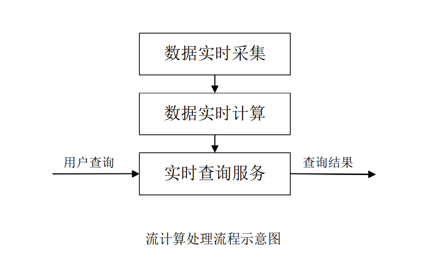


## Flink

Flink主要特性：

- 批流一体化

- 精密的状态管理

- 事件时间支持

- 精确一次的状态一致性保障

- ###### ……

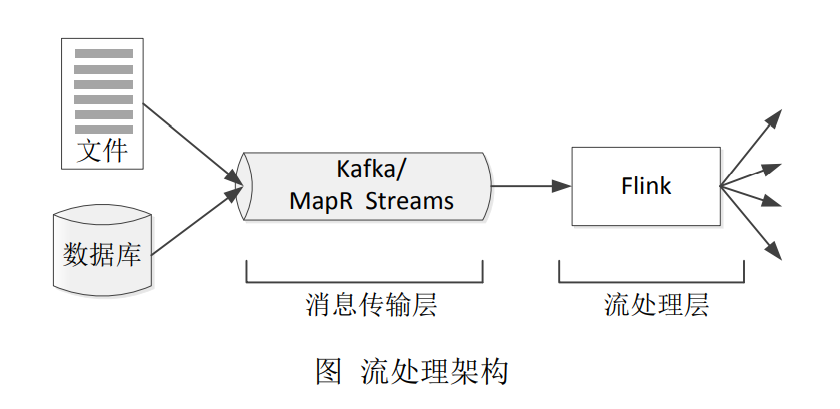


Flink是理想的流计算框架

Flink：低延迟、高吞吐、高性能

Flink高级特性：提供有状态的计算、支持状态管理、支持强一致性的语义、支持对消息乱序的处理……

Flink常见场景

- 事件驱动型应用
- 数据分析应用
- 数据流水线应用

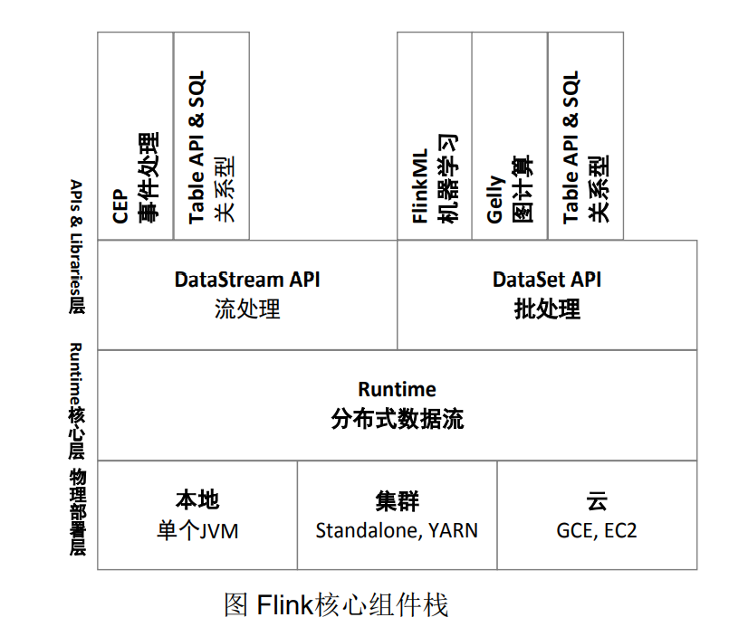

Flink实例：编程实现WordCount

```xml
<?xml version="1.0" encoding="UTF-8"?>
<project xmlns="http://maven.apache.org/POM/4.0.0"
         xmlns:xsi="http://www.w3.org/2001/XMLSchema-instance"
         xsi:schemaLocation="http://maven.apache.org/POM/4.0.0 http://maven.apache.org/xsd/maven-4.0.0.xsd">
    <modelVersion>4.0.0</modelVersion>

    <groupId>org.example</groupId>
    <artifactId>wordCountByFlink</artifactId>
    <version>1.0-SNAPSHOT</version>

    <properties>
        <maven.compiler.source>8</maven.compiler.source>
        <maven.compiler.target>8</maven.compiler.target>
    </properties>

    <dependencies>
        <!-- https://mvnrepository.com/artifact/org.apache.flink/flink-java -->
        <dependency>
            <groupId>org.apache.flink</groupId>
            <artifactId>flink-java</artifactId>
            <version>1.14.2</version>
        </dependency>
        <!-- https://mvnrepository.com/artifact/org.apache.flink/flink-clients -->
        <dependency>
            <groupId>org.apache.flink</groupId>
            <artifactId>flink-clients_2.12</artifactId>
            <version>1.14.2</version>
        </dependency>
        <!-- https://mvnrepository.com/artifact/org.apache.flink/flink-streaming-java -->
        <dependency>
            <groupId>org.apache.flink</groupId>
            <artifactId>flink-streaming-java_2.12</artifactId>
            <version>1.14.2</version>
            <scope>provided</scope>
        </dependency>

    </dependencies>
    <build>
        <plugins>
            <!-- 使用maven-assembly-plugin插件打包 -->
            <plugin>
                <groupId>org.apache.maven.plugins</groupId>
                <artifactId>maven-assembly-plugin</artifactId>
                <version>3.2.0</version>
                <configuration>
                    <archive>
                        <manifest>
                            <mainClass>org.example.WordCount</mainClass>
                        </manifest>
                    </archive>
                    <descriptorRefs>
                        <descriptorRef>jar-with-dependencies</descriptorRef>
                    </descriptorRefs>
                </configuration>
                <executions>
                    <execution>
                        <id>make-assembly</id>
                        <phase>package</phase>
                        <goals>
                            <goal>single</goal>
                        </goals>
                    </execution>
                </executions>
            </plugin>
        </plugins>
    </build>
</project>
```


```java
package org.example;

import org.apache.flink.api.common.functions.FlatMapFunction;
import org.apache.flink.api.java.tuple.Tuple2;
import org.apache.flink.util.Collector;

import java.util.Locale;

public class WordCountTokenizer implements FlatMapFunction<String, Tuple2<String, Integer>> {
    @Override
    public void flatMap(String s, Collector<Tuple2<String, Integer>> collector) throws Exception {
        String[] tokens = s.toLowerCase(Locale.ROOT).split("\\W+");
        for (String tmp : tokens) {
            if (tmp.length() > 0) {
                collector.collect(new Tuple2<>(tmp, 1));
            }
        }
    }

    public WordCountTokenizer() {}
}

```


```java
package org.example;

import org.apache.flink.api.java.DataSet;
import org.apache.flink.api.java.ExecutionEnvironment;

public class WordCountData {
    public static final String[] words = new String[]{
            "Hello World",
            "Hello Hadoop",
            "Hello Flink",
            "Hello Hive",
            "Hello Java",
            "Hello Spark"
    };

    public WordCountData() {}

    public static DataSet<String> getDefaultTextLineDataSet(ExecutionEnvironment env) {
        return env.fromElements(words);
    }
}

```


```java
package org.example;

import org.apache.flink.api.java.DataSet;
import org.apache.flink.api.java.ExecutionEnvironment;
import org.apache.flink.api.java.operators.AggregateOperator;
import org.apache.flink.api.java.tuple.Tuple2;
import org.apache.flink.api.java.utils.ParameterTool;

public class WordCount {
    public static void main(String[] args) throws Exception{
        ParameterTool params = ParameterTool.fromArgs(args);
        ExecutionEnvironment env = ExecutionEnvironment.getExecutionEnvironment();
        env.getConfig().setGlobalJobParameters(params);
        DataSet<String> text;
        if (params.has("input")) {
            text = env.readTextFile(params.get("input"));
        } else {
            System.out.println("Executing WordCount example with default input DataSet.");
            System.out.println("Use --input to specify file input.");
            text = WordCountData.getDefaultTextLineDataSet(env);
        }
        AggregateOperator<Tuple2<String, Integer>> counts = text.flatMap(new WordCountTokenizer()).groupBy(new int[]{0}).sum(1);
        if (params.has("output")) {
            counts.writeAsCsv(params.get("output"), "\n", " ");
            env.execute();
        } else {
            System.out.println("Printing result to stdout.");
            System.out.println("Use --output to specify output path. ");
            counts.print();
        }

    }
}

```


## 图计算

图计算是专门针对图数据结构数据的处理

图数据结构很好地表达了数据之间的关联性

关联性计算是大数据计算的核心——通过获得数据的关联性，可以从噪音很多的海量数据中抽取有用的信息

- 比如，通过为购物者之间的关系建模，就能很快找到口味相似的用户，并为之推荐商品
- 或者在社交网络中，通过传播关系发现意见领袖

很多传统的图计算算法都存在以下几个典型问题：

（1）常常表现出比较差的内存访问局部性

（2）针对单个顶点的处理工作过少

（3）计算过程中伴随着并行度的改变

针对大型图的计算，目前通用的图计算软件主要包括两种：

- 第一种主要是基于遍历算法的、实时的图数据库
- 第二种则是以图顶点为中心的、基于消息传递批处理的并行引擎


## 参考资料

[中国大学MOOC——大数据技术原理与应用](https://www.icourse163.org/course/XMU-1002335004)