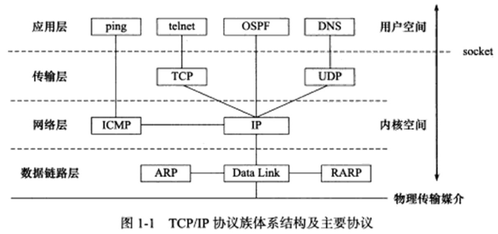
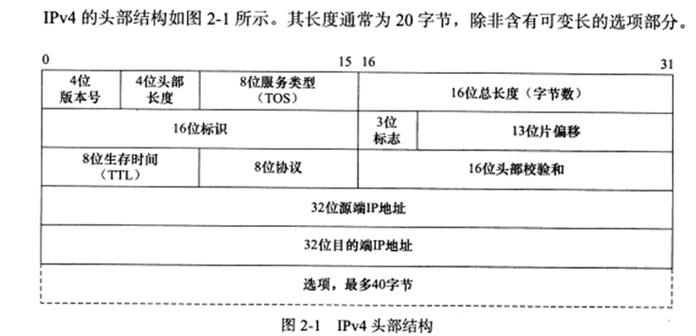
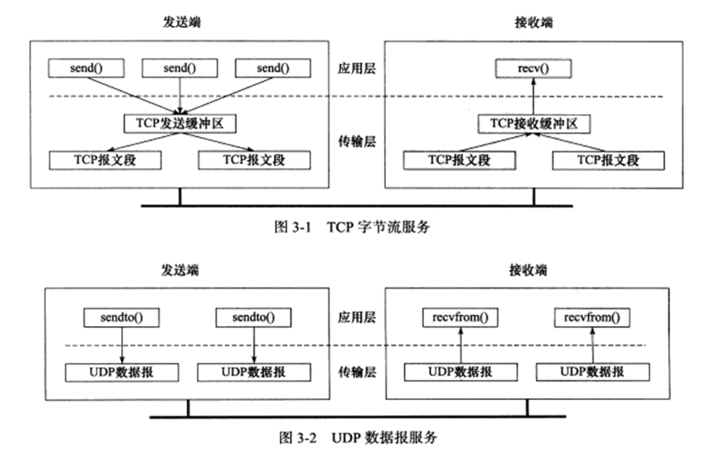
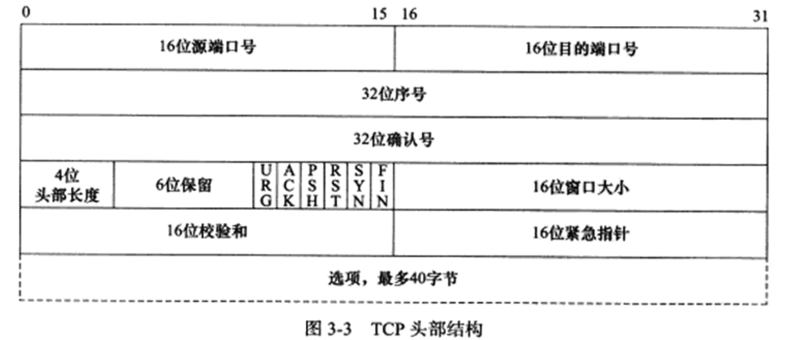
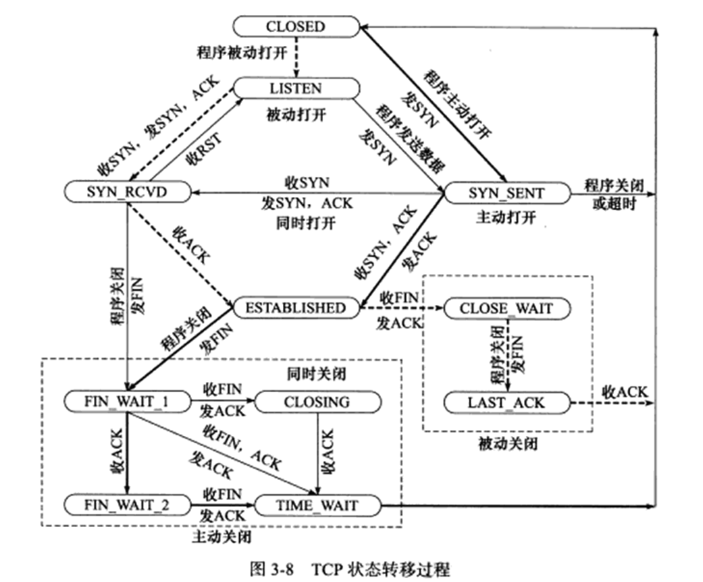

# Linux高性能服务器编程

## TCP/IP协议族

现在Internet使用的主流协议族是TCP/IP协议族，它是一个分层、多协议的通信体系。

TCP/IP协议族是一个四层协议系统，自底而上分别是数据链路层、网络层、传输层和应用层。每一层完成不同的功能，且通过若干协议来实现，上层协议使用下层协议提供的服务。

## IP协议详解

IP协议是TCP/IP协议族的核心协议，也是socket网络编程的基础之一。

## TCP协议详解

TCP协议是TCP/IP协议族中另一个重要的协议。和IP协议相比，TCP协议更靠近应用层，因此在应用程序中具有更强的可操作性。一些重要的socket选项都和TCP协议相关。

TCP协议相对于UDP协议的特点是：面向连接、字节流和可靠传输。

