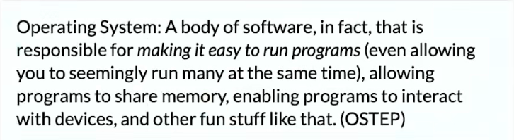

# 操作系统：设计与实现

## 操作系统概述

什么是操作系统？

对单一计算机硬件系统作出抽象、支撑程序执行的软件系统。

操作系统服务谁？

程序 = 状态机

课程涉及：多线程Linux应用程序

操作系统为程序提供什么服务？（设计/应用视角）

操作系统 = 对象 + API

课程涉及：POSIX + 部分Linux特性

如何实现操作系统提供的服务？（实现/硬件视角）

操作系统 = C程序

完成初始化后就成为interrupt/trap/fault handler

课程涉及：xv6、自制迷你操作系统

## 操作系统上的程序

程序就是状态机

C程序的状态机模型（语义，semantics）

- 状态 = 堆 + 栈
- 初始状态 = main的第一条语句
- 迁移 = 执行一条简单语句
  - 任何C程序都可以改写成“非复合语句”的C代码
  - C Intermediate Language

