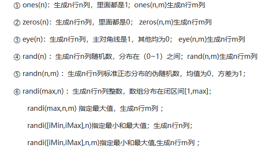

# Matlab图像处理

## Matlab基础

### 数组

#### 1、向量

生成方式1：

x = [值]

```matlab
x = [1 2 3] % 行向量
y = [4; 5; 6] % 列向量
z = x' % 行向量转列向量
```

生成方式2：

x = 初识值 : [步长] : 终值

x =  初识值 : 终值 （默认步长是1）

```matlab
x = 1:2:10
y = 5:10
```

生成方式3：

x = linspace(初值，终值，个数n)

x = linspace(初值，终值)

生成方式4：

x = logspace(初值，终值，个数) 

生成[`10^初值`，`10^终值`]之间的数，个数省略时，默认50个

#### 2、二维数组

直接创建：空格或逗号区分同一行的不同元素，分号或者回车区分不同行的元素

函数创建：



#### 3、数组大小

d = size(数组名) 返回值为一个行向量

[m, n] = size(数组名) 返回m是行的尺寸大小，n是列的尺寸大小

length(数组名)

| length(数组名) | 返回值       |
| -------------- | ------------ |
| 空             | 返回0        |
| 标量           | 返回1        |
| 向量           | 返回实际个数 |
| 多维数组       | 返回较大维度 |

numel函数：返回数组总的个数，n*m

#### 4、数组索引

双下标索引

方法：数组名(所在行，所在列)

单下标索引

方法：数组名(所在序号) 采用列优先

双下标转单下标索引

方法：单下标索引 = sub2ind(size, m, n) (size数组大小 = size(数组名))

单下标转双下标索引

方法：[行, 列] = ind2sub(数组大小，单下标索引)

#### 5、数组扩展

cat函数

方法：扩展结果 = cat(标识，数组1，数组2，...)

标识：1或2

1 列组合（列一致）

2 行组合（行一致）

vercat函数

方法：扩展结果 = vercat(数组1，数组2，...) 垂直扩展

horzcat函数

方法：扩展结果 = horzcat(数组1，数组2，...) 水平扩展

#### 6、块操作

repmat函数：重复数组

blkdiag函数：对角线拼接数组

kron函数：将数组A的元素每一个乘以数组B为一个块

#### 7、数组裁剪

罗列序号的裁剪：直接将需要保留的序号罗列出来

裁剪结果 = 原数组(保留的行，保留的列)

冒号区间裁剪：

m:n 

m是初始值，n是终止值

冒号等差序列：

m:k:n 

m 初始值，k等差值，n终止值

冒号全部：

```matlab
x = y(1:4,:) % 第一行到第五行的所有列
```

删除整行整列：

数组(要删除的行, :) = []

数组(:, 要删除的列) = []

#### 8、数组转置

实数

操作符：`'`或`.'`

函数：transpose或ctranspose

含复数

非共轭转置：`.'`  或 transpose

共轭转置：`'`或 ctranspose

#### 9、数组翻转

#### 10、数组尺寸调整

#### 11、数组与标量的运算

#### 12、数组之间的运算

#### 13、数组的点运算

## 图像处理

