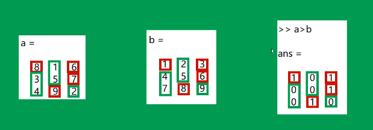

# Matlab图像处理

## Matlab基础

### 数组

#### 1、向量

生成方式1：

x = [值]

```matlab
x = [1 2 3] % 行向量
y = [4; 5; 6] % 列向量
z = x' % 行向量转列向量
```

生成方式2：

x = 初识值 : [步长] : 终值

x =  初识值 : 终值 （默认步长是1）

```matlab
x = 1:2:10
y = 5:10
```

生成方式3：

x = linspace(初值，终值，个数n)

x = linspace(初值，终值)

生成方式4：

x = logspace(初值，终值，个数) 

生成[`10^初值`，`10^终值`]之间的数，个数省略时，默认50个

#### 2、二维数组

直接创建：空格或逗号区分同一行的不同元素，分号或者回车区分不同行的元素

函数创建：


#### 3、数组大小

d = size(数组名) 返回值为一个行向量

[m, n] = size(数组名) 返回m是行的尺寸大小，n是列的尺寸大小

length(数组名)

| length(数组名) | 返回值       |
| -------------- | ------------ |
| 空             | 返回0        |
| 标量           | 返回1        |
| 向量           | 返回实际个数 |
| 多维数组       | 返回较大维度 |

numel函数：返回数组总的个数，n*m

#### 4、数组索引

双下标索引

方法：数组名(所在行，所在列)

单下标索引

方法：数组名(所在序号) 采用列优先

双下标转单下标索引

方法：单下标索引 = sub2ind(size, m, n) (size数组大小 = size(数组名))

单下标转双下标索引

方法：[行, 列] = ind2sub(数组大小，单下标索引)

#### 5、数组扩展

cat函数

方法：扩展结果 = cat(标识，数组1，数组2，...)

标识：1或2

1 列组合（列一致）

2 行组合（行一致）

vercat函数

方法：扩展结果 = vercat(数组1，数组2，...) 垂直扩展

horzcat函数

方法：扩展结果 = horzcat(数组1，数组2，...) 水平扩展

#### 6、块操作

repmat函数：重复数组

blkdiag函数：对角线拼接数组

kron函数：将数组A的元素每一个乘以数组B为一个块

#### 7、数组裁剪

罗列序号的裁剪：直接将需要保留的序号罗列出来

裁剪结果 = 原数组(保留的行，保留的列)

冒号区间裁剪：

m:n 

m是初始值，n是终止值

冒号等差序列：

m:k:n 

m 初始值，k等差值，n终止值

冒号全部：

```matlab
x = y(1:4,:) % 第一行到第五行的所有列
```

删除整行整列：

数组(要删除的行, :) = []

数组(:, 要删除的列) = []

#### 8、数组转置

实数

操作符：`'`或`.'`

函数：transpose或ctranspose

含复数

非共轭转置：`.'`  或 transpose

共轭转置：`'`或 ctranspose

#### 9、数组翻转

上下翻转flipud

```matlab
B = flipud(A)
```

左右翻转fliplf

```matlab
B = fliplf(A)
```

flip函数

```matlab
B = flip(A)
B = flip(A, 1) % 等价于上下翻转
B = flip(A, 2) % 等价于左右翻转
```

rot90函数

```matlab
% 把数组A按照逆时针旋转90*k度，k默认值为1，k为负数时为顺时针旋转
B = rot90(A, k)
```

#### 10、数组尺寸调整

`reshape`函数

结果数组B = reshape(数组A, a, b) 

将数组A调整为a行b列

#### 11、数组与标量的运算

(1) 基本运算

```matlab
% 加
B = A + 标量
% 减
B = A - 标量
% 乘
B = A * 标量
% 除
B = A / 标量
```

(2) 乘方运算

正整数：`B = A^2`（要求A是方阵）——两个数组相乘

负数：`B = A^(-1)` 计算数组A的逆矩阵

小数：`B = A^(0.25)`

#### 12、数组之间的运算

（1）加减法运算（点对点相加减）参与运算的数组应该具有相等的尺寸

（2）乘法：正常的矩阵乘法运算，数组维数相容

（3）除法：

```matlab
A/B：A*inv(B) 或 A*pinv(B)
A\B：inv(A)*B 或 pinv(A)*B
```

inv数组求逆矩阵函数

pinv广义数组求逆函数

#### 13、数组的点运算

乘法（点对点相乘）

【注意】：参与运算的数组应该具有相同的尺寸

```matlab
a.*b 表示a和b中对应的元素相乘
a.*b 与 b.*a 等价
```

除法

参与运算的两个数组必须大小相等

参与运算的两个数组对应的元素做除法

```matlab
% 斜杠上的为分子
a./b % b做分子
b./a % b做分子
```

乘方：求幂

求n个相同因数乘积的运算，叫做乘方

乘方的结果叫做幂

分类（点对数或点对点）

`数组.^标量`

`标量.^数组`

`数组.^数组`

```matlab
% 数组的各个点3次幂，数组元素为底
A.^3
% 分别把这个数组中的元素作为幂，3为底
3.^A
% A数组的元素为底，B数组的元素为幂
A.^B
```

### 逻辑运算

#### 逻辑类型

真：用true创建，用1表示

假：用false创建，用0表示

```matlab
a = true(3);
b = false(5);
```

#### 关系运算




数组大小要求一致

#### 逻辑运算

与：`A & B 或者 and(A, B)`

或：`A | B 或者 or(A, B)`

非：`~A 或者 not(A)`

异或：`xor(A, B)`

数组大小要求一致，点对点运算

#### any函数

>  any - 确定任何数组元素是否为非零
>     此 MATLAB 函数 沿着大小不等于 1 的数组 A 的第一维测试所有元素为非零数字还是逻辑值 1
>     (true)。实际上，any 是逻辑 OR 运算符的原生扩展。 如果 A 为向量，当 A 的任何元素是非
>     零数字或逻辑 1 (true) 时，B = any(A) 返回逻辑 1，当所有元素都为零时，返回逻辑 0
>     (false) 。 如果 A 为非空非向量矩阵，B = any(A) 将 A 的各列视为向量，返回包含逻辑 1
>     和 0 的行向量。 如果 A 为 0×0 空矩阵，any(A) 返回逻辑 0 (false)。 如果 A 为多维数
>     组，则 any(A) 沿第一个非单一维度运算并返回逻辑值数组。此维的大小将变为 1，而所有其他维
>     的大小保持不变。
>
> ```matlab
> B = any(A)
> B = any(A,'all')
> B = any(A,dim)
> B = any(A,vecdim)
> ```

#### all函数

> all - 确定所有的数组元素是为非零还是 true
>     此 MATLAB 函数 沿着大小不等于 1 的数组 A 的第一维测试所有元素为非零还是逻辑值 1
>     (true)。实际上，all 是逻辑 AND 运算符的原生扩展。 如果 A 为向量，当所有元素为非零
>     时，all(A) 返回逻辑 1 (true)，当一个或多个元素为零时，返回逻辑 0 (false)。 如果 A
>     为非空矩阵，all(A) 将 A 的各列视为向量，返回包含逻辑 1 和 0 的行向量。 如果 A 为
>     0×0 空矩阵，all(A) 返回逻辑 1 (true)。 如果 A 为多维数组，则 all(A) 沿第一个非单
>     一维度运算并返回逻辑值数组。此维的大小将变为 1，而所有其他维的大小保持不变。
>
> ```matlab
> B = all(A)
> B = all(A,'all')
> B = all(A,dim)
> B = all(A,vecdim)
> ```

#### 捷径运算符

`&&`

当第一个运算为假的时候，直接返回假

运算数必须为标量

`||`

当第一个运算为真的时候，直接返回真

运算数必须为标量

### 控制结构

顺序结构、选择结构、循环结构、错误控制结构

`return`、`break`、`continue`、`input`、`error`、`keyboard`、`pause`

#### 选择结构

if 语句

```matlab
if 逻辑表达式
   语句
end
```

if-else 语句

```matlab
if 逻辑表达式1
   语句1
else
   语句2
end
```

elseif语句

```matlab
if 逻辑表达式1
	语句1
elseif 逻辑表达式2
	语句2
else
	语句3
end
```

switch语句

```matlab
switch 表达式
	case 值1
		语句1
	case 值2
		语句2
	... ...
	otherwise
		语句n
end
```

#### 循环结构

for语句

```matlab
for 循环变量=开始值:[步长]:终止值
	语句体
end
```

while语句

```matlab
while 表达式
	语句体
end
```

continue语句：结束本次循环，进入下次循环

break语句：结束循环

#### 错误控制结构

```matlab
try
	语句1
catch
	语句2
end
```

### 绘图

#### line函数

line(x, y)：用直线将点连接起来

```matlab
x = 1:0.01:10;
y = sin(x);
line(x, y)
```

#### plot函数

```matlab
plot(x)
plot(x, y)
plot(x1,y1,x2,y2,...,xn,yn)
```

#### polar函数

```matlab
polar(theta, rho)
polar(theta, p)
```

子图绘制subplot

```matlab
% i表示绘制第几个图，x,y代表几行几列
subplot(x, y, i)
```

#### 叠加绘图模式

```matlab
hold on;
hold off;
```

#### 设置坐标轴axis

`坐标轴范围`

axis([X轴范围,Y轴范围])

axis auto 自动调整

axis manual 在叠加绘图中使用较多

axis tight 紧凑

`坐标比例`

axis equal：横坐标与纵坐标单位长度一致

axis square：正方形比例

axis normal：自动调整，默认

`坐标轴关闭`

axis off

#### 坐标轴刻度

`set(gca, 'xTick', 刻度)`

`set(gca, 'xTickLabel', '刻度标签')`

gca：当前坐标

#### 对数坐标

```matlab
% X轴使用对数
semilogx(x,y)
% Y轴使用对数
semilogy(x,y)
% XY轴均使用对数
loglog(x,y)
```

#### 双坐标

plotyy(X1,Y1,X2,Y2)

[AX,H1,H2] = plotyy(参数)

#### 绘图开关

```matlab
axis on;
axis off;
box on;
box off;
grid on;
grid off;
```

#### 图形标注

1）图形标题

```matlab
title(标题);
title(标题,属性名,属性值)
```

2）坐标轴标签

xlabel(标签, 属性名, 属性值)

ylabel(标签, 属性名, 属性值)

3）图例

legend(图例说明)

#### 特殊绘图

柱状图

```matlab
bar(x)
bar(x, y)
% 纵向
barh(x, y)
% 堆积图
bar(y, 'stacked')
```

面积图

```matlab
area(y);
area(y, 属性名称, 属性值)
```

饼图pie

```matlab
pie(数据)
% 数据和超过1，自动计算百分比
% 数据和不超过1，直接绘制，其余部分空缺
```

直方图hist

```matlab
hist(数据)
hist(数据, 分组个数)
hist(数据, X轴划分情况)
```

#### 三维绘图

三维曲线plot3

plot3(x, y, z)

三维曲线之矩形网格

[X, Y] = meshgrid(x, y)

三维曲面之mesh网格图

mesh(x,y,z)

三维曲面之表面图surf

surf(x, y, z)

### 结构体

1 使用赋值方法创建结构体

```matlab
person(1).name = '张三';
person(1).age = 22;
```

2 使用struct创建结构体

```matlab
person = struct('name', '张三', 'age', 22)
```

访问结构体内部元素

获取：结构体名称.字段名

赋值：结构体名称.字段名 = 新值

### 元胞数组

元胞数组每个元素为一个元胞，元胞可以是任意类型、任意尺寸的数据。

（1）使用大括号创建元胞数组

```matlab
a = {rand(3,4),zeros(3)};
```

（2）使用元胞创建元胞数组

```matlab
% 元胞数组名(指定索引) = {元胞}
a(1, 1) = {rand(2,3)};
a(1, 2) = {ones(4)};
```

（3）由元胞内容创建元胞数组

```matlab
% 元胞数组名{指定索引} = 元胞内容
a{1, 1} = rand(2, 3);
a{1, 2} = ones(4);
```

（4）使用celldisp显示元胞数组

```matlab
% 每一个元胞都会具体显示出来
celldisp(a)
```

（5）使用cellplot显示元胞数组

```matlab
cellplot(a)
```

（6）使用大括号访问元胞数组

```matlab
% 元胞数组{下标}
% 元胞数组{下标}(下标)
a{1, 1} % 访问第一个元胞
a{1, 1}(1, 2) % 访问第一个元胞中的第一行第二列元素
```

（7）使用小括号访问元胞数组

```matlab
% 元胞数组(下标)
a(1, 1) % 访问元胞数组的元素，不是元胞的元素
a(1, :) % 访问元胞数组的一行
```

### 字符串

1）使用方括号创建单行字符串

```matlab
s1 = 'hello ';
s2 = 'world!';
s = [s1, s2]
```

2）使用strcat创建单行字符串

```matlab
strcat(子串1, 子串2, ... ,子串n)
% 使用strcat函数连接字符串时，每个字符串的最右侧空格会被忽略
```

3）使用中括号创建多行字符串

```mat
s1 = 'hello ';
s2 = 'world!';
s = [s1; s2]
```

4）使用char构建多行字符串

```matlab
char(子串1, 子串2, ... ,子串n)
% 空字符串不会被忽略，会用空格填满所要求的长度
```

5）字符串比较

```matlab
% 比较字符串
strcmp(a, b)
% 忽略大小写
strcmpi(a, b)
% 比较字符串前n个字符
strncmp(a, b, n)
% 比较字符串前n个字符，忽略大小写
strncmpi(a, b, n)
```

6）使用等号比较字符串

```matlab
%% == 用于比较每个字符中的元素
s1 = 'abc';
s2 = 'ABC';
s1 == s2 
% 0 0 0
```

7）strfind

```matlab
strfind(str, pattern);
% 查找字符串str是否包含pattern子串
% 如果包含返回子串位置，否则返回空数组
```

8）strrep

```matlab
newStr = strrep(s, s1, s2);
% 把字符串s中的s1替换成s2
% 函数返回值：替换后的字符串（新字符串）
% 该函数区分大小写，有几个换几个
```

9）int2str

```matlab
s = int2str(n);
% 将数值数组转换为字符数组
```

10）str2num

```matlab
n = str2num(s);
% 将字符数组转换为数值数组
```

## 图像处理

### 几何变换

1）平移

```matlab
% 结果 = imtranslate(原始图像, 移动方向)
% 移动方向 = [h, v]
% h > 0 右移
% h < 0 左移
% v > 0 下移
% v < 0 上移
```

```matlab
% 平移
I = imread('in\lena.bmp');
J = imtranslate(I, [100, 50]);
subplot(1, 2, 1), imshow(I);
subplot(1, 2, 2), imshow(J);
```

2）旋转

```matlab
% 结果 = imrotate(原始图像, 旋转方向A)
% A > 0 逆时针
% A < 0 顺时针
```

```matlab
% 旋转
I = imread('in/lena.bmp');
J = imrotate(I, 45); % 逆时针旋转45度
subplot(1, 2, 1), imshow(I);
subplot(1, 2, 2), imshow(J);
```

3）缩放

```matlab
% 结果 = imresize(原始图像, 缩放倍数A)
% A > 0 放大
% A < 0 缩小
```

```matlab
% 缩放
I = imread('in/lena.bmp');
J = imresize(I, 10); % 放大
disp(size(I));
disp(size(J));
subplot(1, 2, 1), imshow(I);
subplot(1, 2, 2), imshow(J);
```

4）水平镜像

```matlab
% 结果 = fliplr(原始图像)
```

```matlab
% 水平镜像
I = imread('in\lena.bmp');
J = fliplr(I);
subplot(1, 2, 1), imshow(I);
subplot(1, 2, 2), imshow(J);
```

5）垂直镜像

```matlab
% 结果 = flipud(原始图像)
```

```matlab
% 垂直镜像
I = imread('in\lena.bmp');
J = flipud(I);
subplot(1, 2, 1), imshow(I);
subplot(1, 2, 2), imshow(J);
```

### 正交变换

1）离散余弦变换

```matlab
% 结果 = dct2(原始图像)
% 原始图像 = idct2(离散余弦处理结果)
```

```matlab
% 离散余弦变换
I = imread('in/lena.bmp');
J = dct2(I);
subplot(1, 3, 1), imshow(I);
subplot(1, 3, 2), imshow(J);
I2 = idct2(J);
subplot(1, 3, 3), imshow(I2, []);
```


2）傅里叶变换

```matlab
% 处理结果 = fft2(原始图像);
% 原始图像 = ifft2(傅里叶变换处理结果);
% 将变换的原点移到中心：
% 处理结果A = fftshift(傅里叶变换结果);
% B = abs(A);
% C = log(B);
```

```matlab
% 傅里叶变换
I = imread('in/lena.bmp');
J = fft2(I);
t = fftshift(J);
t1 = abs(t);
t2 = log(t1);
subplot(1, 3, 1), imshow(I);
subplot(1, 3, 2), imshow(t2, []);
I2 = ifft2(J);
subplot(1, 3, 3), imshow(I2, []);
```


3）离散小波变换

```matlab
% 结果 = dwt2(原始图像, 小波名字);
% 处理结果 = [cA, cH, cV, cD]
% cA 近似矩阵
% cH, cV, cD 细节矩阵
% 小波名字: 'db1' 'haar' 'db2' ... 'db45'
% 原始图像 = idwt2(离散小波变换处理结果, 小波名称)
```

```matlab
% 离散小波变换
I = imread('in/lena.bmp');
[cA, cH, cV, cD] = dwt2(I, 'db1');
subplot(1, 3, 1), imshow(I);
test = [cA, cH; cV, cD];
subplot(1, 3, 2), imshow(test, []);
I2 = idwt2(cA, cH, cV, cD, 'db1');
subplot(1, 3, 3), imshow(I2, []);
```


4）提升小波变换

```matlab
% 处理结果 = lwt2(原始图像, 小波名字);
% 处理结果 = [cA, cH, cV, cD];
% cA 近似矩阵
% cH, cV, cD 细节矩阵
```

```matlab
% 提升小波变换
I = imread('in/lena.bmp');
I = double(I);
[cA, cH, cV, cD] = lwt2(I, 'haar');
subplot(1, 3, 1), imshow(I, []);
test = [cA, cH; cV, cD];
subplot(1, 3, 2), imshow(test, []);
I2 = ilwt2(cA, cH, cV, cD, 'db1');
subplot(1, 3, 3), imshow(I2, []);
```

### 边缘检测


### 形态学变换


### 图像增强


