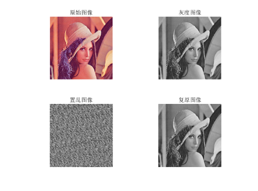
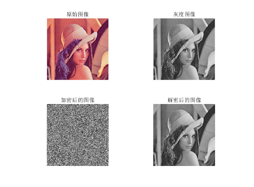

# 图像置乱

图像置乱是信息隐藏技术的一种，图像置乱后图像无法辨认，可以达到对图像信息的隐藏和保护作用。

分类：空域置乱、频域置乱、空频域混合置乱

图像置乱对信息起到了隐藏和保护的作用，既可以对信息进行加密传送，也可以作为图像处理的预处理。

> 图像置乱变换是一种`基于内容的图像加密方法`，与不知道密钥对已加密信息进行解密一样，倘若不知道图像置乱所采用的算法，同样难以恢复原始图像的信息。

## 基于Arnold变换的图像置乱

利用Arnold变换（又称猫脸变换）可以对图像进行置乱，使得原本有意义的图像变成一张无意义的图像。该变换可以在其它图像处理前做预处理，也可以用于普通图像加密。

```matlab
input = imread('./in/lena_std.tif');
subplot(221), imshow(input), title('原始图像');
% 将输入的图像转换为灰度图
img = rgb2gray(input);
subplot(222), imshow(img), title('灰度图像');
% 定义Arnold变换的参数
a = 7;
b = 11;
n = 4;
% 置乱
[h, w] = size(img);
N = h;
arnoldImg = zeros(h, w);
for i=1:n
    for y=1:h
        for x=1:w
            xx = mod((x - 1) + b * (y - 1), N) + 1;
            yy = mod (a * (x - 1) + (a * b + 1) * (y - 1), N) + 1;
            arnoldImg(yy, xx) = img(y, x);
        end
    end
    img = arnoldImg;
end
arnoldImg = uint8(arnoldImg);
subplot(223), imshow(arnoldImg), title('置乱图像');
% 复原
[h, w] = size(arnoldImg);
resultImg = zeros(h, w);
N = h;
for i=1:n
    for y=1:h
        for x=1:w
            xx = mod((a * b + 1) * (x - 1) - b * (y - 1), N) + 1;
            yy = mod(-a * (x - 1) + (y - 1), N) + 1;
            resultImg(yy, xx) = arnoldImg(y, x);
        end
    end
    arnoldImg = resultImg;
end
resultImg = uint8(resultImg);
subplot(224), imshow(resultImg), title('复原图像');
```



## 基于混沌Logistic加密算法的图像加密与还原

```matlab
clear, clc;
input = imread('./in/lena_std.tif');
% 将输入图像转换为灰度图
img = rgb2gray(input);
subplot(221), imshow(input), title('原始图像');
subplot(222), imshow(img), title('灰度图像');
% 参数
x0 = 0.1;
u = 4;
num = 500;
% 利用Logistic混沌映射，对灰度图像进行加密
[m, n] = size(img);
% 迭代num次，达到充分混沌状态
x = x0;
for i=1:num
    x = u * x * (1 - x);
end
% 产生一维混沌加密序列
a = zeros(1, m * n);
a(1) = x;
for i=1:m*n-1
    a(i+1) = u*a(i)*(1-a(i));
end
% 归一化序列
b = uint8(255 * a);
% 转换为二维混沌加密序列
c = reshape(b, m, n);
% 异或操作（加密）
img1 = bitxor(img, c);
subplot(223), imshow(img1), title('加密后的图像');
% 利用Logistic混沌映射，对加密图像进行解密
% 参数
x0 = 0.1;
u = 4;
num = 500;
% 利用Logistic混沌映射，对灰度图像进行加密
[m, n] = size(img1);
% 迭代num次，达到充分混沌状态
x = x0;
for i=1:num
    x = u * x * (1 - x);
end
% 产生一维混沌加密序列
a = zeros(1, m * n);
a(1) = x;
for i=1:m*n-1
    a(i+1) = u*a(i)*(1-a(i));
end
% 归一化序列
b = uint8(255 * a);
% 转换为二维混沌加密序列
c = reshape(b, m, n);
img2 = bitxor(img1, c);
subplot(224), imshow(img2), title('解密后的图像');
```



## 基于骑士巡游变换的图像置乱算法

```matlab
```


## 参考资料

[基于混沌Logistic加密算法的图片加密与还原](https://zhuanlan.zhihu.com/p/183788811)

[基于骑士巡游变换的图像置乱算法及评价方法](https://xuewen.cnki.net/CMFD-2007195179.nh.html)

[基于Arnold置乱的数字图像加密算法](https://www.jiamisoft.com/blog/20722-arnold2.html)

