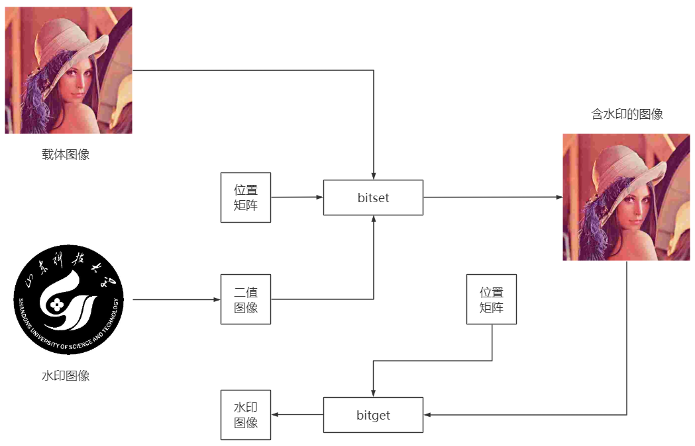

# 版权保护

## 基本原理



`bitset`

Set bit at specific location

```matlab
intout = bitset(A,bit)
intout = bitset(A,bit,assumedtype)
intout = bitset(A,bit,V)
intout = bitset(A,bit,V,assumedtype)
```

`bitget`

Get bit at specified position

```matlab
b = bitget(A,bit)
b = bitget(A,bit,assumedtype)
```

## Matlab实现

```matlab
% 数字图像——版权保护
clear, clc;
% 读入原始图像和版权图像
o = imread('d:/code/matlab/in/lena_std.tif');
subplot(2, 2, 1), imshow(o), title('原始图像');
w = imread('d:/code/matlab/in/sdust_512.jpg');
% 二值化
w = imbinarize(w);
subplot(2, 2, 2), imshow(w), title('版权图像');
% 原始水印大小
[m, n] = size(w);
% 生成位置矩阵
e = linspace(0, 0, m*n);
e(1) = 0.53;
for i = 2:m*n
    e(i) = 1 - 2 * e(i - 1) * e(i - 1);
end
e = mod(fix(e*10000000), 4) + 1;
% 嵌入版权图像
i = 1:m*n;
ow = o;
ow(i) = bitset(o(i), e(i), w(i));
subplot(2, 2, 3), imshow(ow), title('含版权的图像');
% 根据位置矩阵提取版权图像
wG = w;
wG(i) = bitget(ow(i), e(i));
subplot(2, 2, 4), imshow(double(wG)), title('提取出来的版权图像');
```

## 效果展示


## 参考资料

[https://www.cnblogs.com/fengxb1213/p/12905861.html](https://www.cnblogs.com/fengxb1213/p/12905861.html)

