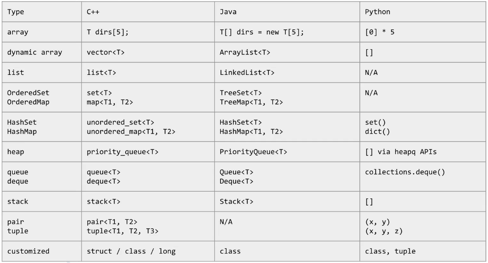

# 常用数据结构总结（Java版）

## C++/Java/Python 数据结构大比较



## array

同一种类型数据的集合，其实数组就是一个容器。数组中的元素从0开始编号，方便操作这些元素。

```java
元素类型[] 数组名 = new 元素类型[元素个数或数组长度];
元素类型[] 数组名 = new 元素类型[]{元素, 元素, ...};
```

多维数组

多维数组可以看成是数组的数组，比如二维数组就是一个特殊的一维数组，其每一元素都是一个一维数组。

```java
type[][] typeName = new type[typeLength1][typeLength2];
```

Arrays 类

java.util.Arrays 类能方便地操作数组

- 给数组赋值：fill方法
- 对数组排序：sort方法
- 比较数组：equals方法
- 查找数组元素：binarySearch方法能对排好序地数组进行二分查找

## dynamic array

ArrayList类是一个特殊地数组——动态数组，通过添加和删除元素，就可以改变数组地长度。

优点：

1. 支持自动改变大小
2. 可以灵活的插入元素
3. 可以灵活的删除元素

初始化：

```java
ArrayList<Integer> arrayList = new ArrayList<>();
```

添加元素：

add(Object value)：将指定元素追加到末尾

add(int index, Object value)：在指定位置index，添加新的元素

删除元素：

remove()：从集合中删除指定位置处的元素，返回该元素

```java
// 根据对象删除
arrayList.remove("test");
// 根据下标删除
arrayList.remove(1);
```

获取长度：

size()：用于获取ArrayList的大小，返回列表中的元素个数

清空：

clear()：清空集合中的所有元素

获取元素：

get(int index)：返回集合中指定位置上的元素

## list

LinkedList是一个双向链表，它也可以被当作堆栈、队列或双端队列进行操作。

```java
LinkedList<E> list = new LinkedList<>();
```

addFirst()：在头部添加元素

addLast()：在尾部添加元素

removeFirst()：在头部移除元素

removeLast()：在尾部移除元素

getFirst()：获取头部元素

getLast()：获取尾部元素

## OrderedSet

TreeSet是一个有序集合

- 存储唯一的元素
- 不保留元素的插入顺序
- 按升序对元素进行排序
- 线程不安全

```java
Set<String> treeSet = new TreeSet<>();
```

add()：添加元素，成功返回true，否则返回false

contains()：检查一个给定的元素是否存在于集合中

remove()：从集合中移除指定元素

first()：返回第一个元素

last()：返回最后一个元素

## OrderedMap

TreeMap是一个能比较元素大小的Map集合，会对传入的key进行大小排序。其中，可以使用元素的自然顺序，也可以使用集合中自定义的比较器来进行排序。

TreeMap具有如下特点：

- 不允许出现重复的key
- 可以出入null键，null值
- 可以对元素进行排序
- 无序集合（插入和遍历顺序不一致）

```java
TreeMap<String,Integer> treeMap = new TreeMap<>();
```

put()：新增元素

get()：获取元素

keySet()：获取所有key

values()：获取所有值

## HashSet

HashSet是基于HashMap来实现的，是一个不允许有重复元素的集合。

允许有null值

无序的，即不会记录插入的顺序

线程不安全

```java
Set<String> set = new HashSet<>();
```

add()：添加元素

contains()：判读元素是否存在

remove()：删除元素

size()：返回集合的大小

## HashMap

HashMap是一个散列表，它存储的内容是键值对（key-value）映射。

```java
Map<String,Integer> map = new HashMap<>();
```

put()：放入元素

get()：取出元素

size()：返回集合的大小

clear()：清空集合

remove()：删除元素

## heap

优先队列PriorityQueue是Queue接口的实现，可以对其中的元素进行排序。

```java
PriorityQueue<Integer> q = new PriorityQueue<>(); 
```

常用方法：

```java
// 返回队首元素
peek();
// 返回队首元素，队首元素出队
poll();
// 添加元素
add();
// 返回队列元素的个数
size();
// 判断队列是否为空，为空返回true，不空返回false
isEmpty();
```

## queue

队列是一种特殊的线性表，它只允许在表的前端进行删除操作，而在表的后端进行插入操作。

LinkedList类实现了Queue接口，因此我们可以把LinkedList当成Queue来用。

```java
Queue<String> q = new LinkedList<>();
```

offer()：添加元素

peek()：查询头部元素

poll()：从队列中删除第一个元素

## deque

Deque是一个双端队列接口，继承自Queue接口，Deque的实现类是LinkedList、ArrayDeque、LinkedBlockingDeque，其中LinkedList是最常用的。

```java
Deque<Integer> q = new LinkedList<>();
```

除了Queue接口中可用的方法之外，Deque还包括以下方法：

- **addFirst()** - 在双端队列的开头添加指定的元素。如果双端队列已满，则引发异常。
- **addLast()** - 在双端队列的末尾添加指定的元素。如果双端队列已满，则引发异常。
- **offerFirst()** - 在双端队列的开头添加指定的元素。如果双端队列已满，则返回false。
- **offerLast()** - 在双端队列的末尾添加指定的元素。如果双端队列已满，则返回false。
- **getFirst()** - 返回双端队列的第一个元素。如果双端队列为空，则引发异常。
- **getLast()** - 返回双端队列的最后一个元素。如果双端队列为空，则引发异常。
- **peekFirst()** - 返回双端队列的第一个元素。如果双端队列为空，则返回null。
- **peekLast()** - 返回双端队列的最后一个元素。如果双端队列为空，则返回null。
- **removeFirst()** - 返回并删除双端队列的第一个元素。如果双端队列为空，则引发异常。
- **removeLast()** - 返回并删除双端队列的最后一个元素。如果双端队列为空，则引发异常。
- **pollFirst()** - 返回并删除双端队列的第一个元素。如果双端队列为空，则返回null。
- **pollLast()** - 返回并删除双端队列的最后一个元素。如果双端队列为空，则返回null。

## stack

Java堆栈 `Stack类`已经过时，Java官方推荐使用Deque替代Stack使用。

Deque堆栈操作的方法：push()、pop()、peek()

