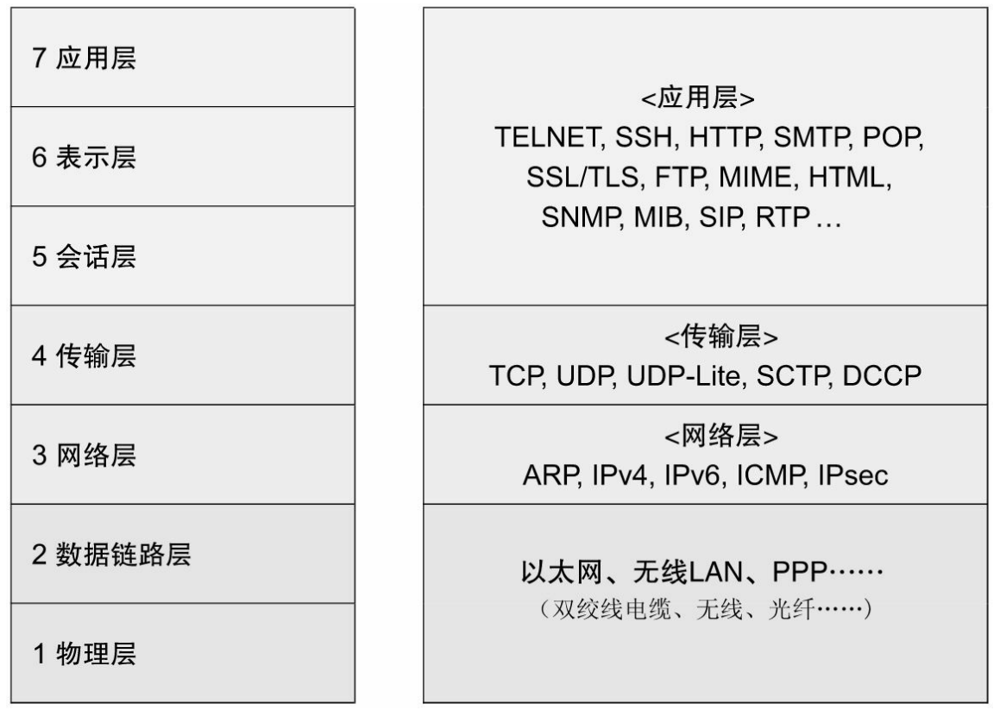
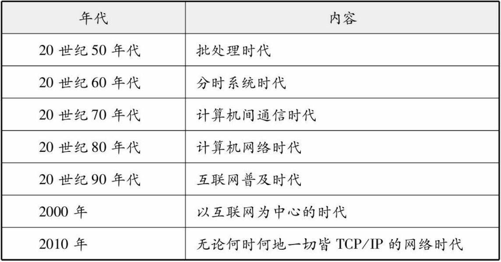

# TCP IP协议

> 信息通信社会这个词俨然已经是现代社会的一个代名词。人们可以使用手机等信息终端随时随地进行交流，而这种环境正是要依赖于网络才得以实现。在这些网络当中，目前使用最为广泛的协议就是TCP/IP。

## 网络基础知识

计算机网络，根据其规模可分为WAN、MAN和LAN

WAN（广域网）指覆盖多个远距离区域的远程网络

MAN（城域网）比广域网再小一级的、连接整个城市的网络

LAN（局域网）指一个楼层、一栋楼或一个校园等相对较小的区域内的网络

**计算机使用模式的演变**

