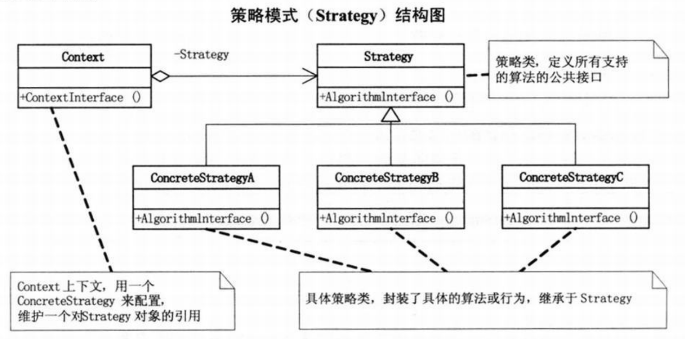
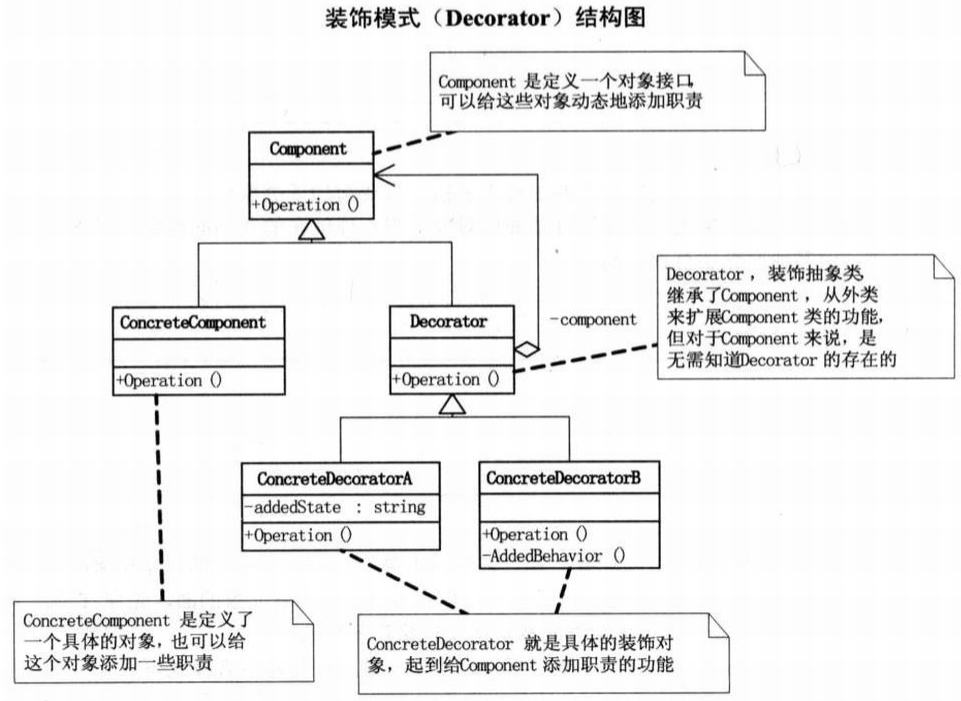
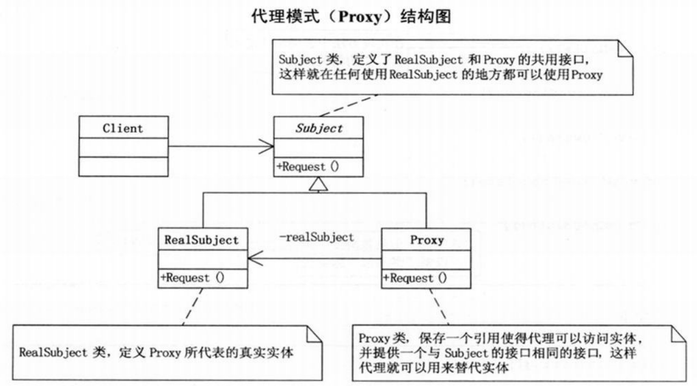
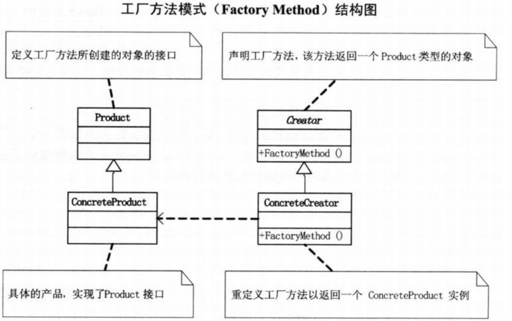

# 大话设计模式

> 如果想成为一名更优秀的软件设计师，了解优秀软件设计的演变过程比学习优秀设计本身更有价值，因为设计的演变过程中蕴藏着大智慧。

## 简单工厂模式

> 小菜到了人家单位，前台小姐姐给了他一份题目，上面写着：“请用C++、Java、C#或VB.NET任意一种面向对象语言实现一个计算器控制台程序，要求输入两个数和运算符号，得到结果。”

让业务逻辑与界面逻辑分开，让它们之间的耦合度下降。只有分离开，才可以达到容易维护或扩展。

把加减乘除等运算分离，修改其中一个不影响另外的几个，增加运算算法也不影响其他代码。

```c#
public class Operation
{
    private double _numberA = 0;
    private double _numberB = 0;

    public double NumberA
    {
        get { return _numberA; }
        set { _numberA = value; }
    }

    public double NumberB
    {
        get { return _numberB; }
        set { _numberB = value; }
    }

    public virtual double GetResult()
    {
        double result = 0;
        return result;
    }
}
```

```c#
class OpearationAdd : Operation
{
    public override double GetResult()
    {
        double result = 0;
        result = NumberA + NumberB;
        return result;
    }
}

class OperationSub : Operation
{
    public override double GetResult()
    {
        double result = 0;
        result = NumberA - NumberB;
        return result;
    }
}

class OpeartionMul : Operation
{
    public override double GetResult()
    {
        double result = 0;
        result = NumberA * NumberB;
        return result;
    }
}

class OperationDiv : Operation
{
    public override double GetResult()
    {
        double result = 0;
        if (NumberB == 0)
        {
            throw new System.Exception("除数不能为0");
        }
        result = NumberA / NumberB;
        return result;
    }
}
```

用一个单独的类来做这个创造实例的过程，这就是工厂。

简单运算工厂类

```c#
public class OperationFactory
{
    public static Operation createOperate(string operate)
    {
        Operation oper = null;
        switch (operate)
        {
            case "+":
                oper = new OpearationAdd();
                break;
            case "-":
                oper = new OperationSub();
                break;
            case "*":
                oper = new OpeartionMul();
                break;
            case "/":
                oper =  new OperationDiv();
                break;
        }
        return oper;
    }
}
```

客户端：

```c#
using System;

namespace calc
{
    class Program
    {
        static void Main(string[] args)
        {
            try
            {
                Console.WriteLine("请输入数字A：");
                string strNumberA = Console.ReadLine();
                Console.WriteLine("请选择运算符号(+、-、*、/)：");
                string strOperate = Console.ReadLine();
                Console.WriteLine("请输入数字B：");
                string strNumberB = Console.ReadLine();
                Operation operation;
                operation = OperationFactory.createOperate(strOperate);
                operation.NumberA = Convert.ToDouble(strNumberA);
                operation.NumberB = Convert.ToDouble(strNumberB);
                double result = operation.GetResult();
                Console.WriteLine("结果是：" + Convert.ToString(result));
            }
            catch (Exception ex)
            {
                Console.WriteLine("您的输入有错：" + ex.Message);
            }
        }
    }
}
```

## 策略模式

> 做一个商场收银软件，营业员根据客户所购买商品的单价和数量，向客户收费。

> 面向对象的编程，并不是类越多越好，类的划分是为了封装，但分类的基础是抽象，具有相同属性和功能的对象的抽象集合才是类。

**策略模式：** 它定义了算法家族，分别封装起来，让它们之间可以相互替换，此模式让算法的变化，不会影响到使用算法的客户。

商场收银时如何促销，用打折还是返利，其实都是一些算法，用工厂来生成算法对象，这没有错，但算法本身只是一种策略，最重要的是这些算法是随时都可能互相替换的，这就是变化点，而封装变化点是我们面向对象的一种很重要的思维方式。



策略模式的优点：

1）策略模式的Strategy类层次为Context定义了一系列的可供重用的算法或行为。继承有助于析取出这些算法中的公共功能。

2）简化了单元测试，因为每个算法都有自己的类，可以通过自己的接口单独测试。

```c#
abstract class CashSuper
{
    public abstract double acceptCash(double money);
}

class CashNormal : CashSuper
{
    public override double acceptCash(double money)
    {
        return money;
    }
}

class CashRebate : CashSuper
{
    private double moneyRebate = 1d;
    public CashRebate(string moneyRebate)
    {
        this.moneyRebate = double.Parse(moneyRebate);
    }
    public override double acceptCash(double money)
    {
        return money * moneyRebate;
    }
}

class CashReturn : CashSuper
{
    private double moneyConditon = 0.0d;
    private double moneyReturn = 0.0d;
    public CashReturn(string moneyConditon, string moneyReturn)
    {
        this.moneyConditon = double.Parse(moneyConditon);
        this.moneyReturn = double.Parse(moneyReturn);
    }
    public override double acceptCash(double money)
    {
        double result = money;
        if (money >= moneyConditon) {
            result = money - Math.Floor(money / moneyConditon) * moneyReturn;
        }
        return result;
    }
}
```

CashContext类

```c#
class CashContext
{
    CashSuper cs = null;
    public CashContext(string type)
    {
        switch (type)
        {
            case "正常收费":
                CashNormal cs0 = new CashNormal();
                cs = cs0;
                break;
            case "满300返100":
                CashReturn cr1 = new CashReturn("300", "100");
                cs = cr1;
                break;
            case "打8折":
                CashRebate cr2 = new CashRebate("0.8");
                cs = cr2;
                break;
        }
    }
    public double GetResult(double money)
    {
        return cs.acceptCash(money);
    }
}
```

客户端

```c#
using System;

namespace cash
{
    class Program
    {
        static void Main(string[] args)
        {
            Console.WriteLine("----正常收费----");
            Console.WriteLine("单价：");
            string price = Console.ReadLine();
            Console.WriteLine("数量：");
            string num = Console.ReadLine();
            CashContext context = new CashContext("正常收费");
            Console.WriteLine("单价：" + price + ", 数量：" + num + ", 合计：" + context.GetResult(double.Parse(price) * double.Parse(num)));
            Console.WriteLine("----满300返100----");
            Console.WriteLine("单价：");
            price = Console.ReadLine();
            Console.WriteLine("数量：");
            num = Console.ReadLine();
            context = new CashContext("满300返100");
            Console.WriteLine("单价：" + price + ", 数量：" + num + ", 合计：" + context.GetResult(double.Parse(price) * double.Parse(num)));
            Console.WriteLine("----打8折----");
            Console.WriteLine("单价：");
            price = Console.ReadLine();
            Console.WriteLine("数量：");
            num = Console.ReadLine();
            context = new CashContext("打8折");
            Console.WriteLine("单价：" + price + ", 数量：" + num + ", 合计：" + context.GetResult(double.Parse(price) * double.Parse(num)));
        }
    }
}

```

## 单一职责原则

单一职责原则（SRP）：就一个类而言，应该仅有一个引起它变化的原因。

> 如果一个类承担的职责过多，就等于把这些职责耦合在一起，一个职责的变化可能会削弱或者抑制这个类完成其他职责的能力。这种耦合会导致脆弱的设计，当变化发生时，设计会遭受到意想不到的破坏。

在编程时，我们要在类的职责分离上多思考，做到单一职责，这样你的代码才是真正的易维护、易扩展、易复用、灵活多样。

## 开放-封闭原则

开放-封闭原则：软件实体（类、模块、函数等等）应该可以扩展，但是不可修改。

对于扩展是开放的，对于更改是封闭的。

面对需求，对程序的改动是通过增加新代码进行的，而不是更改现有的代码。这就是`开放-封闭原则`的精神所在。

## 依赖倒转原则

> 抽象不应该依赖细节，细节应该依赖于抽象。
>
> 要针对接口编程，不要对实现编程。

**依赖倒转原则：**

- 高层模块不应该依赖底层模块。两个都应该依赖抽象。
- 抽象不应该依赖细节，细节应该依赖抽象。

**里氏代换原则：** 一个软件实体如果使用的是一个父类的话，那么一定适用于其子类，而且它察觉不出父类对象和子类对象的区别。也就是说，在软件里面，把父类都替换成它的子类，程序的行为没有变化，简单地说，子类型必须能够替换掉它们的父类型。

里氏代换原则（LSP）：子类型必须能够替换掉它们的父类型。

> 依赖倒转其实可以说是面向对象设计的标志，用哪种语言来编写程序不重要，如果编写时考虑的都是如何针对抽象编程而不是针对细节编程，即程序中所有的依赖关系都是终止于抽象类或者接口，那就是面向对象的设计，反之那就是过程化的设计了。

## 装饰模式

装饰模式（Decorator）：动态地给一个对象添加一些额外的职责，就增加功能来说，装饰模式比生成子类更为灵活。



装饰模式的优点：把类中的装饰功能从类中搬移去除，这样可以简化原有的类。把类的核心职责和装饰功能区分开了。而且可以去除相关类中重复的装饰逻辑。

```c#
using System;
class Person
{
    public Person()
    {  }
    private string name;
    public Person(string name)
    {
        this.name = name;
    }
    public virtual void Show()
    {
        Console.WriteLine("装扮的{0}", name);
    }
}
```

```c#
class Finery : Person
{
    protected Person component;
    // 打扮
    public void Decorate(Person component)
    {
        this.component = component;
    }
    public override void Show()
    {
        if (component != null)
        {
            component.Show();
        }
    }
}


class TShirts : Finery
{
    public override void Show()
    {
        Console.Write("大T恤 ");
        base.Show();
    }
}


class BigTrouser : Finery
{
    public override void Show()
    {
        Console.Write("垮裤 ");
        base.Show();
    }
}
```

客户端

```c#
using System;

namespace finery
{
    class Program
    {
        static void Main(string[] args)
        {
            Person person = new Person("小明");
            Console.WriteLine("第一种装扮：");
            TShirts t = new TShirts();
            BigTrouser b = new BigTrouser();
            t.Decorate(person);
            b.Decorate(t);
            b.Show();
        }
    }
}

```

## 代理模式

代理模式：为其他对象提供一种代理以控制对这个对象的访问。



**代理模式的应用**

- 远程代理：为一个对象在不同的地址空间提供局部代表。这样可以隐藏一个对象存在于不同地址空间的事实
- 虚拟代理：根据需要创建开销很大的对象。通过它来存放实例化需要很长时间的真实对象。
- 安全代理：用来控制真实对象访问时的权限。
- 智能指引：当调用真实的对象时，代理处理另外一些事。

- ……

```c#
class SchoolGirl
{
    private string name;
    public string Name
    {
        get { return name; }
        set { name = value; }
    }
}

interface GiveGift
{
    void GiveDolls();
    void GiveFlowers();
    void GiveChocolate();
}

class Pursuit : GiveGift
{
    SchoolGirl mm;
    public Pursuit(SchoolGirl mm)
    {
        this.mm = mm;
    }
    public void GiveDolls()
    {
        Console.WriteLine(mm.Name + " 送你洋娃娃");
    }
    public void GiveFlowers()
    {
        Console.WriteLine(mm.Name + " 送你鲜花");
    }
    public void GiveChocolate()
    {
        Console.WriteLine(mm.Name + " 送你巧克力");
    }
}
```

```c#
class Proxy : GiveGift
{
    Pursuit gg;
    public Proxy(SchoolGirl mm)
    {
        gg = new Pursuit(mm);
    }
    public void GiveDolls()
    {
        gg.GiveDolls();
    }
    public void GiveFlowers()
    {
        gg.GiveFlowers();
    }
    public void GiveChocolate()
    {
        gg.GiveChocolate();
    }
}
```

客户端

```c#
using System;

namespace pursuit
{
    class Program
    {
        static void Main(string[] args)
        {
            SchoolGirl mm = new SchoolGirl();
            mm.Name = "李娇娇";
            Proxy proxy = new Proxy(mm);
            proxy.GiveDolls();
            proxy.GiveFlowers();
            proxy.GiveChocolate();
        }
    }
}
```

## 工厂方法模式

工厂方法模式：定义一个用于创建对象的接口，让子类决定实例化哪一个类。工厂方法使一个类的实例化延迟到其子类。



工厂方法模式是简单工厂模式的进一步抽象和推广。由于使用了多态性，工厂方法模式保持了简单工厂模式的优点，而且克服了它的缺点。但缺点是由于每加一个产品，就需要加一个产品工厂的类，增加了额外的开发量。

## 原型模式

