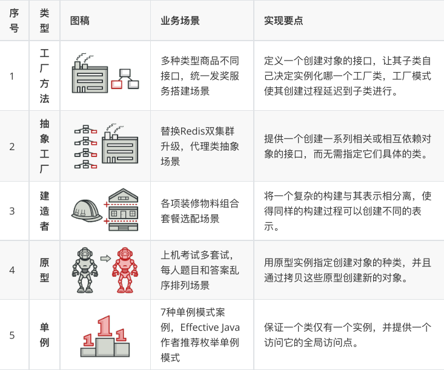
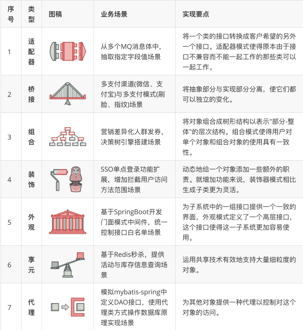
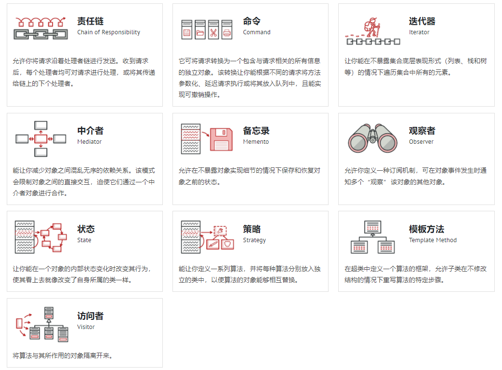

# 设计模式学习笔记

设计模式遵循的六大原则

- 单一职责（一个类和方法只做一件事）
- 里氏替换（多态、子类可扩展父类）
- 依赖倒置（细节依赖抽象，下层依赖上层）
- 接口隔离（建立单一接口）
- 迪米特原则（最少知道，降低耦合）
- 开闭原则（抽象架构，扩展实现）

创建型模式

这类模式提供创建对象的机制，能够提升已有代码的灵活性和可复用性。

结构型模式

这类模式介绍如何将对象和类组装成较大的结构，并同时保持结构的灵活和高效。

行为模式

这类模式负责对象间的高效沟通和职责委派

创建者模式

这类模式提供创建对象的机制，能够提升已有代码的灵活性和可复用性。

创建者模式包括：工厂方法、抽象工厂、生成器、原型、单例

## 工厂方法模式

工厂模式又称工厂方法模式，是一种创建型设计模式，其在父类中提供一个创建对象的方法，允许子类决定实例化对象的类型。

主要意图：定义一个创建对象的接口，让其子类自己决定实例化哪一个工厂类，工厂模式使其创建过程延迟到子类进行

优点：避免创建者与具体的产品逻辑耦合，满足单一职责，每一个业务逻辑实现都在所属自己的类中完成，满足开闭原则，无需更改调用方法就可以在程序中引入新的产品类型。

## 抽象工厂模式

主要意图：为了解决接口选择问题

抽象工厂是一个中心工厂，创建其他工厂的模式

具体场景：

- 不同系统内的回车换行
- IDEA开发工具的差异展示（Win和Mac）
- ……

抽象工厂模式，所要解决的问题就是在一个产品族，存在多个不同类型的产品情况下，接口选择问题。

这个设计模式满足了，单一职责、开闭原则、解耦等优点。

