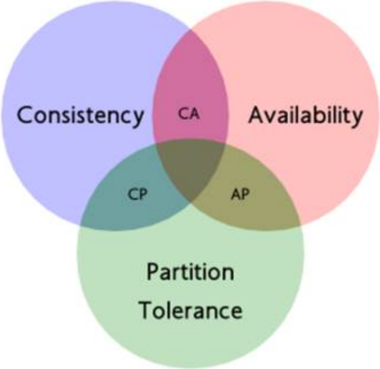

# 分布式相关面试题汇总

## CAP

Web服务无法同时满足以下3个属性

- 一致性（Consistency）：客户端知道一系列的操作都会同时发生（生效）
- 可用性（Availability）：每个操作都必须以可预期的响应结束
- 分区容错性（Partition tolerance）：即使出现单个组件无法使用，操作依然可以完成

一个Web应用至多只能同时支持上面的两个属性。因此，设计人员必须在一致性与可用性之间做出选择。

一个分布式系统最多只能满足CAP中的2项

CAP在迄今为止的分布式系统中都是适用的

## ZAB协议

## Paxos算法

## 分布式数据一致性

