# 【牛客论坛】常见面试题

## MySQL

存储引擎、事务、锁、索引

### 存储引擎

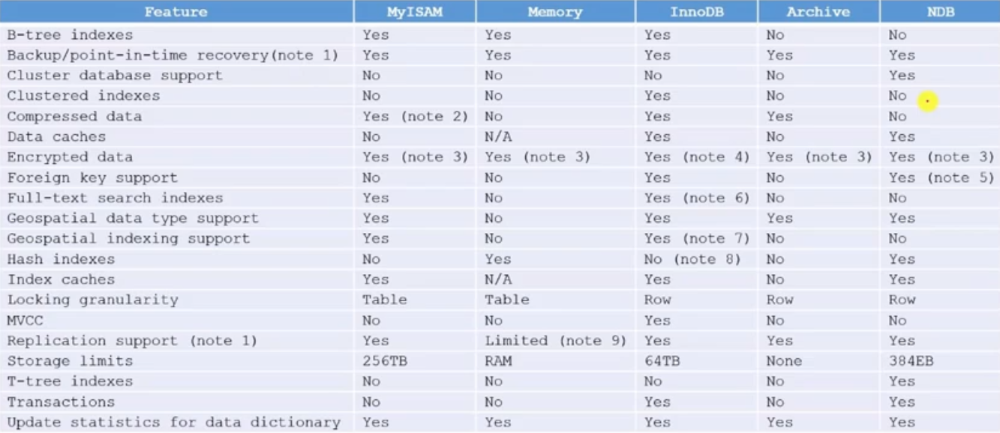

### 事务

事务的特性：

原子性、一致性、隔离性、持久性

事务的隔离性

- 并发异常：第一类丢失更新、第二类丢失更新、脏读、不可重复读、幻读
- 隔离级别：Read Uncommitted、Read Committed、Repeatable Read、Serializable

Spring事务管理

- 声明式事务
- 编程式事务

### 锁

范围

- 表级锁：开销小，加锁快，发生锁冲突的概率高，并发度低，不会出现死锁
- 行级锁：开销大，加锁慢，发生锁冲突的概率低，并发度高，会出现死锁

类型（InnoDB）

- 共享锁（S）：行级，读取一行；
- 排他锁（X）：行级，更新一行；
- 意向共享锁（IS）：表级，准备加共享锁；
- 意向排他锁（IX）：表级，准备加排他锁；
- 间隙锁（NK）：行级，使用范围条件时，对范围内不存在的记录加锁。一是为了防止幻读，二是为了满足恢复和复制的需要。


加锁

- 增加行级锁之前，InnoDB会自动给表加意向锁；
- 执行DML语句时，InnoDB会自动给数据加排他锁；
- 执行DQL语句时
  - 共享锁（S）：`select ... from ... where ... lock in share mode`
  - 排他锁（X）：`select ... from ... where ... for update`
  - 间隙锁（NK）：上述SQL采用范围条件时，InnoDB对不存在的记录自动增加间隙锁。

死锁

- 场景
  - 事务1：`update T set ... where id = 1; update T set ... where id = 2`
  - 事务2：`update T set ... where id = 2; update T set ... where id = 1`
- 解决方案
  1. 一般InnoDB会自动检测到，并使一个事务回滚，另一个事务继续；
  2. 设置超时等待参数`innodb_lock_wait_timeout`
- 避免死锁
  1. 不同的业务并发访问多个表时，应约定以相同的顺序来访问这些表
  2. 以批量的方式处理数据时，应事先对数据排序，保证线程按固定的顺序来处理数据
  3. 在事务中，如果要更新记录，应直接申请足够级别的锁，即排他锁

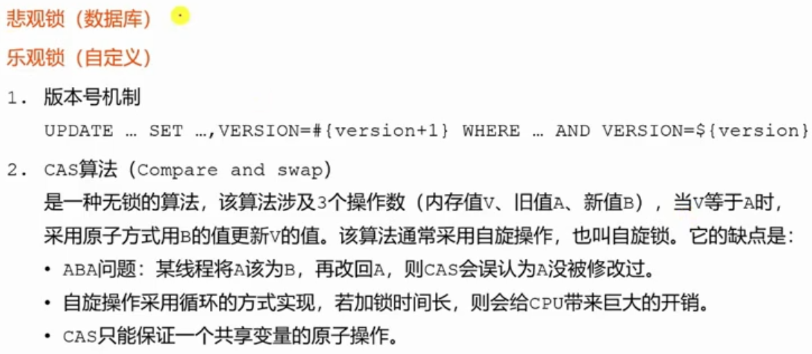

### 索引

B+Tree（InnoDB）

- 数据分块存储，每一块称为一页
- 所有的值都是按顺序存储的，并且每一个叶子到根的距离相同
- 非叶子结点存储数据的边界，叶子结点存储指向数据行的指针
- 通过边界缩小数据的范围，从而避免全表扫描，加快了查找的速度

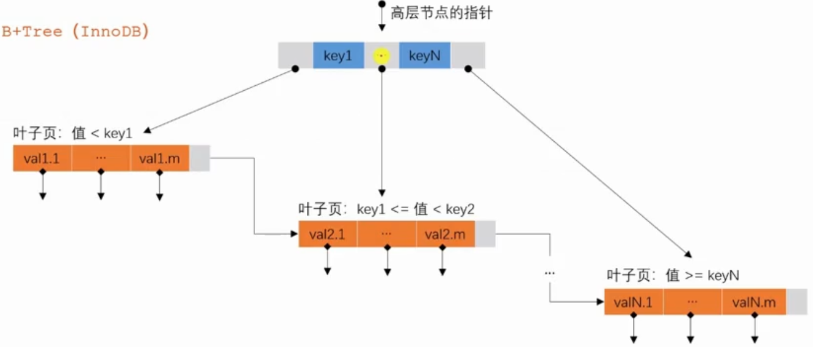


## Redis

数据类型、过期策略、淘汰策略、缓存穿透、缓存击穿、缓存雪崩、分布式锁

### 数据类型

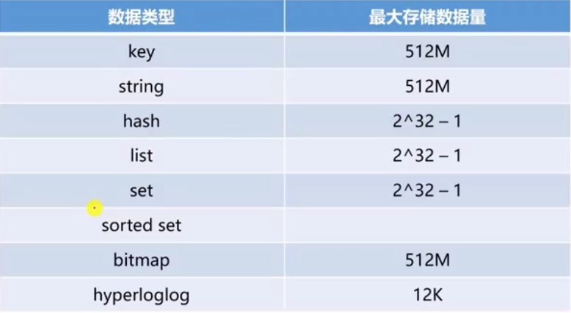

### 过期策略

Redis会把设置了过期时间的key放入一个独立的字典里，在key过期时并不会立刻删除它。

Redis会通过如下两种策略，来删除过期的key：

- 惰性删除：客户端访问某个key时，redis会检查该key是否过期，若过期则删除
- 定期扫描：Redis默认每秒执行10次过期扫描（配置hz选项），扫描策略如下：
  1. 从过期字典中随机选择20个key
  2. 删除这20个key中已经过期的key
  3. 如果过期的key比例超过25%，则重复步骤1

### 淘汰策略

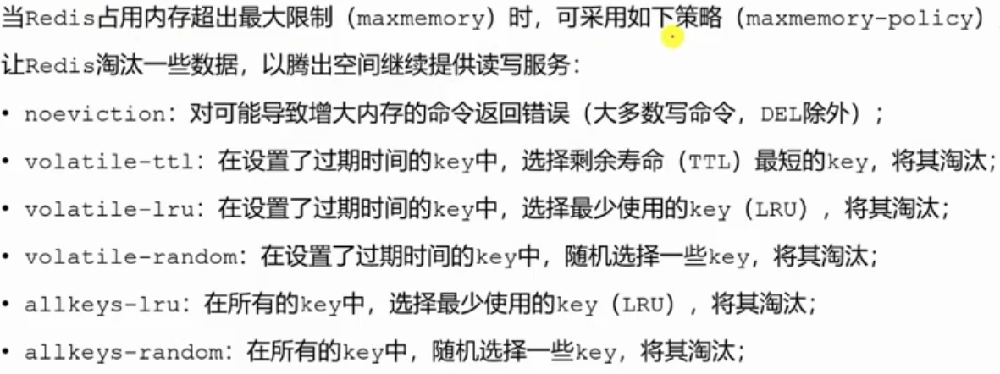

### 缓存穿透

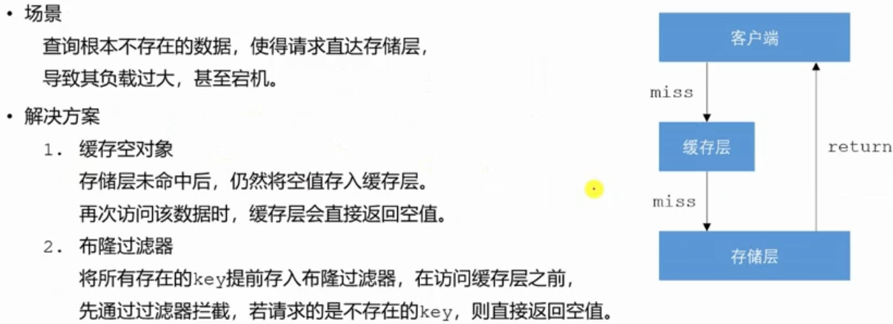

### 缓存击穿

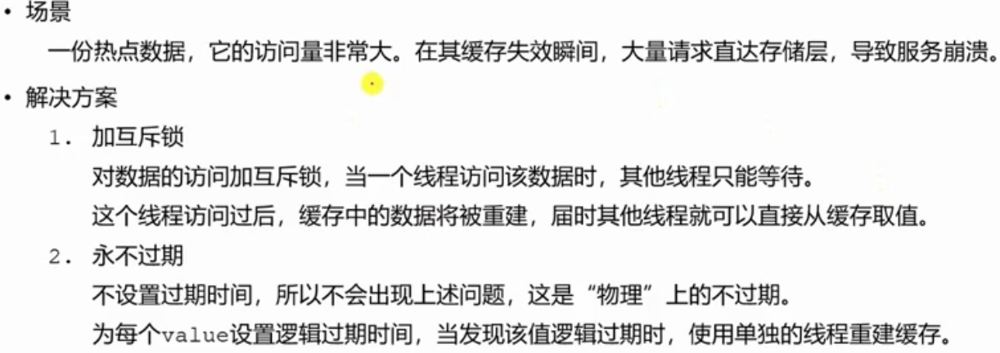

### 缓存雪崩


### 分布式锁


实现方式：

1. 基于数据库实现分布式锁；
2. 基于Redis实现分布式锁；
3. 基于Zookeeper实现分布式锁；

Redis实现分布式锁的原则

1. 安全属性：独享。在任一时刻，只有一个客户端持有锁
2. 活性A：无死锁。即便持有锁的客户端或者网络被分裂，锁仍然可以被获取
3. 活性B：容错。只要大部分Redis节点都活着，客户端就可以获取和释放锁

单Redis实例实现分布式锁

1. 获取锁使用命令：

   `SET resource_name my_random_value NX PX 30000`

   NX：仅在key不存在时，才执行成功

   PX：设置锁的自动过期时间

2. 通过Lua脚本释放锁：

```lua
if redis.call("get", KEYS[1]) == ARGV[1] then
    return redis.call("del", KEYS[1])
else return 0 end
```

可以避免删除别的客户端获取成功的锁：

`A加锁 -> A阻塞 -> 因超时释放锁 -> B加锁 -> A恢复 -> 释放锁`

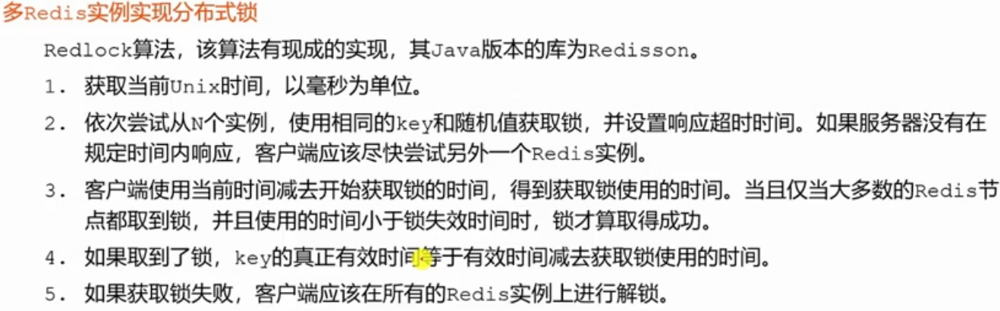

## Spring

Spring IOC、Spring AOP、Spring MVC

### Spring IOC

Bean的作用域

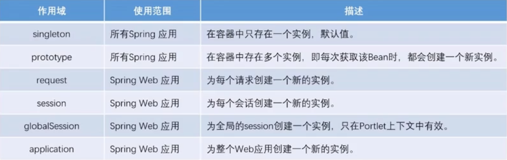

### Spring AOP

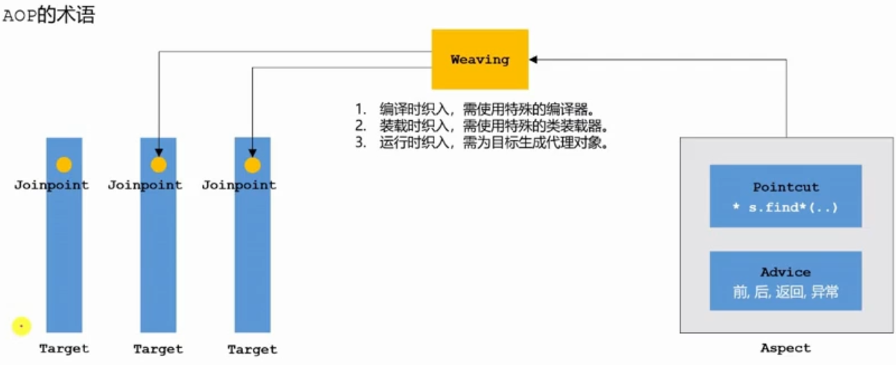

### Spring MVC

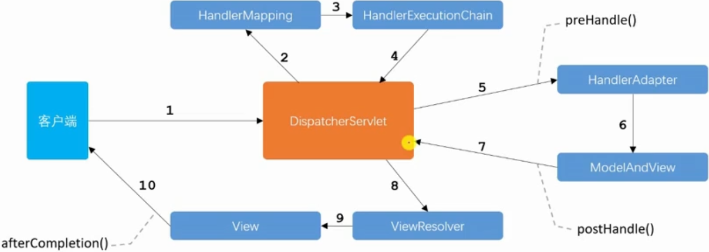

