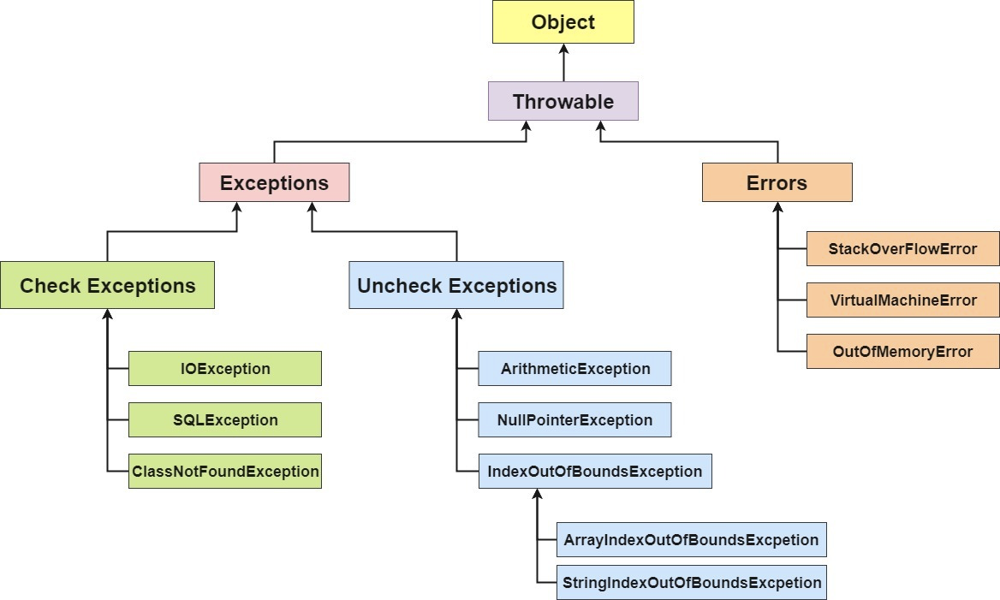
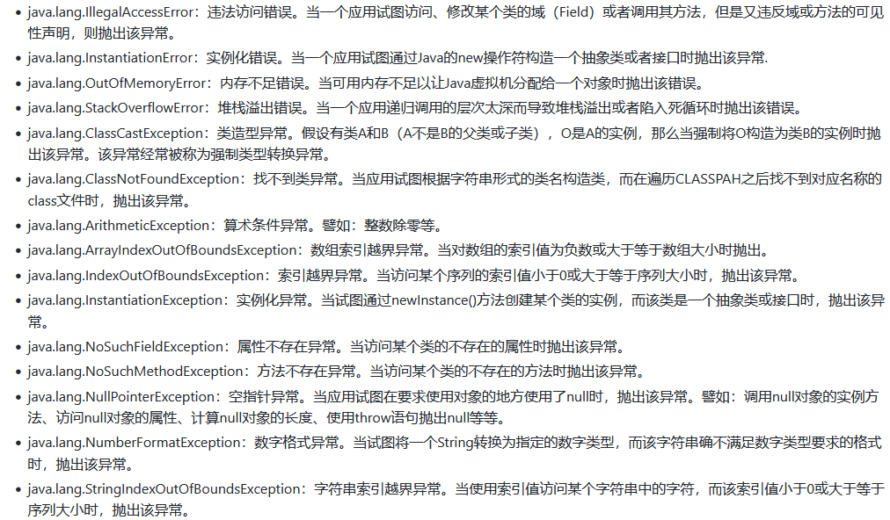
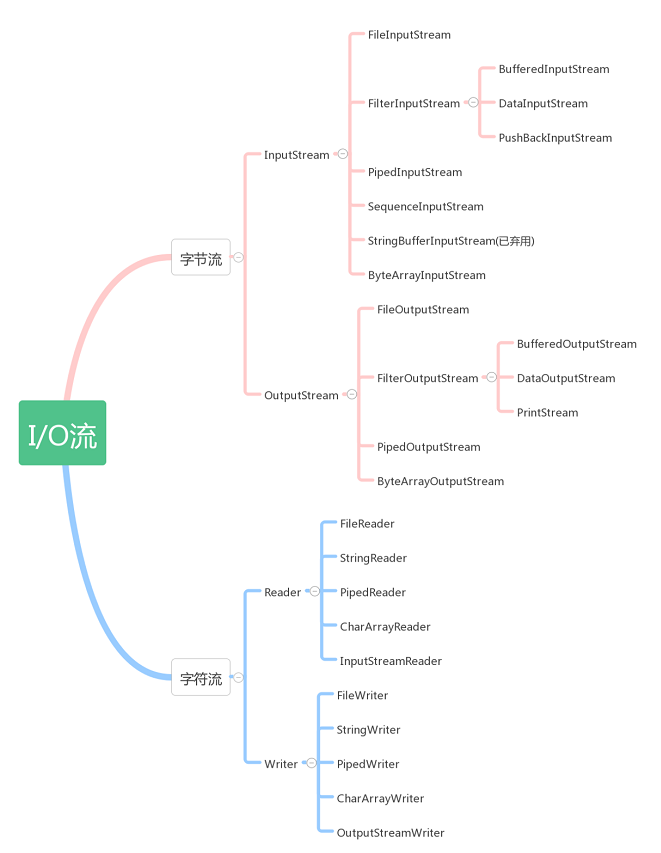
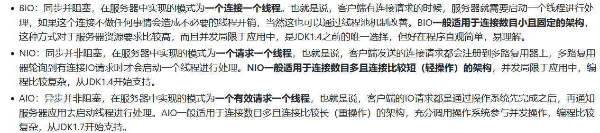

# 常见面试题总结（Java基础）

## Java概述

### Java语言有哪些特点？

- 平台无关性（一次编写，到处运行）
- 面向对象
- 可靠性、安全性
- 支持多线程、网络编程
- 编译与解释并存

### JVM、JRE和JDK的关系是什么？

JDK包含JRE，JER包含JVM


### 一个Java文件从编译到运行的过程


### 字节码的优势是什么？

Java语言通过字节码的方式，在一定程度上解决了传统解释型语言执行效率低的问题，同时又保留了解释型语言可移植的特点。所以，Java程序运行时比较高效，而且，由于字节码并不针对一种特定的机器，因此，Java程序无须重新编译便可在多种不同的计算机上运行。

### 谈一谈 Oracle JDK 和 Open JDK的区别

OpenJDK是一个参考模型并且是完全开源的，而Oracle JDK 是 Open JDK 的一个实现，并不是完全开源的。

在稳定性方面，Oracle JDK 比 Open JDK更稳定。

在响应性和JVM性能方面，Oracle JDK 与 Open JDK 相比提供了更好的性能。

## 基础语法

### Java有哪些数据类型？

Java 语言的数据类型分为两种：基本数据类型和引用数据类型。


### public、private、protected、以及不写（默认）时的区别？

Java 中，可以使用访问控制符来保护对类、变量、方法和构造方法的访问。Java 支持4种不同的访问权限。

- default（即默认，不写）：在同一包内可见，不使用任何修饰符。使用对象：类、接口、变量、方法
- private：在同一个类内可见。使用对象：变量、方法。不能修饰类（外部类）
- public：对所有类可见。使用对象：类、接口、变量、方法
- protected：对同一个包的类和所有子类可见。使用对象：变量、方法。不能修饰类（外部类）


### final、finally、finalize的区别？

final用于修饰变量、方法和类。

- final修饰变量：被修饰的变量不可变，不可变分为`引用不可变`和`对象不可变`，final是引用不可变，final修饰的变量必须初始化，通常修饰常量。
- final修饰方法：被修饰的方法不允许任何子类重写，子类可以使用该方法。
- final修饰类：被修饰的类不能被继承，所有方法不能被重写。

finally作为异常处理的一部分，出现在`try/catch`语句中，并且附带一个语句块表示这段语句最终一定被执行（无论是否出现异常），经常被用在需要释放资源的情况下，`System.exit(0)`可以阻断finally执行。

finalize是在`java.lang.Object`里定义的方法，finalize被调用不一定会立即回收该对象，不推荐使用finalize方法。

### 谈一谈static关键字

static关键字表明一个成员变量或者是成员方法可以在没有所属类的实例变量的情况下被访问。

Java的static方法不能被覆盖，static变量在Java中是属于类的，它在所有的实例中的值都是一样的。

代码块执行顺序：

静态代码块——> 构造代码块 ——> 构造函数——> 普通代码块

继承中代码块执行顺序：

父类静态块——> 子类静态块——> 父类代码块——> 父类构造器——> 子类代码块——> 子类构造器

## 面向对象

### 面向对象的三大特性

- 封装
- 继承
- 多态

### 重载（overload）和重写（override）的区别？

方法的重载和重写都是实现多态的方式，区别在于前者实现的是编译时的多态，而后者实现的是运行时的多态性。

重写发生在子类与父类之间，重写方法返回值和形参都不能改变，与方法返回值和访问修饰符无关

重载是在一个类里面，方法名字相同，而参数不同。返回类型可以相同也可以不同。每个重载的方法（或者构造函数）都必须有个独一无二的参数类型列表，最常用的地方就是构造器的重载。

### 抽象类和接口的区别？

语法层面上的区别：

- 抽象类可以提供成员方法的实现细节，而接口只能存在public abstract方法
- 抽象类中的成员变量可以是各种类型的，而接口中的成员变量只能是public static final类型的
- 接口中不能含有静态代码块以及静态方法，而抽象类可以有静态代码块和静态方法
- 一个类只能继承一个抽象类，而一个类却可以实现多个接口

设计层面上的区别：

- 抽象类是对一种事物的抽象，即对类抽象，而接口是对行为的抽象。抽象类是对整个类整体进行抽象，包括属性、行为，但是接口却是对类局部（行为）进行抽象。
- 抽象类作为很多子类的父类，它是一种模板式设计，而接口是一种行为规范，它是一种辐射式设计。

### Java创建对象的方式有哪些？

1. new创建对象
2. 通过反射机制
3. 采用clone机制
4. 通过序列化机制

### 值传递和引用传递的区别？

值传递：在方法调用时，传递的参数是按值的拷贝传递，传递的是值的拷贝

引用传递：在方法调用时，传递的参数是按引用进行传递，其实传递的是引用的地址，也就是变量所对应的内存空间地址

### == 和 equals 区别？

`==`常用于相同的基本数据类型之间的比较，也可以用于相同类型的对象之间的比较

如果`==`比较的是基本数据类型，那么比较的是两个基本数据类型的值是否相等

如果`==`比较的是两个对象，那么比较的是两个对象的引用，也就是判断两个对象是否指向了同一块内存区域

equals方法主要用于两个对象之间，检测一个对象是否等于另一个对象

Object类的equals方法：

```java
public boolean equals(Object obj) {
    return (this == obj);
}
```

### 谈一谈 hashCode() 方法

hashCode() 的作用是获取哈希码，返回一个int整数，哈希码的作用是确定该对象在哈希表中的索引位置。

- 如果两个对象相等，则hashcode一定也是相同的
- 两个对象相等，对两个对象分别调用equals方法都返回true
- 两个对象有相同的hashcode值，它们也不一定是相等的

### 为什么重写equals方法必须重写hashcode方法？

判断的时候先根据hashcode进行判断，相同的情况下再根据equals()方法进行判断。如果只是重写equals方法，而不重写hashcode方法，会造成hashcode的值不同，而equals()方法判断出来的结果为true。

在Java中的一些容器中，不允许有两个完全相同的对象，插入的时候，如果判断相同则会进行覆盖。这时候如果只是重写了equals()方法，而不重写hashcode方法，Object中hashcode是根据对象的存储地址转换而形成的一个哈希值。这时候就有可能因为没有重写hashcode方法，造成相同的对象散列到不同的位置而造成对象的不能覆盖的问题。

## String相关

### String为什么要设计成不可变的？

1. 便于实现字符串池
2. 使多线程安全
3. 避免安全问题
4. 加快字符串处理速度

总体来说，String不可变的原因包括 设计考虑，效率优化，以及安全性这三大方面。

### String，StringBuffer，StringBuilder 的区别是什么？

可变与不可变

String类中使用字符数组保存字符串，因为有final修饰符，所以String对象是不可变。对于已经存在的String对象的修改都是重新创建一个新的对象，然后再把新的值保存进去。

```java
private final char value[];
```

StringBuilder与StringBuffer都继承自AbstractStringBuilder类，在AbstractStringBuilder中也是使用字符数组保存字符串，这两种对象都是可变的。

```java
char[] value;
```

是否线程安全

String对象是不可变的，显然是线程安全的

StringBuilder是非线程安全的

StringBuffer对方法加了同步锁或者对调用的方法加了同步锁，所以是线程安全的

```java
@Override
public synchronized StringBuffer append(String str) {
    toStringCache = null;
    super.append(str);
    return this;
}
```

性能

每次对String类型进行改变的时候，都会生成一个新的String对象，然后将指针指向新的String对象。

StringBuffer每次对StringBuffer对象本身进行操作，而不是生成新的对象并改变对象的引用。

相同情况下，使用StringBuilder相比使用StringBuffer仅能获得 `10% ~ 15%` 左右的性能提升，但是却要冒着线程不安全的风险。

### 字符型常量和字符串常量的区别？

字符常量是单引号引起的一个字符，字符串常量是双引号引起的若干个字符

字符常量相当于一个整型值（ASCII），可以参加表达式运算，字符串常量代表一个地址值（该字符串在内存中存放位置，相当于对象）

字符常量占2个字节（char在Java中占两个字节），字符串常量占若干个字节（至少一个字符结束标志）

### String有哪些特性？

- 不变性：String是只读字符串，可以保证数据的一致性
- 常量池优化：String对象创建之后，会在字符串常量池中进行缓存，如果下次创建同样的对象时，会直接返回缓存的引用
- final：使用final来定义String类，表示String类不能被继承，提高了系统的安全性

### HashMap中用String做key有什么好处？

HashMap内部实现是通过key的hashcode来确定value的存储位置，因为字符串是不可变的，所以当创建字符串时，它的hashcode被缓存下来，不需要再次计算，所以相比于其他对象更快。

## 包装类型

### 基本类型与包装类型的区别？

Java 为每一个基本数据类型都引入了对应的包装类型，int的包装类是Integer，从Java5开始引入了自动装箱/拆箱机制，把基本类型转换成包装类型的过程叫做装箱（boxing），反之，把包装类型转换成基本类型的过程叫做拆箱（unboxing），使得二者可以相互转换。

Java为每个基本类型提供了包装类型

| 基本类型 | 包装类型  |
| -------- | --------- |
| boolean  | Boolean   |
| char     | Character |
| byte     | Byte      |
| short    | Short     |
| int      | Integer   |
| long     | Long      |
| float    | Float     |
| double   | Double    |

包装类型可以为null，而基本类型不可以

包装类型可以用于泛型，而基本类型不可以

基本类型比包装类型更高效

### int和Integer的区别？

- Integer是int的包装类，int是基本数据类型
- Integer变量必须实例化后才能使用，int变量不需要
- Integer实际是对象的引用，指向此new的Integer对象，int是直接存储数据值
- Integer默认值是null，int的默认值是0

## 反射

### 什么是反射？

反射是在运行状态中，对于任意一个类，都能够知道这个类的所有属性和方法；对于任意一个对象，都能够调用它的任意一个方法和属性；这种动态获取的信息以及动态调用对象的方法的功能称为Java语言的反射机制。

### 反射机制的优缺点有哪些？

优点：

能够运行时动态获取类的实例，提高灵活性；可与动态编译结合

加载MySQL的驱动类

```java
Class.forName("com.mysql.jdbc.Driver")
```

缺点：

使用反射性能较低，需要解析字节码，将内存中的对象进行解析。其解决方案是：通过`setAccessible(true)` 关闭JDK的安全检查来提升反射速度；多次创建一个类的实例时，有缓存会快很多

### 如何获取反射中的Class对象？

1、Class.forName("类的路径")；当你知道该类的全路径名时，你可以使用该方法获取Class类对象。

```java
Class clz = Class.forName("java.lang.String");
```

2、类名.class。这种方法只适合在编译前就知道操作的类

```java
Class clz = String.class;
```

3、对象名.getClass()

```java
String str = new String("test");
Class clz = str.getClass();
```

4、如果是基本类型的包装类，可以调用包装类的Type属性来获得该包装类的Class对象。

### Java反射API有哪些？

反射API用来生成JVM中的类、接口和对象信息

- Class类：反射的核心类，可以获取类的属性，方法等信息
- Field类：表示类的成员变量，可以用来获取和设置类之中的属性值
- Method类：表示类的方法，它可以用来获取类中的方法信息或者执行方法
- Constructor类：表示类的构造方法

### 反射的使用步骤

1. 获取想要操作的类的Class对象，这是反射的核心，通过Class对象，我们可以任意调用类的方法
2. 调用Class类中的方法，这就是反射的使用阶段
3. 使用反射API来操作这些信息

### 反射的应用有哪些？

- 反射让开发人员通过外部类的全路径名创建对象，并使用这些类，实现一些扩展的功能
- 反射让开发人员可以枚举出类的全部成员，包括构造函数、属性、方法。以帮助开发者写出正确的代码
- 测试时可以利用反射API访问类的私有成员，以保证测试代码覆盖率

## 泛型

### 什么是泛型？

泛型是JDK1.5的一个新特性，泛型就是将类型参数化，其在编译时才确定具体的参数。这种参数类型可以用在类、接口和方法的创建中，分别称为泛型类、泛型接口、泛型方法。

### 使用泛型的好处是什么？

1. 类型安全
2. 消除强制类型转换
3. 潜在的性能收益

### 什么是类型擦除？

使用泛型时加上的类型参数，编译器在编译的时候去掉类型参数。

大部分情况下，泛型类型都会以Object进行替换，而有一种情况则不是，那就是使用到了extends和super语法的有界类型。

编译器会正常的将使用泛型的地方编译并进行类型擦除，然后返回实例。但是除此之外，如果构建泛型实例时使用了泛型语法，那么编译器将该标记该实例并关注该实例后续所有方法的调用，每次调用前都进行安全检查，非指定类型的方法都不能调用成功。

编译器不仅关注一个泛型方法的调用，它还会为某些返回值为限定的泛型类型的方法进行强制类型转换，由于类型擦除，返回值为泛型类型的方法都会擦除成Object类型，当这些方法被调用后，编译器会额外插入一行 `checkcast`指令用于强制类型转换。

## 序列化

### Java的序列化与反序列化是什么？

Java序列化是指把Java对象转换为字节序列的过程，而Java反序列化是指把字节序列恢复为Java对象的过程

- 序列化：序列化是把对象转换成有序字节流，以便在网络上传输或者保存在本地文件中。核心作用是对象状态的保存与重建。
- 反序列化：客户端从文件中或者网络上获得序列化后的对象字节流，根据字节流中所保存的对象状态及描述信息，通过反序列化重建对象。

### 为什么需要序列化与反序列化？

对内存中的对象进行持久化或网络传输，这个时候都需要序列化或反序列化

1. 对象序列化可以实现分布式对象
2. Java对象序列化不仅保留一个对象的数据，而且递归保存对象引用的每个对象的数据
3. 序列化可以将内存中的类写入文件或数据库中
4. 对象、文件、数据，有许多不同的格式，很难统一传输和保存

### 序列化实现的方式有哪些？

实现`Serializable`接口或者`Externalizable`接口

Serializable接口

类通过实现`java.io.Serializable`接口以启用其序列化功能。可序列化类的所有子类型本身都是可序列化的。序列化接口没有方法或字段，仅用于标识可序列化的语义。

Externalizable接口

Externalizable继承自Serializable，该接口中定义了两个抽象方法：`writeExternal()`与`readExternal()`

当使用Externalizable接口进行序列化与反序列化的时候需要开发人员重写`writeExternal()`与`readExternal()`方法。否则，所有变量的值都会变成默认值。

| 实现Serializable接口                                         | 实现Externalizable接口   |
| ------------------------------------------------------------ | ------------------------ |
| 系统自动存储必要的信息                                       | 程序员决定存储哪些信息   |
| Java内建支持，易于实现，只需要实现该接口即可，无需任何代码支持 | 必须实现接口内的两个方法 |
| 性能略差                                                     | 性能略好                 |

### 什么是serialVersionUID？

serialVersionUID 用来表明类的不同版本间的兼容性

Java的序列化机制是通过在运行时判断类的serialVersionUID进行比较，如果相同就认为是一致的，可以进行反序列化，否则就会出现序列化版本不一致的异常。

### 静态变量会被序列化吗？

不会，因为序列化是针对对象而言的，而静态变量优先于对象存在，随着类的加载而加载，所以不会被序列化。

## 异常

### Error 和 Exception 区别是什么？

Java中，所有的异常都有一个共同的祖先`Throwable`类。Throwable类有两个重要的子类`Exception`（异常）和`Error`（错误）



Exception：程序本身可以处理的异常，可以通过catch来进行捕获，通常遇到这种错误，应该对其进行处理，使应用程序可以继续正常运行。Exception又可以分为运行时异常和非运行时异常。

Error：程序无法处理的错误，我们不能通过catch来进行捕获。例如，系统崩溃、内存不足、堆栈溢出等，编译器不会对这类错误进行检测，一旦这类错误发生，通常应用程序会被终止，仅靠应用程序本身无法恢复。

### 非受检查异常和受检查异常之间的区别？

是否强制要求调用者必须处理此异常，如果强制要求调用者必须进行处理，那么就是受检查异常，否则就是非受检查异常。

### throw 和 throws 的区别是什么？

- throw关键字用在方法内部，只能用于抛出一种异常，用来抛出方法或代码块中的异常，受检查异常和非受检查异常都可以抛出
- throws 关键字用在方法声明上，可以抛出多个异常，用来标识该方法可能抛出的异常列表。一个方法用throws标识了可能抛出的异常列表，调用该方法的方法必须包含处理异常的代码

### Java常见异常有哪些？




### JVM是如何处理异常的？

在一个方法中，如果发生异常，这个方法会创建一个异常对象，并交给JVM，该异常对象包含异常名称，异常描述以及异常发生时应用程序的状态。创建异常对象并转交给JVM的过程称为抛出异常。可能有一系列的方法调用，最终才进入抛出异常的方法，这一系列方法调用的有序列表叫做调用栈。

JVM会顺着调用栈查找是否有可以处理异常的代码，如果有，则调用异常处理代码。当JVM发现可以处理异常的代码时，会把发生的异常传递给它。如果JVM没有找到可以处理该异常的代码块，JVM就会将该异常转交给默认的异常处理器（默认处理器为JVM的一部分），默认异常处理器打印出异常信息并终止应用程序。

## IO

### Java 的IO流分为几种？

- 按照流的方向：输入流和输出流
- 按照实现功能分：节点流和处理流
- 按照处理数据的单位：字节流和字符流



### 字节流如何转为字符流？

字节输入流转字符输入流通过`InputStreamReader`实现，该类的构造函数可以传入`InputStream`对象

字节输出流转字符输出流通过`OutputStreamWriter`实现，该类的构造函数可以传入`OutputStream`对象

### 字符流与字节流的区别？

- 读写的时候字节流是按字节读写，字符流按字符读写
- 字节流适合所有类型文件的数据传输，字符流只能处理纯文本数据
- 在读写文件需要对内容按行处理，处理某一行的时候一般选择字符流
- 只是读写文件，和文件内容无关时，一般选择字节流

### BIO、NIO、AIO的区别？



## 参考资料

[https://github.com/lyh2048/Java-Interview](https://github.com/lyh2048/Java-Interview)

https://juejin.cn/post/6844903741032759310

https://blog.csdn.net/chenliguan/article/details/53888018

https://segmentfault.com/a/1190000010162647

https://juejin.cn/post/6856664924203663367

[http://www.fanyilun.me/2015/10/29/Java%E5%8F%8D%E5%B0%84%E5%8E%9F%E7%90%86/](http://www.fanyilun.me/2015/10/29/Java反射原理/)

https://www.cnblogs.com/lixuwu/p/10829368.html

https://juejin.cn/post/6844903848167866375

https://blog.csdn.net/lanzhupi/article/details/109809836

https://juejin.cn/post/6844903746682486791

https://blog.csdn.net/ThinkWon/article/details/101681073

https://simplesnippets.tech/exception-handling-in-java-part-1/

https://www.cnblogs.com/xingyunblog/p/8688859.html

https://mp.weixin.qq.com/s/p5qM2UJ1uIWyongfVpRbCg

https://juejin.cn/post/6844903520856965128
