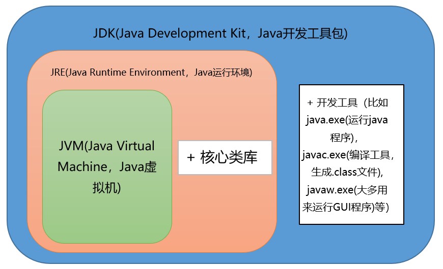
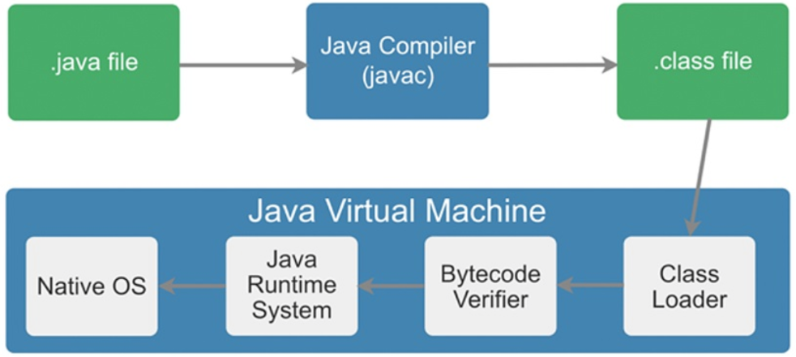
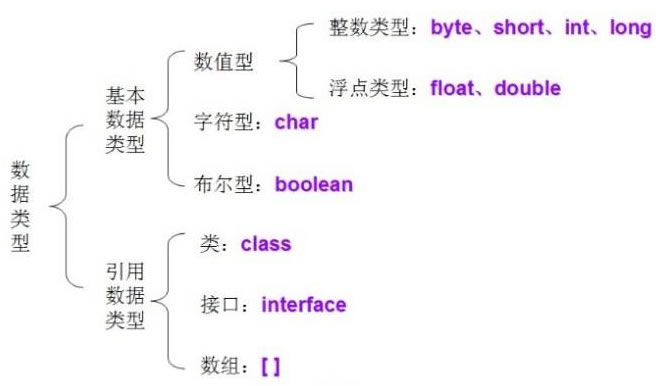

# 常见面试题总结（Java基础）

## Java概述

### Java语言有哪些特点？

- 平台无关性（一次编写，到处运行）
- 面向对象
- 可靠性、安全性
- 支持多线程、网络编程
- 编译与解释并存

### JVM、JRE和JDK的关系是什么？

JDK包含JRE，JER包含JVM



### 一个Java文件从编译到运行的过程



### 字节码的优势是什么？

Java语言通过字节码的方式，在一定程度上解决了传统解释型语言执行效率低的问题，同时又保留了解释型语言可移植的特点。所以，Java程序运行时比较高效，而且，由于字节码并不针对一种特定的机器，因此，Java程序无须重新编译便可在多种不同的计算机上运行。

### 谈一谈 Oracle JDK 和 Open JDK的区别

OpenJDK是一个参考模型并且是完全开源的，而Oracle JDK 是 Open JDK 的一个实现，并不是完全开源的。

在稳定性方面，Oracle JDK 比 Open JDK更稳定。

在响应性和JVM性能方面，Oracle JDK 与 Open JDK 相比提供了更好的性能。

## 基础语法

### Java有哪些数据类型？

Java 语言的数据类型分为两种：基本数据类型和引用数据类型。



### public、private、protected、以及不写（默认）时的区别？

Java 中，可以使用访问控制符来保护对类、变量、方法和构造方法的访问。Java 支持4种不同的访问权限。

- default（即默认，不写）：在同一包内可见，不使用任何修饰符。使用对象：类、接口、变量、方法
- private：在同一个类内可见。使用对象：变量、方法。不能修饰类（外部类）
- public：对所有类可见。使用对象：类、接口、变量、方法
- protected：对同一个包的类和所有子类可见。使用对象：变量、方法。不能修饰类（外部类）


### final、finally、finalize的区别？

final用于修饰变量、方法和类。

- final修饰变量：被修饰的变量不可变，不可变分为`引用不可变`和`对象不可变`，final是引用不可变，final修饰的变量必须初始化，通常修饰常量。
- final修饰方法：被修饰的方法不允许任何子类重写，子类可以使用该方法。
- final修饰类：被修饰的类不能被继承，所有方法不能被重写。

finally作为异常处理的一部分，出现在`try/catch`语句中，并且附带一个语句块表示这段语句最终一定被执行（无论是否出现异常），经常被用在需要释放资源的情况下，`System.exit(0)`可以阻断finally执行。

finalize是在`java.lang.Object`里定义的方法，finalize被调用不一定会立即回收该对象，不推荐使用finalize方法。

### 谈一谈static关键字

static关键字表明一个成员变量或者是成员方法可以在没有所属类的实例变量的情况下被访问。

Java的static方法不能被覆盖，static变量在Java中是属于类的，它在所有的实例中的值都是一样的。

代码块执行顺序：

静态代码块——> 构造代码块 ——> 构造函数——> 普通代码块

继承中代码块执行顺序：

父类静态块——> 子类静态块——> 父类代码块——> 父类构造器——> 子类代码块——> 子类构造器

## 面向对象

### 面向对象的三大特性

- 封装
- 继承
- 多态

### 重载（overload）和重写（override）的区别？

方法的重载和重写都是实现多态的方式，区别在于前者实现的是编译时的多态，而后者实现的是运行时的多态性。

重写发生在子类与父类之间，重写方法返回值和形参都不能改变，与方法返回值和访问修饰符无关

重载是在一个类里面，方法名字相同，而参数不同。返回类型可以相同也可以不同。每个重载的方法（或者构造函数）都必须有个独一无二的参数类型列表，最常用的地方就是构造器的重载。

### 抽象类和接口的区别？

语法层面上的区别：

- 抽象类可以提供成员方法的实现细节，而接口只能存在public abstract方法
- 抽象类中的成员变量可以是各种类型的，而接口中的成员变量只能是public static final类型的
- 接口中不能含有静态代码块以及静态方法，而抽象类可以有静态代码块和静态方法
- 一个类只能继承一个抽象类，而一个类却可以实现多个接口

设计层面上的区别：

- 抽象类是对一种事物的抽象，即对类抽象，而接口是对行为的抽象。抽象类是对整个类整体进行抽象，包括属性、行为，但是接口却是对类局部（行为）进行抽象。
- 抽象类作为很多子类的父类，它是一种模板式设计，而接口是一种行为规范，它是一种辐射式设计。

### Java创建对象的方式有哪些？

1. new创建对象
2. 通过反射机制
3. 采用clone机制
4. 通过序列化机制

### 值传递和引用传递的区别？

值传递：在方法调用时，传递的参数是按值的拷贝传递，传递的是值的拷贝

引用传递：在方法调用时，传递的参数是按引用进行传递，其实传递的是引用的地址，也就是变量所对应的内存空间地址

### == 和 equals 区别？

`==`常用于相同的基本数据类型之间的比较，也可以用于相同类型的对象之间的比较

如果`==`比较的是基本数据类型，那么比较的是两个基本数据类型的值是否相等

如果`==`比较的是两个对象，那么比较的是两个对象的引用，也就是判断两个对象是否指向了同一块内存区域

equals方法主要用于两个对象之间，检测一个对象是否等于另一个对象

Object类的equals方法：

```java
public boolean equals(Object obj) {
    return (this == obj);
}
```

### 谈一谈 hashCode() 方法

hashCode() 的作用是获取哈希码，返回一个int整数，哈希码的作用是确定该对象在哈希表中的索引位置。

- 如果两个对象相等，则hashcode一定也是相同的
- 两个对象相等，对两个对象分别调用equals方法都返回true
- 两个对象有相同的hashcode值，它们也不一定是相等的

